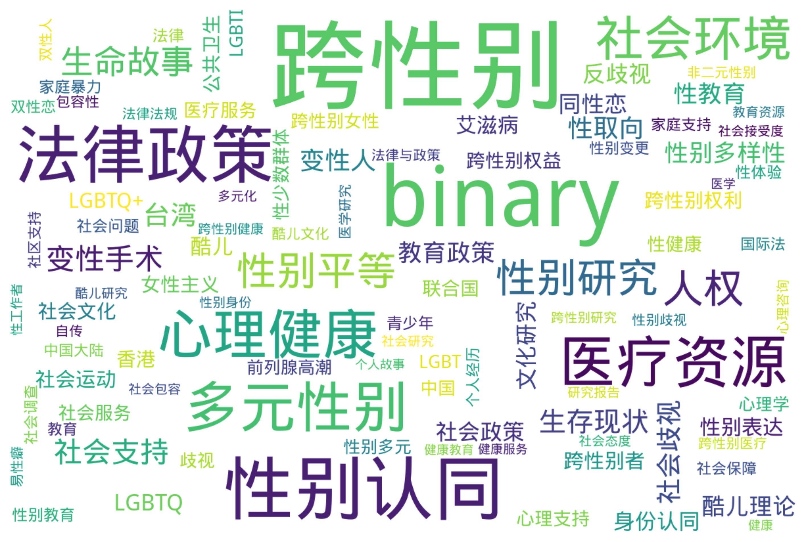

# 跨性别与多元性别文档档案库 数据分析
*生成日期：2025-02-18*

## 执行摘要
本报告分析了 669 个项目的时间分布和主题分类。

## 时间分布

### 年度明细

| 年份 | 数量 |
|------|-------|
| 2024 | 42 |
| 2023 | 70 |
| 2022 | 74 |
| 2021 | 55 |
| 2020 | 38 |
| 2019 | 39 |
| 2018 | 41 |
| 2017 | 45 |
| 2016 | 36 |
| 2015 | 43 |
| 2014 | 22 |
| 2013 | 22 |
| 2012 | 26 |
| 2011 | 22 |
| 2010 | 13 |
| 2009 | 18 |
| 2008 | 9 |
| 2007 | 11 |
| 2006 | 4 |
| 2005 | 5 |
| 2004 | 7 |
| 2003 | 5 |
| 2002 | 6 |
| 2001 | 2 |
| 2000 | 2 |
| 1999 | 2 |
| 1998 | 2 |
| 1997 | 2 |
| 1996 | 1 |
| 1993 | 2 |
| 1992 | 2 |
| 1902 | 1 |

## 地区分布

  `未知: 551 (40.2%)`  `中国大陆: 394 (28.7%)`  `美国: 134 (9.8%)`  `台湾: 94 (6.9%)`  `香港: 51 (3.7%)`  `全球: 17 (1.2%)`  `国际: 13 (0.9%)`  `加拿大: 12 (0.9%)`  `新加坡: 8 (0.6%)`  `台灣: 5 (0.4%)`  `日本: 5 (0.4%)`  `泰国: 5 (0.4%)`  `中国: 4 (0.3%)`  `亚太地区: 4 (0.3%)`  `德国: 4 (0.3%)`  `澳大利亚: 3 (0.2%)`  `苏格兰: 3 (0.2%)`  `马来西亚: 3 (0.2%)`  `加拿大卑诗省: 2 (0.1%)`  `孟加拉: 2 (0.1%)`  `新西兰: 2 (0.1%)`  `瑞典: 2 (0.1%)`  `美国加州: 2 (0.1%)`  `不列颠哥伦比亚省，加拿大: 1 (0.1%)`  `东亚: 1 (0.1%)`  `中国大陆、香港: 1 (0.1%)`  `中国大陆与台湾: 1 (0.1%)`  `亚洲: 1 (0.1%)`  `亚洲及太平洋地区: 1 (0.1%)`  `亚洲及太平洋岛屿: 1 (0.1%)`  `亚洲地区: 1 (0.1%)`  `俄罗斯联邦: 1 (0.1%)`  `全球范围: 1 (0.1%)`  `内蒙古: 1 (0.1%)`  `准确地区未知: 1 (0.1%)`  `加拿大亚伯达省: 1 (0.1%)`  `加泰罗尼亚: 1 (0.1%)`  `南非: 1 (0.1%)`  `印度: 1 (0.1%)`  `印度尼西亚: 1 (0.1%)`  `厄瓜多尔: 1 (0.1%)`  `哥斯达黎加: 1 (0.1%)`  `国外: 1 (0.1%)`  `土耳其: 1 (0.1%)`  `圣基茨和尼维斯: 1 (0.1%)`  `圭亚那: 1 (0.1%)`  `山东省: 1 (0.1%)`  `巴巴多斯: 1 (0.1%)`  `新南威尔士州: 1 (0.1%)`  `日本港区: 1 (0.1%)`  `毛里求斯: 1 (0.1%)`  `江苏 南京: 1 (0.1%)`  `法国: 1 (0.1%)`  `洪都拉斯: 1 (0.1%)`  `海外: 1 (0.1%)`  `港澳台: 1 (0.1%)`  `湖南，中国: 1 (0.1%)`  `澳大利亚与加拿大: 1 (0.1%)`  `澳大利亚维多利亚州: 1 (0.1%)`  `澳门: 1 (0.1%)`  `爱尔兰: 1 (0.1%)`  `特立尼达和多巴哥: 1 (0.1%)`  `甘肃，中国: 1 (0.1%)`  `福建, 中国: 1 (0.1%)`  `纽约，乌拉圭: 1 (0.1%)`  `维多利亚州, 澳大利亚: 1 (0.1%)`  `维多利亚州，澳大利亚: 1 (0.1%)`  `美国, 俄勒冈州: 1 (0.1%)`  `美国新泽西州: 1 (0.1%)`  `英国: 1 (0.1%)`  `菲律宾: 1 (0.1%)`  `葡萄牙: 1 (0.1%)`  `蒙古: 1 (0.1%)`  `越南: 1 (0.1%)`

## 主题分析

### 标签词云

### 热门标签

**前50个热门标签：**

  `跨性别: 508`  `binary: 361`  `性别认同: 240`  `法律政策: 199`  `医疗资源: 155`  `多元性别: 149`  `心理健康: 146`  `社会环境: 114`  `性别研究: 76`  `人权: 75`  `性别平等: 73`  `生命故事: 50`  `变性手术: 39`  `社会支持: 37`  `生存现状: 33`  `台湾: 32`  `社会歧视: 31`  `变性人: 29`  `性取向: 29`  `性别多样性: 26`  `性教育: 26`  `教育政策: 26`  `酷儿理论: 25`  `LGBTQ: 24`  `反歧视: 24`  `同性恋: 24`  `文化研究: 23`  `社会政策: 23`  `身份认同: 22`  `酷儿: 22`  `LGBTQ+: 21`  `性别表达: 21`  `艾滋病: 21`  `社会运动: 20`  `跨性别者: 20`  `公共卫生: 19`  `女性主义: 19`  `社会文化: 19`  `跨性别权利: 19`  `香港: 19`  `联合国: 18`  `跨性别权益: 18`  `LGBT: 17`  `LGBTI: 17`  `医疗服务: 17`  `心理支持: 17`  `性健康: 17`  `性少数群体: 17`  `社会服务: 17`  `中国: 16`

查看更多标签

 `歧视: 16` `跨性别女性: 16` `前列腺高潮: 15` `心理学: 15` `性别多元: 15` `家庭暴力: 13` `性体验: 13` `性别教育: 13` `法律: 13` `社会问题: 13` `青少年: 13` `个人经历: 12` `中国大陆: 12` `双性恋: 12` `国际法: 12` `家庭支持: 12` `性别变更: 12` `教育: 12` `社会保障: 12` `社会调查: 12` `包容性: 11` `双性人: 11` `心理咨询: 11` `社区支持: 11` `酷儿文化: 11` `医学研究: 10` `性别歧视: 10` `易性癖: 10` `法律与政策: 10` `法律法规: 10` `自传: 10` `跨性别医疗: 10` `非二元性别: 10` `多元化: 9` `性别身份: 9` `性工作者: 9` `教育资源: 9` `研究报告: 9` `社会包容: 9` `社会态度: 9` `社会接受度: 9` `社会研究: 9` `跨性别健康: 9` `跨性别研究: 9` `酷儿研究: 9` `个人故事: 8` `健康: 8` `健康教育: 8` `健康服务: 8` `医学: 8` `医学伦理: 8` `变性经历: 8` `女同性恋: 8` `女性化: 8` `性别暴力: 8` `性别理论: 8` `性别认同障碍: 8` `性别重置手术: 8` `文学分析: 8` `法律保护: 8` `激素治疗: 8` `社会变革: 8` `社会学: 8` `社会接受: 8` `社会接纳: 8` `过渡经历: 8` `公共健康: 7` `变性: 7` `员工权益: 7` `婚姻法: 7` `性倾向: 7` `性别不一致: 7` `性别平等教育: 7` `性别政治: 7` `性别焦虑: 7` `性别确认: 7` `扭转治疗: 7` `数据统计: 7` `精神健康: 7` `调查报告: 7` `跨性别支持: 7` `COVID-19: 6` `HIV: 6` `LGBTQIA+: 6` `医疗保险: 6` `医疗政策: 6` `心理治疗: 6` `性别角色: 6` `性少数: 6` `抑郁: 6` `政策建议: 6` `文学作品: 6` `易性症: 6` `法律权益: 6` `生活故事: 6` `生活经历: 6` `社会偏见: 6` `社会性别: 6` `社会正义: 6` `社会责任: 6` `统计报告: 6` `联合国报告: 6` `临床研究: 5` `人权保护: 5` `伪娘: 5` `健康资源: 5` `医疗经历: 5` `变身小说: 5` `台湾文学: 5` `国际合作: 5` `基督教: 5` `多元文化: 5` `大学生: 5` `女权主义: 5` `妇女权利: 5` `学生权利: 5` `家庭关系: 5` `工作环境: 5` `性别少数: 5` `性别平权: 5` `性别转换: 5` `性别过渡: 5` `性别酷儿: 5` `性别重塑: 5` `性工作: 5` `性骚扰: 5` `整形外科: 5` `文学创作: 5` `新加坡: 5` `暴力: 5` `权利: 5` `男性健康: 5` `真实记录: 5` `社会挑战: 5` `社会现状: 5` `社会现象: 5` `精神卫生: 5` `精神障碍: 5` `经验分享: 5` `统计数据: 5` `艺术创作: 5` `荷尔蒙治疗: 5` `HRT: 4` `LGBTIQ+: 4` `LGBTQI: 4` `亚太地区: 4` `人文社科: 4` `人权保障: 4` `健康政策: 4` `儿童权利: 4` `全球健康: 4` `医学指南: 4` `医学文献: 4` `医疗指南: 4` `医疗支持: 4` `医疗照护: 4` `医疗规范: 4` `变性者: 4` `同志: 4` `同志运动: 4` `同性婚姻: 4` `国际人权法: 4` `多样性: 4` `女性健康: 4` `媒体报道: 4` `性传播疾病: 4` `性别刻板印象: 4` `性别友善: 4` `性别少数群体: 4` `性别意识: 4` `性别政策: 4` `性别文化: 4` `性别肯定护理: 4` `性别议题: 4` `性行为: 4` `投诉程序: 4` `报告: 4` `教育环境: 4` `文化活动: 4` `文化现象: 4` `文学艺术: 4` `新冠疫情: 4` `朱迪斯·巴特勒: 4` `校园环境: 4` `法律权利: 4` `法律研究: 4` `法律问题: 4` `泰国: 4` `激素替代疗法: 4` `生殖健康: 4` `电影分析: 4` `社会变迁: 4` `社会工作: 4` `社会环境记录: 4` `社会科学: 4` `社会认同: 4` `社会认知: 4` `社会适应: 4` `社区服务: 4` `社区管理: 4` `社区讨论: 4` `社群讨论: 4` `移民权利: 4` `美国: 4` `自我认同: 4` `自杀预防: 4` `跨性別: 4` `酷儿神学: 4` `酷儿艺术: 4` `青少年教育: 4` `非歧视: 4` `DSM-5: 3` `LGBTQIA: 3` `LGBT权利: 3` `MTF: 3` `上海: 3` `中国文化: 3` `中国法律: 3` `临床应用: 3` `举报机制: 3` `亚文化: 3` `人权教育: 3` `住房歧视: 3` `健康权益: 3` `健康照护: 3` `健康调查: 3` `儿童心理: 3` `儿童青少年: 3` `公安部: 3` `出柜指南: 3` `劳动法: 3` `包容性教育: 3` `医学教育: 3` `医学案例: 3` `医学资源: 3` `医疗: 3` `医疗安全: 3` `医疗干预: 3` `医疗指导: 3` `医疗援助: 3` `医疗研究: 3` `医疗管理: 3` `历史: 3` `双灵: 3` `反歧视政策: 3` `可持续发展目标: 3` `后殖民主义: 3` `国际人权: 3` `外科治疗: 3` `多样性与包容性: 3` `女同志: 3` `婚姻权利: 3` `学术研究: 3` `学生权益: 3` `家庭接纳: 3` `家庭教育: 3` `少数群体权利: 3` `就业歧视: 3` `庇护所: 3` `心理护理: 3` `心理评估: 3` `性别: 3` `性别不安: 3` `性别多元化: 3` `性别差异: 3` `性别承认: 3` `性别流动: 3` `性别流动性: 3` `性别烦躁: 3` `性别确认手术: 3` `性别重置: 3` `性别重置技术: 3` `性激素: 3` `户籍管理: 3` `支持服务: 3` `政府政策: 3` `文化: 3` `文化批评: 3` `文化认同: 3` `文学批评: 3` `文学研究: 3` `文学评论: 3` `无歧视政策: 3` `未成年人: 3` `校园安全: 3` `校园欺凌: 3` `案例分析: 3` `民权法: 3` `法律咨询: 3` `法律指导: 3` `法律改革: 3` `法律框架: 3` `法律案例: 3` `法律程序: 3` `流行病学: 3` `湖南省: 3` `焦虑: 3` `爱滋病: 3` `生存状况: 3` `生活经验: 3` `生物学: 3` `电影: 3` `男同性恋: 3` `疫苗接种: 3` `研究: 3` `社会公正: 3` `社会关注: 3` `社会压力: 3` `社会新闻: 3` `社区参与: 3` `社区资源: 3` `社群支持: 3` `纪录片: 3` `纽约州: 3` `纽约市: 3` `网络文学: 3` `职场歧视: 3` `自杀意念: 3` `艺术展览: 3` `艾滋病毒: 3` `艾滋病防治: 3` `药物安全: 3` `药物说明书: 3` `跨性别者支持: 3` `跨文化研究: 3` `身体探索: 3` `身体自主权: 3` `阴道再造: 3` `隐私保护: 3` `青少年健康: 3` `青少年发展: 3` `骚扰: 3` `COVID-19影响: 2` `DSD: 2` `LGBTIQA+: 2` `LGBTQ+支持: 2` `LGBTQ2S+: 2` `LGBTQI+: 2` `LGBTQ权利: 2` `LGBT群体: 2` `Limelight社区: 2` `SOGI教育: 2` `世界卫生组织: 2` `东南亚: 2` `两性畸形: 2` `个人成长: 2` `个人权利: 2` `个人经验: 2` `中华女子学院: 2` `中国历史: 2` `中国电影: 2` `临床实践: 2` `互助小组: 2` `亚洲: 2` `京剧: 2` `亲密伴侣暴力: 2` `人妖: 2` `人工智能: 2` `人文学科: 2` `人权机制: 2` `人格障碍: 2` `企业政策: 2` `企业行为准则: 2` `伦理学: 2` `体育教育: 2` `俄勒冈州: 2` `假两性畸形: 2` `假药: 2` `偏见: 2` `健康不平等: 2` `健康公平: 2` `健康平等: 2` `健康支持: 2` `健康权: 2` `健康权利: 2` `儒家思想: 2` `儿童教育: 2` `全球卫生: 2` `公众调查: 2` `公共服务: 2` `公平住房法: 2` `公平性: 2` `公民权利: 2` `公益: 2` `公证: 2` `军队: 2` `创伤: 2` `刻板印象: 2` `前列腺癌: 2` `加州: 2` `北京同志中心: 2` `医学共识: 2` `医学指导: 2` `医学标准: 2` `医疗伦理: 2` `医疗保障: 2` `医疗改革: 2` `医疗经验: 2` `千年发展目标: 2` `卫生政策: 2` `卫生服务: 2` `卫生设施: 2` `卫生部: 2` `危机干预: 2` `危险行为: 2` `历史研究: 2` `历史记录: 2` `厦门大学: 2` `去病理化: 2` `去精神病化: 2` `反暴力: 2` `反歧视法: 2` `反骚扰: 2` `受教育权: 2` `变态心理: 2` `变性学生: 2` `口述历史: 2` `可持续发展: 2` `吉利德科学: 2` `同工同酬: 2` `同志政治: 2` `同志文化: 2` `同性恋研究: 2` `后现代主义: 2` `后结构主义: 2` `咨询文件: 2` `咨询服务: 2` `嗓音训练: 2` `国家卫生健康委员会: 2` `国际人权条约: 2` `国际公约: 2` `国际特赦组织: 2` `国际组织: 2` `声音训练: 2` `多学科合作: 2` `天津市: 2` `姓名变更: 2` `威尼斯双年展: 2` `婚姻法律: 2` `孟加拉: 2` `学校支持: 2` `学校环境: 2` `学生手册: 2` `安全指南: 2` `宗教与性别: 2` `实证研究: 2` `家庭: 2` `家暴: 2` `家长支持: 2` `少数族裔: 2` `平权: 2` `平等: 2` `平等与不歧视: 2` `平等就业: 2` `平等待遇: 2` `平等机会: 2` `年报: 2` `心理健康资源: 2` `心理服务: 2` `心理研究: 2` `心理调查: 2` `心理转变: 2` `心理适应: 2` `心理障碍: 2` `志愿者: 2` `性与生殖健康: 2` `性侵害: 2` `性侵犯: 2` `性別主流化: 2` `性別平等: 2` `性別認同: 2` `性别争议: 2` `性别伦理: 2` `性别偏见: 2` `性别健康: 2` `性别包容: 2` `性别发育异常: 2` `性别多样化: 2` `性别权益: 2` `性别正义: 2` `性别登记: 2` `性别表演: 2` `性别表现: 2` `性别观念: 2` `性别解放运动: 2` `性别认定: 2` `性别选择权: 2` `性小众: 2` `性少数人群: 2` `性工作者权益: 2` `性心理障碍: 2` `性文化: 2` `性权利: 2` `性生活: 2` `性知识: 2` `性经验分享: 2` `性身份障碍: 2` `性／别研究: 2` `患者故事: 2` `患者满意度: 2` `情绪管理: 2` `成瘾: 2` `成长经历: 2` `戒网瘾学校: 2` `户口登记: 2` `手术规范: 2` `批判理论: 2` `抑郁症: 2` `拉拉: 2` `指南: 2` `政治影响: 2` `政策: 2` `政策报告: 2` `政策文件: 2` `政策法规: 2` `政策通知: 2` `教育手册: 2` `教育权: 2` `教育管理: 2` `数字文化: 2` `文化传播: 2` `文化反思: 2` `文化多样性: 2` `文化影响: 2` `文化政治: 2` `文化表达: 2` `新闻报道: 2` `普遍定期审议: 2` `暴力与歧视: 2` `暴力事件: 2` `更年期: 2` `权利保障: 2` `校园文化: 2` `校园歧视: 2` `校园霸凌: 2` `残疾人权利: 2` `民主化进程: 2` `求助热线: 2` `法学研究: 2` `法律与社会环境: 2` `法律与道德: 2` `法律分析: 2` `法律变革: 2` `法律承认: 2` `法律援助: 2` `法律规范: 2` `波特兰公立学校: 2` `游戏行业: 2` `激素替代治疗: 2` `爱情故事: 2` `父母手册: 2` `父母指南: 2` `猴痘: 2` `环境保护: 2` `现身过程: 2` `生命经历: 2` `生存故事: 2` `生活体验: 2` `生活指导: 2` `生活方式: 2` `电影放映: 2` `电影研究: 2` `电影节: 2` `电视剧: 2` `男扮女装: 2` `男男性行为者: 2` `男跨女: 2` `疾病分类: 2` `病例报告: 2` `睾酮: 2` `研究论文: 2` `研究资料: 2` `社交行为: 2` `社会争议: 2` `社会倡导: 2` `社会公平: 2` `社会包容性: 2` `社会困境: 2` `社会平等: 2` `社会政治: 2` `社会权益: 2` `社会污名: 2` `社会福利: 2` `社会科学研究: 2` `社会组织: 2` `社会观察: 2` `社会角色: 2` `社会议题: 2` `社会评论: 2` `社群服务: 2` `社群治理: 2` `种族平等: 2` `科学创新: 2` `科技与社会: 2` `符号学: 2` `管理规范: 2` `精神疾病: 2` `纪大伟: 2` `经济困难: 2` `绝经: 2` `绝经症状: 2` `网络暴力: 2` `网络销售: 2` `老年人: 2` `老年人健康: 2` `职业发展: 2` `职场包容性: 2` `职场文化: 2` `腐女: 2` `腹腔镜手术: 2` `自助手册: 2` `自我探索: 2` `自我效能感: 2` `艺术: 2` `艺术史: 2` `艺术研究: 2` `艺术评论: 2` `艾滋病大会: 2` `苏格兰: 2` `药品监管: 2` `荷尔蒙替代疗法: 2` `视觉文化: 2` `许通元: 2` `证据收集: 2` `诈骗: 2` `诊疗指南: 2` `语言学: 2` `调查研究: 2` `质性研究: 2` `跨学科研究: 2` `跨性别儿童: 2` `跨性别患者: 2` `跨性别护理: 2` `跨性别政策: 2` `跨性别教育: 2` `跨性别群体: 2` `跨性别者权利: 2` `跨性别者权益: 2` `跨性别者经历: 2` `边缘化群体: 2` `酷儿文学: 2` `重性精神疾病: 2` `问卷调查: 2` `间性人: 2` `防治策略: 2` `阴道再造术: 2` `雌二醇: 2` `雌激素: 2` `青少年心理: 2` `青少年支持: 2` `非政府组织: 2` `非自杀倾向自残行为: 2` `韧性: 2` `领导力: 2` `香港教育: 2` `高雄市: 2` `#MeToo运动: 1` `2018-2019学年: 1` `2SLGBTQ+: 1` `AA制: 1` `AG: 1` `Autogynephilia: 1` `BC肌: 1` `BIPOC: 1` `BL文化: 1` `BL漫画: 1` `Bilibili: 1` `Bubble_T: 1` `B站后浪: 1` `CCMD-3: 1` `CEDAW: 1` `COSPLAY: 1` `COVID-19疫苗: 1` `CareOregon: 1` `Cosplay: 1` `DIY艺术: 1` `DSD儿童: 1` `DSM: 1` `ESG表现: 1` `FRIDA基金会: 1` `FtM: 1` `GBT社群: 1` `HIV/AIDS: 1` `HIV感染: 1` `HIV感染风险: 1` `HIV检测: 1` `HIV管理: 1` `HIV脆弱性: 1` `HIV预防: 1` `ICD: 1` `ICD-11: 1` `IC肌: 1` `IEEE: 1` `J.K.罗琳: 1` `LGBT+: 1` `LGBTI+权利: 1` `LGBTIQ: 1` `LGBTIQ+女性: 1` `LGBTI人权: 1` `LGBTI权利: 1` `LGBTI社群: 1` `LGBTQ+医疗: 1` `LGBTQ+权利: 1` `LGBTQ+权益: 1` `LGBTQA权益: 1` `LGBTQI+支持: 1` `LGBTQI+社区: 1` `LGBTQIA+支持: 1` `LGBTQIA2S+: 1` `LGBTQIA权益: 1` `LGBTSQQ: 1` `LGBT历史: 1` `LGBT支持: 1` `Limelight: 1` `Limelights社区: 1` `Limelight社群: 1` `Medicare: 1` `NGO支持: 1` `OFCCP: 1` `PC肌: 1` `PC肌肉: 1` `SM文化: 1` `STEM教育: 1` `SuperO: 1` `TWVQ: 1` `Title IX: 1` `Trans Care BC: 1` `Trevor计划: 1` `T婆: 1` `UBC: 1` `UCSF: 1` `UNDP: 1` `UNESCO: 1` `VLSI: 1` `Vivek Shraya: 1` `WPATH: 1` `WPATH标准: 1` `Yanhee医院: 1` `[Unknown tags(update needed)]: 1` `ftm: 1` `gender-based violence: 1` `hMPXV: 1` `torchlight: 1` `上海骄傲电影节: 1` `上海骄傲节: 1` `不健康内容: 1` `不平等现象: 1` `不歧视政策: 1` `专业实践: 1` `专科医生培训: 1` `世界华文文学: 1` `东亚地区: 1` `东京奥运会: 1` `东北地区: 1` `东方主义: 1` `东方女性: 1` `个人体验: 1` `个人信息收集: 1` `个人历程: 1` `个人叙述: 1` `个人安全: 1` `个人认同: 1` `个人过渡经历: 1` `个人陈述: 1` `个体故事: 1` `个体经历: 1` `中介作用: 1` `中华小儿外科杂志: 1` `中国医学标准: 1` `中国古典文学: 1` `中国同性恋: 1` `中国后社会主义: 1` `中国城市: 1` `中国女权主义: 1` `中国性科学: 1` `中国戏剧: 1` `中国护理: 1` `中国政府: 1` `中国文学: 1` `中国标准: 1` `中国研究: 1` `中国社会工作: 1` `中国科学: 1` `中国立法: 1` `中国精神医学: 1` `中国经验: 1` `中央大学: 1` `中学教育: 1` `中性厕所: 1` `中文教学: 1` `中日关系: 1` `中港台地区: 1` `临床分析: 1` `临床医学: 1` `临床实践指南: 1` `临床护理: 1` `临床指南: 1` `临床指标: 1` `临床经验: 1` `主体性: 1` `主流文化: 1` `举报信函: 1` `乌拉圭: 1` `九十年代: 1` `习近平政策: 1` `乡村文化: 1` `书评: 1` `乳头刺激: 1` `乳首开发: 1` `争议事件: 1` `二维性别认知: 1` `互动教学: 1` `互联网内容: 1` `互联网时代: 1` `互聯網: 1` `五四运动: 1` `亚太裔: 1` `亚细亚学: 1` `亚裔美国人: 1` `亚裔酷儿: 1` `交叉歧视: 1` `交流心得: 1` `亲子沟通: 1` `亲密关系: 1` `亲情: 1` `人力资源管理: 1` `人口基金: 1` `人口普查: 1` `人口统计: 1` `人口贩卖: 1` `人妖文化: 1` `人妖现象: 1` `人工智能公平性: 1` `人工智能辅助治疗: 1` `人工流产: 1` `人工生殖: 1` `人才培养: 1` `人文学: 1` `人文思潮: 1` `人文社会医学: 1` `人文社会科学: 1` `人权委员会: 1` `人权审查: 1` `人权报告: 1` `人权捍卫者: 1` `人权法: 1` `人权法案: 1` `人权理事会: 1` `人权研究: 1` `人权评估: 1` `人格特征: 1` `人物多元性: 1` `人物采访: 1` `人生故事: 1` `人类社会行为: 1` `人群研究: 1` `人群规模: 1` `人身安全: 1` `人身安全保护令: 1` `人身权: 1` `人道主义: 1` `人道干预: 1` `仇恨暴力: 1` `仇恨犯罪: 1` `代孕: 1` `代理人: 1` `代言: 1` `价值观: 1` `任务指导: 1` `任意拘留: 1` `企业实践: 1` `企业文化: 1` `企业案例: 1` `企业社会责任: 1` `企业责任: 1` `伊利诺伊州: 1` `优质护理服务: 1` `会议议程: 1` `会阴按摩: 1` `传播学: 1` `传统理论批判: 1` `传统观念: 1` `伦理困境: 1` `伦理审核: 1` `伦理指导: 1` `伦理文学: 1` `伦理讨论: 1` `伦理道德: 1` `伪娘文化: 1` `伪娘训练: 1` `伴侣卡: 1` `低剂量雌激素: 1` `低钾血症: 1` `住房评估: 1` `体育: 1` `体育与性别: 1` `体育新闻: 1` `体育权益: 1` `体育比赛: 1` `体育科学: 1` `体育运动: 1` `体验分享: 1` `何清濂: 1` `佳雅·萨·埃鲁阿: 1` `侮辱言论: 1` `俄勒冈州健康计划: 1` `俄罗斯: 1` `保安部门: 1` `保险: 1` `保险手册: 1` `保险条款: 1` `保险计划: 1` `信仰与性别认同: 1` `信仰与性别身份: 1` `信仰解放: 1` `信任与沟通: 1` `信任等级制度: 1` `信度: 1` `修哈兹·曼南: 1` `修复: 1` `倡导: 1` `假药问题: 1` `做性别: 1` `健康与安全: 1` `健康与权利: 1` `健康中心: 1` `健康企业建设: 1` `健康保险: 1` `健康信息: 1` `健康安全: 1` `健康差异: 1` `健康干预: 1` `健康成长: 1` `健康报告: 1` `健康推广: 1` `健康提示: 1` `健康研究: 1` `健康筛查: 1` `健康管理: 1` `健康行为: 1` `健康调研: 1` `健康隐私: 1` `健康需求: 1` `健康风险: 1` `健康风险评估: 1` `健身用药: 1` `偶像崇拜: 1` `催眠音声: 1` `傳播學: 1` `儿童: 1` `儿童与青少年: 1` `儿童与青少年支持: 1` `儿童保护: 1` `儿童健康: 1` `儿童基金会: 1` `儿童心理健康: 1` `儿童心理学: 1` `儿童性别认同: 1` `儿童性别问题: 1` `儿童文学: 1` `儿童易性癖者: 1` `儿童权益: 1` `儿童福利: 1` `儿童青少年性别不安: 1` `先天性结构畸形: 1` `先天性肾上腺增生症: 1` `先锋诗歌: 1` `克氏综合征: 1` `克莱夫·贝尔: 1` `免疫功能: 1` `免疫系统: 1` `免疫调节: 1` `党词结构: 1` `入门指南: 1` `全国大专院校运动会: 1` `全民就绪计划: 1` `全球健康公平: 1` `全球化: 1` `全球化影响: 1` `全球战略: 1` `全球教育监测: 1` `全球网络: 1` `全球调查: 1` `全球运动: 1` `公众意见征询: 1` `公众支持: 1` `公共卫生政策: 1` `公共外交: 1` `公共安全: 1` `公共空间: 1` `公共领域: 1` `公务程序: 1` `公司报告: 1` `公司治理: 1` `公司财务: 1` `公安服务: 1` `公安机关: 1` `公安部文件: 1` `公平与包容: 1` `公平住宅计划: 1` `公民权益: 1` `公民社会: 1` `公益报告: 1` `公益组织: 1` `公视: 1` `共享体验: 1` `共同体认同: 1` `共同生活: 1` `共同经历: 1` `共识声明: 1` `关怀伦理: 1` `关系型歧视: 1` `关键人群干预: 1` `养老需求: 1` `内分泌治疗: 1` `内分泌疾病: 1` `内化嫌恶: 1` `内卷化: 1` `内在客体关系: 1` `农村妇女: 1` `决策支持: 1` `减少危害: 1` `出柜: 1` `出柜指导: 1` `出版物: 1` `出生缺陷: 1` `出生证明更改: 1` `刑法: 1` `刘婷: 1` `刘霆: 1` `创伤反应: 1` `初中课程: 1` `初级卫生保健: 1` `利未记: 1` `剂量推荐: 1` `前列腺刺激: 1` `剧场行动: 1` `加利福尼亚州: 1` `动物保护: 1` `劳动仲裁: 1` `劳动权利: 1` `劳教人员: 1` `包容性指标: 1` `包容性政策: 1` `包容性文化: 1` `包容性沟通: 1` `包容性环境: 1` `包容性语言: 1` `包容教育: 1` `化妆入门: 1` `化妆技巧: 1` `北京: 1` `北京LGBT中心: 1` `北京行动纲要: 1` `北京酷儿影展: 1` `北医三院: 1` `北欧文学: 1` `区域主义: 1` `医学与法律: 1` `医学分类: 1` `医学历史: 1` `医学和人权: 1` `医学培训: 1` `医学影像: 1` `医学心理学: 1` `医学政策: 1` `医学方法: 1` `医学术语: 1` `医学治疗: 1` `医学知识: 1` `医学经历: 1` `医学论文: 1` `医学访谈: 1` `医学过渡: 1` `医学进展: 1` `医患关系: 1` `医护人员: 1` `医护关系: 1` `医护责任: 1` `医生介绍: 1` `医疗专业: 1` `医疗中心: 1` `医疗体系: 1` `医疗体验: 1` `医疗保健: 1` `医疗保护: 1` `医疗保障制度: 1` `医疗信息: 1` `医疗健康: 1` `医疗制度: 1` `医疗器械: 1` `医疗导航: 1` `医疗技术: 1` `医疗护理: 1` `医疗救助: 1` `医疗暴力: 1` `医疗权: 1` `医疗权利: 1` `医疗标准: 1` `医疗标准化: 1` `医疗法律: 1` `医疗监管: 1` `医疗策略: 1` `医疗纠纷: 1` `医疗证明: 1` `医疗质量控制: 1` `医疗费用: 1` `医疗障碍: 1` `医疗需求: 1` `医药制造: 1` `医药政策: 1` `医院: 1` `医院价格: 1` `医院指南: 1` `匿名举报: 1` `匿名通讯: 1` `华人生活: 1` `华语世界: 1` `华语同性恋电影: 1` `华语女性酷儿电影: 1` `华语文化: 1` `华语文化圈: 1` `协议书: 1` `协调访问: 1` `卑诗公园局: 1` `南非: 1` `南韩: 1` `博物馆研究: 1` `卡米拉·帕格丽亚: 1` `卫生与保健: 1` `卫生健康: 1` `卫生战略: 1` `卫生行政: 1` `卫生调查: 1` `印尼: 1` `危机咨询: 1` `危机支持: 1` `危机热线: 1` `危险因素: 1` `厄瓜多尔: 1` `历史修正: 1` `历史变迁: 1` `历史文化: 1` `历史法律: 1` `压力因素: 1` `压力模型: 1` `压枪: 1` `厕所使用: 1` `原住民参与: 1` `原住民文化: 1` `去病化: 1` `参考书: 1` `友善医疗: 1` `友善厕所: 1` `友善旅宿: 1` `友善校园: 1` `双性: 1` `双性人身份: 1` `双性儿童: 1` `双性恋恐惧: 1` `双灵人: 1` `反串模仿: 1` `反串行為: 1` `反人权运动: 1` `反家暴法: 1` `反对权力压迫: 1` `反对歧视: 1` `反就业歧视法: 1` `反性别写作: 1` `反性别运动: 1` `反性骚扰: 1` `反扭转治疗: 1` `反映生存现状: 1` `反欺凌: 1` `反歧视建议: 1` `反歧视措施: 1` `反歧视法律: 1` `反歧视活动: 1` `反歧视立法: 1` `反污名化: 1` `反诈骗: 1` `反跨个体: 1` `反跨性别言论: 1` `反霸凌: 1` `发声练习: 1` `发声训练: 1` `受众分析: 1` `受保护特征: 1` `受害者: 1` `受害者支持: 1` `受暴经验: 1` `变声障碍: 1` `变性人权利: 1` `变性人权益: 1` `变性人案例: 1` `变性实践: 1` `变性护理: 1` `变性欲望: 1` `变性者权利: 1` `变性者电影: 1` `变更或压制实践禁止法: 1` `变装: 1` `变装皇后: 1` `变身文学: 1` `叙事学: 1` `叙事形式: 1` `口腔黏膜微粒: 1` `口述史: 1` `台湾小说: 1` `台湾政治: 1` `台湾教育: 1` `台湾文化: 1` `台湾社会: 1` `台湾综艺节目: 1` `台湾酷儿运动: 1` `台灣: 1` `史丹: 1` `右美沙芬: 1` `司法: 1` `合作协议: 1` `合法化: 1` `合规药物: 1` `吉林大学: 1` `同伴支持: 1` `同志人权: 1` `同志医疗: 1` `同志友善环境: 1` `同志小说: 1` `同志教育: 1` `同志文学: 1` `同志电影: 1` `同志群体: 1` `同志议题: 1` `同性亲密关系: 1` `同性婚姻权: 1` `同性恋公共空间: 1` `同性恋历史: 1` `同性恋文化: 1` `同性恋权利: 1` `同性恋社群: 1` `同性恋者权利: 1` `同性欲: 1` `同盟: 1` `同种胰岛移植: 1` `后人类时代: 1` `后学: 1` `后庭游戏: 1` `后殖民: 1` `后殖民理论: 1` `后现代哲学: 1` `后现代女权主义: 1` `吴曾: 1` `吴继文: 1` `员工健康: 1` `员工多样性: 1` `员工援助计划: 1` `员工资源小组: 1` `和平集会: 1` `和解协议: 1` `咨询与疗法: 1` `咨询代表会: 1` `咨询技能: 1` `咨询经验: 1` `哀悼: 1` `哥斯达黎加: 1` `商业道德: 1` `嗓音分析: 1` `嗓音评估: 1` `嗓音调整: 1` `器官移植: 1` `囚犯: 1` `四性研讨会: 1` `回转治疗: 1` `围手术期护理: 1` `国中教育: 1` `国家广电总局: 1` `国家政策: 1` `国家标准: 1` `国家药监局: 1` `国族问题: 1` `国际LGBTI骄傲日: 1` `国际不再恐同日: 1` `国际人权审议: 1` `国际人权标准: 1` `国际人道法: 1` `国际刑法: 1` `国际劳工公约: 1` `国际劳工组织: 1` `国际同性恋者协会: 1` `国际奥委会: 1` `国际奥林匹克委员会: 1` `国际妇女节: 1` `国际政策: 1` `国际疾病分类: 1` `国际艺术家: 1` `图书馆: 1` `土著人民权利: 1` `圣经: 1` `圣经释经: 1` `在校大学生: 1` `在线支持: 1` `地下聚会: 1` `地域研究: 1` `城市合作: 1` `城市性: 1` `城市空间: 1` `培训手册: 1` `基于性别的暴力: 1` `基本权利: 1` `基督教家庭事工: 1` `声带截短术: 1` `声门闭合不全: 1` `声音女性化: 1` `声音改善: 1` `声音表达: 1` `复原力: 1` `复旦大学: 1` `夏威夷: 1` `夏目漱石: 1` `外源性同性性行为: 1` `外科手术: 1` `外籍舞者: 1` `多代理系统: 1` `多元与包容: 1` `多元交叉: 1` `多元包容性: 1` `多元婚姻: 1` `多元性別: 1` `多元性别健康资源: 1` `多元性别教育: 1` `多元性别研究: 1` `多元性别社区: 1` `多元文化教育: 1` `多学科分析: 1` `多学科诊疗: 1` `多样性性别: 1` `多样性教育: 1` `多重人格: 1` `夜明珠: 1` `大台北: 1` `大学: 1` `大学生心理健康: 1` `大学辅导: 1` `大熊猫: 1` `天津杨柳青: 1` `太平洋岛民: 1` `太监: 1` `失忆: 1` `失血性休克: 1` `奇幻文学: 1` `奥运性别议题: 1` `女同性恋者: 1` `女同运动: 1` `女声技巧: 1` `女女性接触者: 1` `女性: 1` `女性主义文学: 1` `女性励志: 1` `女性化手术: 1` `女性化生活: 1` `女性化训练: 1` `女性叙事: 1` `女性同性恋: 1` `女性员工: 1` `女性工程师: 1` `女性性工作者: 1` `女性文化: 1` `女性易性癖: 1` `女性暴力: 1` `女性权利: 1` `女性权益: 1` `女性生存状态: 1` `女性研究: 1` `女性角色: 1` `女性赋权: 1` `女房客: 1` `女扮男装: 1` `女装: 1` `好郁: 1` `妆容: 1` `妇女健康: 1` `妇女权益: 1` `妇女运动: 1` `妇科: 1` `威廉·萨默赛特·毛姆: 1` `娱乐性使用指南: 1` `婚前性行为: 1` `婚姻: 1` `婚姻修订: 1` `婚姻制度: 1` `婚姻家庭: 1` `婚姻平权: 1` `婚姻平等: 1` `婚姻登记: 1` `媒体: 1` `媒体分析: 1` `媒体政策: 1` `媒体文化: 1` `媒体监测: 1` `媒体监管: 1` `媒体角色: 1` `孕产妇教育: 1` `学术: 1` `学术会议: 1` `学术文献: 1` `学术翻译: 1` `学术讨论: 1` `学术访谈: 1` `学校: 1` `学校安全: 1` `学校安全政策: 1` `学校政策: 1` `学生医疗保险: 1` `学生家长手册: 1` `学生成功: 1` `学生支持: 1` `学生支持方案: 1` `学生登记: 1` `学生责任: 1` `学生运动员: 1` `学生隐私权: 1` `安乐死: 1` `安全与信任: 1` `安全住房: 1` `安全措施: 1` `安全用药: 1` `安全避孕知识: 1` `安吉拉·卡特: 1` `安妮·勃朗特: 1` `安迪·沃霍尔: 1` `宗教教育: 1` `宗教研究: 1` `定量研究: 1` `实践指南: 1` `实践研究: 1` `审美原理: 1` `审美文化: 1` `宪法: 1` `家国想像: 1` `家庭主题: 1` `家庭信息: 1` `家庭参与: 1` `家庭咨询: 1` `家庭影响: 1` `家庭沟通: 1` `家庭法: 1` `家庭生活教育: 1` `家庭生活权: 1` `家庭矛盾: 1` `家庭研究: 1` `家庭结构: 1` `家庭虐待: 1` `家长信息: 1` `家长心声: 1` `家长意见: 1` `家长知情权: 1` `密西根大学: 1` `对话与交流: 1` `小说: 1` `小说分析: 1` `小说推荐: 1` `小说母题: 1` `小说研究: 1` `少数族裔压力: 1` `少数群体: 1` `就业: 1` `就业保护: 1` `就业市场: 1` `就业平等: 1` `就业权: 1` `就业权益: 1` `就业调查: 1` `就诊指南: 1` `屁穴高潮: 1` `居民身份证: 1` `山西省: 1` `川普: 1` `州长公告: 1` `工作场所: 1` `工作场所包容性: 1` `工作场所歧视: 1` `工作负担: 1` `工程硕士研究: 1` `巫俊锋: 1` `巴巴多斯: 1` `市场展望: 1` `平权住房: 1` `平权论述: 1` `平等与权利: 1` `平等就业权: 1` `平等工作计划: 1` `平等性: 1` `平等机会法: 1` `平等权利: 1` `平等法案: 1` `年画: 1` `年长妇女: 1` `年长者住房: 1` `年长者支持: 1` `年龄差异: 1` `幸存者: 1` `幸福: 1` `幸福感: 1` `幸福指数: 1` `幸福生活课程: 1` `幸福科学: 1` `幼儿成长: 1` `幽默: 1` `广东省: 1` `广播电视: 1` `广电总局: 1` `广西政法报: 1` `庇护: 1` `应急服务: 1` `庚子之变: 1` `废娼主义: 1` `康复措施: 1` `开发教程: 1` `异基因造血干细胞移植: 1` `异性恋: 1` `异性恋霸权: 1` `异装现象: 1` `异装症: 1` `异装癖: 1` `张莎: 1` `弱势群体: 1` `强制医疗: 1` `强制扭转治疗: 1` `强奸: 1` `当代小说: 1` `当代电影: 1` `当代艺术: 1` `形态与符号: 1` `彩虹人群: 1` `彩虹城市网络: 1` `影像交流: 1` `影集分析: 1` `彼得·亨特: 1` `征求意见: 1` `循证医学: 1` `微文学: 1` `微歧视: 1` `微粒移植: 1` `德国文学: 1` `心智能力法令: 1` `心灵纪实: 1` `心理健康宣传月: 1` `心理健康支持: 1` `心理健康服务: 1` `心理健康治疗: 1` `心理健康研究: 1` `心理准备: 1` `心理创伤: 1` `心理动力学: 1` `心理危机咨询: 1` `心理压力: 1` `心理困境: 1` `心理学教学: 1` `心理学研究: 1` `心理小说: 1` `心理工作者: 1` `心理干预: 1` `心理性别: 1` `心理成长: 1` `心理挑战: 1` `心理挣扎: 1` `心理描写: 1` `心理援助: 1` `心理放松: 1` `心理状态: 1` `心理病理: 1` `心理社会影响: 1` `心理社会研究: 1` `心理认知: 1` `心理语言: 1` `心理辅导: 1` `心理问题: 1` `心脏骤停: 1` `心血管疾病: 1` `心里健康: 1` `志愿者服务: 1` `志愿者活动: 1` `快感: 1` `快感体验: 1` `快感开发: 1` `快感方法: 1` `快感训练: 1` `态度研究: 1` `思想政治教育: 1` `急救治疗: 1` `性与性别少数群体: 1` `性传播感染: 1` `性伴侣关系: 1` `性侵害防治: 1` `性倾向扭转治疗: 1` `性偏好障碍: 1` `性健康教育: 1` `性傾向: 1` `性別不安: 1` `性別事件: 1` `性別刻板印象: 1` `性別展演: 1` `性別差異: 1` `性別意識: 1` `性別統計: 1` `性别不平等: 1` `性别不符: 1` `性别不顺从: 1` `性别与职业: 1` `性别中立代词: 1` `性别主流化: 1` `性别乘骚扰: 1` `性别书写: 1` `性别互动论: 1` `性别光谱: 1` `性别再赋手术: 1` `性别医学: 1` `性别历史: 1` `性别友善语言: 1` `性别变异: 1` `性别困惑: 1` `性别多元性: 1` `性别少数族群: 1` `性别形上学: 1` `性别形成: 1` `性别恒常性: 1` `性别意识形态: 1` `性别意识障碍: 1` `性别批评: 1` `性别承认制度: 1` `性别承认法: 1` `性别报告: 1` `性别操演理论: 1` `性别术语: 1` `性别权利: 1` `性别检测: 1` `性别治理: 1` `性别法律: 1` `性别消费: 1` `性别焦躁症: 1` `性别特征: 1` `性别确认医疗: 1` `性别确认照护: 1` `性别符号: 1` `性别符号学: 1` `性别统计: 1` `性别置换手术: 1` `性别肯定医疗: 1` `性别自主决定权: 1` `性别苦恼: 1` `性别规范: 1` `性别解构: 1` `性别认同保护: 1` `性别认定护理: 1` `性别认知: 1` `性别认知发展: 1` `性别词: 1` `性别赋权: 1` `性别起点论: 1` `性别身份认同: 1` `性别转换手术: 1` `性别过渡经历: 1` `性别选择: 1` `性别重塑手术: 1` `性别重建: 1` `性别重置术: 1` `性别非二元: 1` `性别非顺应: 1` `性功能: 1` `性功能恢复: 1` `性功能障碍: 1` `性医学: 1` `性历史: 1` `性压抑: 1` `性压迫: 1` `性发育异常: 1` `性向保护: 1` `性唤起: 1` `性多元: 1` `性学专业: 1` `性学研究: 1` `性少数压力模型: 1` `性少数者: 1` `性工作刑事化: 1` `性工作者经济赋权: 1` `性工作者问题: 1` `性心理: 1` `性心理学: 1` `性快感: 1` `性愉悦: 1` `性技巧: 1` `性暴力: 1` `性服务网络: 1` `性权利教育: 1` `性權報告: 1` `性欲: 1` `性正义: 1` `性法律与道德: 1` `性爱健康: 1` `性爱叙事: 1` `性爱技巧: 1` `性犯罪: 1` `性理论: 1` `性生物学: 1` `性癖症: 1` `性的别认同: 1` `性知识教育: 1` `性科学: 1` `性行为指南: 1` `性行为特征: 1` `性风险: 1` `性騷擾: 1` `性高潮: 1` `总体规划: 1` `恋爱关系: 1` `恢复性正义: 1` `恶性心律失常: 1` `患者建议: 1` `患者权益: 1` `患者案例: 1` `患者登记表: 1` `患者经历: 1` `患者隐私: 1` `悼念: 1` `悼念日: 1` `情感关系: 1` `情感困境: 1` `情感处理: 1` `情感操控: 1` `情感教育: 1` `情感表达: 1` `情欲: 1` `情欲书写: 1` `情趣用品: 1` `意味形式: 1` `意见征集: 1` `意识形态分析: 1` `戏剧批评: 1` `戏剧研究: 1` `戏剧表演: 1` `戏剧表现: 1` `戏曲艺术: 1` `成人教育: 1` `成年心理: 1` `成瘾性药品: 1` `成瘾行为: 1` `成膜凝胶: 1` `成长小说: 1` `成长故事: 1` `户口管理: 1` `户政法令: 1` `户籍登记: 1` `手册: 1` `手动刺激: 1` `手术培训: 1` `手术安全: 1` `手术技术: 1` `手术护理: 1` `手术指导: 1` `手术治疗: 1` `手术申请: 1` `手术经验: 1` `扮装: 1` `扮装技巧: 1` `扮装文化: 1` `技巧练习，言语训练，言语治疗，康复医学: 1` `技术创新: 1` `技术编码: 1` `技术规范: 1` `技术隐私: 1` `抑郁障碍: 1` `投诉: 1` `投诉指南: 1` `投诉机制: 1` `抗争: 1` `抚养性别: 1` `抢当铺事件: 1` `护理: 1` `护理保险: 1` `护理实践: 1` `护理监管局: 1` `护理管理: 1` `护理经验: 1` `护理调查: 1` `护肤: 1` `护肤常识: 1` `拉什迪: 1` `招聘与晋升: 1` `招聘政策: 1` `拨款明细: 1` `指导手册: 1` `捕获-再捕获方法: 1` `授权委托书: 1` `探索性: 1` `探索性行为: 1` `接受: 1` `摄影: 1` `摄影艺术: 1` `支持: 1` `支持与教育: 1` `支持建议: 1` `支持手册: 1` `支持指南: 1` `支持父母: 1` `支持网络: 1` `支持资源: 1` `支持跨性别人士: 1` `收容所法规: 1` `放射学: 1` `政务公开: 1` `政府报告: 1` `政府文件: 1` `政府治理: 1` `政府通知: 1` `政治正确: 1` `政治隐喻: 1` `政策分析: 1` `政策制定: 1` `政策反思: 1` `政策变化: 1` `政策实施: 1` `政策审查: 1` `政策指南: 1` `政策支持: 1` `政策答复: 1` `政策评审: 1` `效度: 1` `敏感度和价格: 1` `敏感度提升: 1` `教学支持: 1` `教学计划: 1` `教学评估: 1` `教师指导: 1` `教案: 1` `教案设计: 1` `教育争议: 1` `教育体系: 1` `教育保障: 1` `教育公平: 1` `教育工作者: 1` `教育影响: 1` `教育扶贫: 1` `教育指南: 1` `教育指导: 1` `教育支持: 1` `教育机构: 1` `教育权利: 1` `教育权益: 1` `教育策略: 1` `教育经历: 1` `教育课程: 1` `教育部: 1` `教育问责: 1` `数字媒体: 1` `数字暴力: 1` `数字身分证: 1` `数据共享: 1` `数据收集: 1` `数梦: 1` `整容: 1` `整容节目: 1` `整形美容: 1` `文人情感: 1` `文化交流: 1` `文化交际: 1` `文化代表: 1` `文化再现: 1` `文化冲突: 1` `文化分析: 1` `文化历史: 1` `文化变迁: 1` `文化属性: 1` `文化差异: 1` `文化建设: 1` `文化心理: 1` `文化意义: 1` `文化批判: 1` `文化抵抗: 1` `文化指南: 1` `文化挑战: 1` `文化接受: 1` `文化政策: 1` `文化敏感性: 1` `文化权利: 1` `文化混杂性: 1` `文化理论: 1` `文化符号: 1` `文化符号学: 1` `文化背景: 1` `文化融合: 1` `文化观念: 1` `文化评论: 1` `文化转变: 1` `文学: 1` `文学与电影互动: 1` `文学与艺术创作: 1` `文学改编: 1` `文学比较: 1` `文本盜獵: 1` `文档分享: 1` `文献: 1` `文献档案: 1` `文献计量学: 1` `文艺节目管理: 1` `文集: 1` `新加坡文化: 1` `新加坡电影: 1` `新北市: 1` `新型毒品: 1` `新型给药系统: 1` `新媒体: 1` `新潮演剧: 1` `新生和家庭计划: 1` `新移民难民医保: 1` `新西兰: 1` `新闻伦理: 1` `新闻调查: 1` `族词结构: 1` `无器具技巧: 1` `无家可归: 1` `无家可归者援助: 1` `无家可归者支持: 1` `无意识偏见: 1` `无歧视: 1` `无歧视环境: 1` `无障碍服务: 1` `无障碍设施: 1` `日惹原则: 1` `日本: 1` `日本私小说: 1` `日记: 1` `旧金山: 1` `时间空间二元性: 1` `时间观: 1` `明光社: 1` `明末清初: 1` `明清小说: 1` `明清戏剧: 1` `明清时期: 1` `易性乔装: 1` `晚清: 1` `普遍定期审议机制: 1` `暴力与保障: 1` `暴力和歧视问题: 1` `暴力虐待: 1` `曼谷雨变性中心: 1` `朋友歧视: 1` `服务关系: 1` `服务提供: 1` `服务记录: 1` `服务需求: 1` `服装反抗行动: 1` `服装搭配: 1` `未成年人保护: 1` `未来: 1` `术后护理: 1` `朱天文: 1` `朱迪斯·斯泰西: 1` `权利教育: 1` `权利运动: 1` `权利通知: 1` `权力关系: 1` `权力结构: 1` `权益保护: 1` `束缚: 1` `杰弗里·尤金尼德斯: 1` `林恩·康威: 1` `柳叶刀: 1` `标准化进程: 1` `标签讨论: 1` `标题党: 1` `校园剧情: 1` `校园性别暴力: 1` `校园故事: 1` `校园暴力: 1` `校园生活: 1` `株洲市: 1` `核心家庭: 1` `案例研究: 1` `桑青与桃红: 1` `档案: 1` `档案研究: 1` `档案资料: 1` `梅兰芳: 1` `梅森大学: 1` `植物药物: 1` `欧洲人权公约: 1` `欧洲法律: 1` `欺凌: 1` `欺凌与歧视: 1` `歌手影响: 1` `歌词文本: 1` `正义: 1` `武装冲突: 1` `歧視: 1` `歧视与反歧视: 1` `歧视与暴力: 1` `歧视性骚扰: 1` `歧视报告: 1` `歧视消除: 1` `歧视现状: 1` `歧视知觉: 1` `歧视问题: 1` `死亡因素统计: 1` `死刑: 1` `残疾人权利公约: 1` `残疾权利: 1` `残酷乐观主义: 1` `毒品成瘾: 1` `毒品政策: 1` `比对题目: 1` `比较法: 1` `毛孔问题: 1` `民主化: 1` `民国: 1` `民权: 1` `民权法律: 1` `民权法案: 1` `民间社会参与: 1` `气候变化: 1` `氟他胺: 1` `氯化钡中毒: 1` `水润肌肤: 1` `汉语构词法: 1` `江西省: 1` `污名化: 1` `沟通建议: 1` `沟通援助: 1` `河川治理: 1` `治疗工作规范: 1` `治疗方法: 1` `治疗经验: 1` `治疗选择: 1` `治疗预防: 1` `泌尿外科: 1` `泌尿生殖系统: 1` `泌尿生殖道健康: 1` `法医创伤学: 1` `法医学: 1` `法医死亡学: 1` `法医窒息学: 1` `法医课程: 1` `法国: 1` `法律与社会: 1` `法律义务: 1` `法律事务: 1` `法律体系: 1` `法律保障: 1` `法律信息: 1` `法律制度: 1` `法律和政策: 1` `法律回应: 1` `法律地位: 1` `法律指南: 1` `法律支持: 1` `法律政策评估: 1` `法律教育: 1` `法律文书: 1` `法律服务: 1` `法律标准: 1` `法律比较研究: 1` `法律法社会: 1` `法律状态: 1` `法律环境: 1` `法律理论: 1` `法律草案: 1` `法律规制: 1` `法律解读: 1` `法律评论: 1` `法律诉讼: 1` `法律资源: 1` `法律限制: 1` `法治: 1` `法语与英语对照词汇: 1` `泛娱乐化: 1` `波士顿: 1` `注射指导: 1` `泰国文化: 1` `泰国法政大学: 1` `洛杉矶: 1` `洪都拉斯: 1` `活动家: 1` `活动报告: 1` `活动策划: 1` `派对文化: 1` `流离失所者保护: 1` `流行文化: 1` `流行歌曲: 1` `海华郡公立学校: 1` `海报: 1` `消声模式: 1` `消费者保护: 1` `涴肠: 1` `深圳医院: 1` `深度保湿: 1` `深度心理治疗: 1` `清代社会: 1` `清朝: 1` `温哥华: 1` `港区伴侣制度: 1` `港澳: 1` `游静: 1` `湖南文学: 1` `满意度测评: 1` `澳门大学: 1` `激素干预: 1` `激素疗法: 1` `激素补充治疗: 1` `激进女权主义: 1` `灰色市场: 1` `烟酒成瘾: 1` `焦虑症状: 1` `焦虑障碍: 1` `照护准则: 1` `父权: 1` `父母支持: 1` `父母经验: 1` `物质使用: 1` `物质使用障碍: 1` `物质滥用: 1` `特教服务: 1` `特朗普主义: 1` `特殊教育: 1` `特训学校: 1` `独立生活: 1` `独立电影: 1` `环境保护法: 1` `环境调查: 1` `现代中国文学: 1` `现代化: 1` `现代性: 1` `现代汉语: 1` `理论批判: 1` `理论渊源: 1` `理赔信息: 1` `瑞典法律: 1` `瑞士文化: 1` `生命伦理: 1` `生命故事与过渡经历: 1` `生存与发展: 1` `生存困境: 1` `生存指南: 1` `生存权利: 1` `生存状态: 1` `生殖健康教育: 1` `生殖器重塑: 1` `生殖权利: 1` `生活哲学: 1` `生活困境: 1` `生活技巧: 1` `生活条件: 1` `生活状况: 1` `生活状况调查: 1` `生活美容: 1` `生活质量评估: 1` `生物医学研究: 1` `生物因素: 1` `生物学属性: 1` `生理体验: 1` `生理健康: 1` `生理反应: 1` `生理变化: 1` `生理学: 1` `生理心理: 1` `生理治疗: 1` `生理过渡: 1` `生育: 1` `用户互动: 1` `用户封禁: 1` `用户权益: 1` `用户行为规范: 1` `用户视角: 1` `用户间斗争: 1` `用户隐私: 1` `申请流程: 1` `电击治疗: 1` `电影制作: 1` `电影审查: 1` `电影改编: 1` `电影访谈: 1` `电视节目: 1` `男变女: 1` `男声女调: 1` `男女关系: 1` `男孩别哭: 1` `男孩教育: 1` `男性: 1` `男性变女性: 1` `男性性健康: 1` `男性性别认同: 1` `男性生殖健康: 1` `男性生理: 1` `男性肉体美: 1` `男旦: 1` `男男性服务者: 1` `男跨女跨性别: 1` `男转女手术: 1` `留学保险: 1` `留学生: 1` `疟疾: 1` `疫情应对: 1` `疫情影响: 1` `疾病控制: 1` `疾病机制: 1` `疾病治疗: 1` `病假: 1` `病毒抑制: 1` `病痛与恢复: 1` `病痛挑战基金会: 1` `癌症治疗: 1` `白先勇: 1` `白蛇故事: 1` `百合文化: 1` `皮肤护理: 1` `盆底肌肉: 1` `监狱管理: 1` `监管文件: 1` `真两性畸形: 1` `真实故事: 1` `真实经历: 1` `真性与假性: 1` `睾丸异位: 1` `睾酮治疗: 1` `知情同意: 1` `知识产权: 1` `知识普及: 1` `知识生产: 1` `矫治治疗: 1` `短片: 1` `研究分析: 1` `研究数据: 1` `研究资助: 1` `磁气针贴: 1` `社交健康: 1` `社交发展: 1` `社交媒体: 1` `社交态度: 1` `社交挑战: 1` `社会人口学特征: 1` `社会介入: 1` `社会位置论: 1` `社会促进因素: 1` `社会保护: 1` `社会保障政策: 1` `社会健康保障: 1` `社会医疗: 1` `社会反响: 1` `社会发展: 1` `社会变化: 1` `社会命名: 1` `社会和谐: 1` `社会因素: 1` `社会多元化: 1` `社会孤立: 1` `社会学研究: 1` `社会差异: 1` `社会建构: 1` `社会影响: 1` `社会影响力: 1` `社会心态: 1` `社会心理健康: 1` `社会心理因素: 1` `社会心理学: 1` `社会态度调查: 1` `社会性别理论: 1` `社会性教育: 1` `社会批判: 1` `社会抗议: 1` `社会指标: 1` `社会排斥: 1` `社会探讨: 1` `社会改革: 1` `社会文化影响: 1` `社会文化背景: 1` `社会污名化: 1` `社会治理: 1` `社会活动: 1` `社会焦虑: 1` `社会环境与法律政策: 1` `社会现实: 1` `社会理念: 1` `社会生态: 1` `社会矛盾: 1` `社会科学文献: 1` `社会纽带: 1` `社会结构: 1` `社会统计: 1` `社会群体: 1` `社会苗圃: 1` `社会融入: 1` `社会规范: 1` `社会认知理论: 1` `社会讨论: 1` `社会语言学: 1` `社会调研: 1` `社会边缘: 1` `社会边缘化: 1` `社会进步: 1` `社区: 1` `社区主导服务: 1` `社区健康服务: 1` `社区健康资源: 1` `社区关怀: 1` `社区动态: 1` `社区发展: 1` `社区合作: 1` `社区故事: 1` `社区矫正: 1` `社区经验: 1` `社区联系: 1` `社区规范: 1` `社区论坛: 1` `社区需求评估: 1` `社工教育: 1` `社會心理學: 1` `社會情緒學習: 1` `社會排斥: 1` `社會接受: 1` `社福: 1` `社群伦理: 1` `社群参与: 1` `社群建设: 1` `社群现状: 1` `社群發展: 1` `社群管理: 1` `社群调查: 1` `神学: 1` `神经内分泌免疫学: 1` `神经多样性: 1` `禁止令: 1` `禁毒宣传: 1` `福建: 1` `秋橙: 1` `种族与性别: 1` `种族主义: 1` `种族歧视: 1` `种族融合: 1` `科学研究: 1` `科学研究基金: 1` `科學怪人: 1` `科技发展: 1` `科特迪瓦: 1` `秦惠英: 1` `移民与难民支持: 1` `移民医疗保障: 1` `移民政策: 1` `移民权益: 1` `移民融入: 1` `空间政治: 1` `突尼斯: 1` `立法政策: 1` `立法研究: 1` `竞技体育: 1` `符号形式: 1` `第三类医疗技术: 1` `管制刑: 1` `精神健康研究: 1` `精神健康资源: 1` `精神分析: 1` `精神医学: 1` `精神卫生服务: 1` `精神卫生法: 1` `精神卫生管理: 1` `精神放松: 1` `精神活性物质: 1` `精神疾病分类: 1` `精神病: 1` `精神病学: 1` `精神病理: 1` `糖尿病: 1` `素人艺术: 1` `素质教育: 1` `紧急健康准备: 1` `纪实文学: 1` `纽约: 1` `纽约健康医院: 1` `纽约左翼论坛: 1` `线上支持: 1` `组织政策: 1` `细细老师: 1` `细胞介导的免疫反应: 1` `经济学人: 1` `经济正义: 1` `经济状况: 1` `经济社会权利: 1` `经济福祉: 1` `绑架防范: 1` `结婚权利: 1` `结构性歧视: 1` `统计分析: 1` `继续医学教育: 1` `继续教育: 1` `维多利亚州: 1` `维多利亚时期: 1` `综合照护: 1` `综合诊疗: 1` `缓刑: 1` `网络安全: 1` `网络审查: 1` `网络小说: 1` `网络成瘾: 1` `网络欺凌: 1` `网络民族志: 1` `网络流行文化: 1` `罕见病: 1` `罗曼什语: 1` `罗氏集团: 1` `美国大学图书馆: 1` `美国教育政策: 1` `美国教育部: 1` `美妆护理: 1` `美学: 1` `美学特征: 1` `美容: 1` `美容化妆: 1` `美容技巧: 1` `美容教学: 1` `美属萨摩亚: 1` `翻译: 1` `翻译服务: 1` `老年人权利: 1` `老年人需求: 1` `老龄化: 1` `聂华苓: 1` `职业健康: 1` `职业和技术教育: 1` `职业女性: 1` `职业教育: 1` `职业歧视: 1` `职场: 1` `职场困境: 1` `职场多元化: 1` `职场平等: 1` `职场权益: 1` `职场经历: 1` `联合国人口基金: 1` `联合国会议: 1` `联合国声明: 1` `联合国大会: 1` `联合国教科文组织: 1` `联邦临时医疗保险: 1` `联邦合同遵循项目: 1` `联邦法律: 1` `肛门快感: 1` `肛门扩张: 1` `肛门练习: 1` `肤色歧视: 1` `肤色管理: 1` `肥胖管理: 1` `肿瘤消融治疗: 1` `脱细胞同种异体真皮: 1` `腐文化: 1` `腹腔镜技术: 1` `自信提升: 1` `自切: 1` `自慰工具: 1` `自我保护: 1` `自我塑造: 1` `自我女性恋: 1` `自我护理: 1` `自我提升: 1` `自我教育: 1` `自我暗示: 1` `自我民族誌: 1` `自我疗愈: 1` `自我表达: 1` `自我认知: 1` `自我证明表: 1` `自我调教: 1` `自杀尝试: 1` `自杀率: 1` `自身免疫性疾病: 1` `自闭症: 1` `舞蹈行业: 1` `色情信息: 1` `色诱技巧: 1` `艺术与历史: 1` `艺术与设计: 1` `艺术教育: 1` `艺术表达: 1` `艾滋病预防: 1` `艾滋病风险: 1` `艾萨克·朱利安: 1` `节目单: 1` `芝加哥公立学校: 1` `英汉文化差异: 1` `英语: 1` `草芥: 1` `草药治疗: 1` `荣格理论: 1` `药代: 1` `药代动力学: 1` `药品政策: 1` `药商价格对比: 1` `药物: 1` `药物副作用: 1` `药物影响: 1` `药物成瘾: 1` `药物滥用: 1` `華人性權: 1` `華人社會: 1` `菲律宾政府: 1` `营养生活: 1` `蒙哥马利公立学校: 1` `蓝调文化: 1` `虚假信息: 1` `虛擬空間: 1` `蝴蝶夫人: 1` `血脂管理: 1` `行业分析: 1` `补充医疗保险: 1` `补助金申请: 1` `表达自由: 1` `袁维昌: 1` `被授权人: 1` `西方左翼思想: 1` `西方文学: 1` `西方歌剧: 1` `西方理论: 1` `西方社会: 1` `西游记: 1` `西雅图: 1` `观光旅游: 1` `观影指南: 1` `观点分享: 1` `规范化培训: 1` `解剖学: 1` `警察改革: 1` `计划生育: 1` `认同: 1` `认同政治: 1` `讨论规则: 1` `议员手册: 1` `论坛: 1` `论坛管理: 1` `论文学术研究: 1` `证件修改: 1` `评估: 1` `诊断与治疗: 1` `诊断标准: 1` `诊疗共识: 1` `词汇对比: 1` `词汇演变: 1` `诗词发展: 1` `语料库分析: 1` `语言使用调查: 1` `语言建构: 1` `语言模型: 1` `语言研究: 1` `语言虐待: 1` `语音声学: 1` `课程信息: 1` `课程大纲: 1` `课程目录: 1` `调查: 1` `调研: 1` `调研报告: 1` `質性研究: 1` `贝尔维尤学区: 1` `负责任的药物使用: 1` `质量歧视: 1` `贫民反抗: 1` `贫穷: 1` `费城: 1` `资本主义危机: 1` `资源书籍: 1` `资源指南: 1` `资源汇编: 1` `资源筹措: 1` `资源链接: 1` `资金支持: 1` `赋能: 1` `赛义德: 1` `超声特征: 1` `超声诊断: 1` `超处方用药: 1` `超大规模集成电路: 1` `超长小说: 1` `越南: 1` `足球: 1` `跨儿心理: 1` `跨儿文化: 1` `跨儿研究: 1` `跨国经济: 1` `跨国转向: 1` `跨国问题: 1` `跨学科课程: 1` `跨性别与医疗: 1` `跨性别主题: 1` `跨性别保险资源: 1` `跨性别健康资源: 1` `跨性别医学: 1` `跨性别医疗资源: 1` `跨性别友善资源: 1` `跨性别叙事: 1` `跨性别口述史: 1` `跨性别学生: 1` `跨性别宣传: 1` `跨性别技术: 1` `跨性别故事: 1` `跨性别文化: 1` `跨性别歧视: 1` `跨性别治疗: 1` `跨性别生活: 1` `跨性别男性: 1` `跨性别经历: 1` `跨性别经验: 1` `跨性别者心理健康: 1` `跨性别者护理: 1` `跨性别者故事: 1` `跨性别艺术: 1` `跨性别议题: 1` `跨性别运动: 1` `跨性别运动员: 1` `跨性别问题: 1` `跨文化: 1` `跨文化交流: 1` `跨文化传播: 1` `跨文化共生: 1` `跨文化分析: 1` `跨文化戏剧: 1` `身份信息更改: 1` `身份发展: 1` `身份权: 1` `身份训练: 1` `身份证件修改: 1` `身体保养: 1` `身体健康: 1` `身体安全: 1` `身体完整性: 1` `身体形象: 1` `身体快感: 1` `身体意识: 1` `身体表现: 1` `身体锻炼: 1` `身材调整: 1` `转化治疗: 1` `轮动收缩: 1` `轻度SM: 1` `辅导困境: 1` `边缘化: 1` `辽宁科技大学: 1` `进化心理学: 1` `远程医疗: 1` `违规处理: 1` `逃生方法: 1` `选择名: 1` `选美比赛: 1` `道德模范: 1` `道德观: 1` `道德规范: 1` `遗传学: 1` `遗传病: 1` `遮眼睛玩法: 1` `邓玉娇案件: 1` `邱妙津: 1` `邹丹妮: 1` `郁达夫: 1` `都市变迁: 1` `都市空间: 1` `酥麻感: 1` `酷儿代词: 1` `酷儿家庭: 1` `酷儿小说: 1` `酷儿影像: 1` `酷儿抗争: 1` `酷儿政治: 1` `酷儿时装秀: 1` `酷儿权益: 1` `酷儿现代性: 1` `酷儿生态学: 1` `酷儿电影: 1` `酷儿电影节: 1` `酷儿空间: 1` `酷儿论坛: 1` `酷儿身份: 1` `酷儿迁移: 1` `酷儿运动: 1` `酷儿阳刚: 1` `酷刑: 1` `醫學診斷: 1` `醫療: 1` `重点人群: 1` `金融排斥: 1` `金融服务: 1` `针对重点人群的服务: 1` `锻炼计划: 1` `防御机制: 1` `防晒: 1` `防治: 1` `防治政策: 1` `防治歧视: 1` `阳刚之气: 1` `阳刚性: 1` `阴囊皮瓣法: 1` `阴茎再造: 1` `阴蒂再造: 1` `阴道成形术: 1` `阴道治疗: 1` `阴阳人: 1` `阿雅娜·雅尼·布鲁姆菲尔德: 1` `陈凯歌: 1` `限制人身自由: 1` `随意伴侣: 1` `隐私权: 1` `隐藏的历史: 1` `难民: 1` `难民署: 1` `雄激素: 1` `集会自由: 1` `集体诉讼: 1` `雇员权利: 1` `雌二醇凝胶: 1` `零容忍政策: 1` `霸王别姬: 1` `青少年保护: 1` `青少年心理健康: 1` `青少年心理咨询: 1` `青少年性别问题: 1` `青少年性教育: 1` `青少年文学: 1` `青少年服务: 1` `青少年权利: 1` `青少年药物滥用: 1` `青少年资源: 1` `青少年问题: 1` `青少年题材: 1` `青年: 1` `青年支持: 1` `青年文化: 1` `青年研究者: 1` `青年跨性别者: 1` `青春: 1` `青春成长: 1` `青春期心理: 1` `青春期抑制治疗: 1` `青春期阻断剂: 1` `非二元性别者: 1` `非必要手术: 1` `非性别常规者: 1` `非意愿妊娠: 1` `非歧视政策: 1` `非法药物: 1` `非法行医: 1` `非洲: 1` `非自然叙事: 1` `非规范化身体: 1` `面部女性化手术: 1` `韩国电影: 1` `音乐研究: 1` `音乐行业: 1` `音调提升: 1` `项目资助: 1` `顺性别: 1` `颁奖典礼: 1` `预防: 1` `预防暴力: 1` `预防自杀: 1` `预防项目: 1` `风险沟通: 1` `飞天奖: 1` `馆藏发展政策: 1` `香港文化: 1` `香港终审法院: 1` `马华文学: 1` `骄傲庆典: 1` `骚扰零容忍: 1` `高中课程: 1` `高校学术交流: 1` `高潮类型: 1` `黑人代表性: 1` `黑人土著有色人种: 1` `黑人艺术: 1`

## 说明
- 所有统计数据截至报告生成日期
- 标签保持原始大小写形式