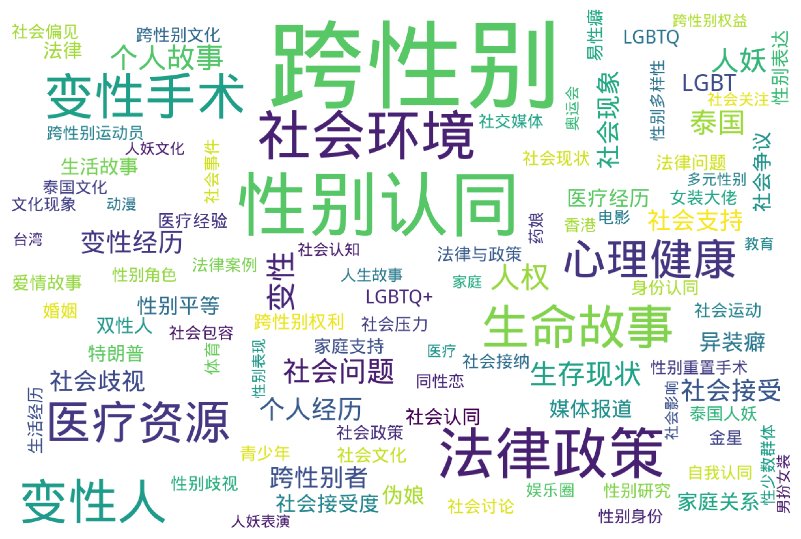

# 跨性别与多元性别新闻网页档案库 数据分析
*生成日期：2025-02-18*

## 执行摘要
本报告分析了 3,618 个项目的时间分布和主题分类。

## 时间分布

### 年度明细

| 年份 | 数量 |
|------|-------|
| 2025 | 14 |
| 2024 | 612 |
| 2023 | 340 |
| 2022 | 204 |
| 2021 | 266 |
| 2020 | 160 |
| 2019 | 130 |
| 2018 | 174 |
| 2017 | 201 |
| 2016 | 163 |
| 2015 | 196 |
| 2014 | 131 |
| 2013 | 94 |
| 2012 | 98 |
| 2011 | 54 |
| 2010 | 111 |
| 2009 | 117 |
| 2008 | 80 |
| 2007 | 94 |
| 2006 | 103 |
| 2005 | 84 |
| 2004 | 101 |
| 2003 | 43 |
| 2002 | 27 |
| 2001 | 13 |
| 2000 | 2 |
| 1999 | 1 |
| 1996 | 4 |
| 1992 | 1 |

## 地区分布

  `中国大陆: 1,678 (43.2%)`  `未知: 537 (13.8%)`  `美国: 467 (12.0%)`  `泰国: 244 (6.3%)`  `台湾: 216 (5.6%)`  `香港: 130 (3.3%)`  `英国: 71 (1.8%)`  `日本: 57 (1.5%)`  `新加坡: 41 (1.1%)`  `韩国: 35 (0.9%)`  `德国: 29 (0.7%)`  `印度: 26 (0.7%)`  `巴西: 21 (0.5%)`  `俄罗斯: 20 (0.5%)`  `澳大利亚: 20 (0.5%)`  `菲律宾: 19 (0.5%)`  `新西兰: 17 (0.4%)`  `加拿大: 16 (0.4%)`  `阿根廷: 14 (0.4%)`  `马来西亚: 11 (0.3%)`  `巴基斯坦: 8 (0.2%)`  `天津市: 7 (0.2%)`  `意大利: 6 (0.2%)`  `丹麦: 5 (0.1%)`  `国际: 5 (0.1%)`  `法国: 5 (0.1%)`  `四川，中国: 4 (0.1%)`  `广西: 4 (0.1%)`  `苏格兰: 4 (0.1%)`  `荷兰: 4 (0.1%)`  `西班牙: 4 (0.1%)`  `中国: 3 (0.1%)`  `印尼: 3 (0.1%)`  `古巴: 3 (0.1%)`  `四川: 3 (0.1%)`  `墨西哥: 3 (0.1%)`  `尼泊尔: 3 (0.1%)`  `广东: 3 (0.1%)`  `浙江省: 3 (0.1%)`  `瑞士: 3 (0.1%)`  `福建省: 3 (0.1%)`  `秘鲁: 3 (0.1%)`  `越南: 3 (0.1%)`  `中国吉林省: 2 (0.1%)`  `中国大陆，中国: 2 (0.1%)`  `乌克兰: 2 (0.1%)`  `亚洲: 2 (0.1%)`  `伊朗: 2 (0.1%)`  `加纳: 2 (0.1%)`  `匈牙利: 2 (0.1%)`  `哥伦比亚: 2 (0.1%)`  `土耳其: 2 (0.1%)`  `安徽: 2 (0.1%)`  `巴西圣保罗: 2 (0.1%)`  `广东省，中国: 2 (0.1%)`  `捷克: 2 (0.1%)`  `柬埔寨: 2 (0.1%)`  `江苏省: 2 (0.1%)`  `河北省: 2 (0.1%)`  `泰国普吉岛: 2 (0.1%)`  `湖南省: 2 (0.1%)`  `瑞典: 2 (0.1%)`  `阿尔及利亚: 2 (0.1%)`  `东亚: 1 (0.0%)`  `东京，日本: 1 (0.0%)`  `东南亚: 1 (0.0%)`  `中国与泰国: 1 (0.0%)`  `中国广西，泰国: 1 (0.0%)`  `中国成都: 1 (0.0%)`  `亚伯塔省: 1 (0.0%)`  `亚美尼亚: 1 (0.0%)`  `以色列: 1 (0.0%)`  `保加利亚: 1 (0.0%)`  `全球: 1 (0.0%)`  `内蒙古自治区: 1 (0.0%)`  `内蒙古自治区，中国: 1 (0.0%)`  `加沙，巴勒斯坦: 1 (0.0%)`  `加泰罗尼亚: 1 (0.0%)`  `北京, 中国: 1 (0.0%)`  `印度北方邦: 1 (0.0%)`  `印度安得拉邦: 1 (0.0%)`  `印度尼西亚: 1 (0.0%)`  `台湾、新北市、三峡区: 1 (0.0%)`  `台湾、日本: 1 (0.0%)`  `台湾省: 1 (0.0%)`  `台湾，中国大陆: 1 (0.0%)`  `台灣: 1 (0.0%)`  `四川，中国大陆: 1 (0.0%)`  `圭亚那: 1 (0.0%)`  `大连, 中国: 1 (0.0%)`  `大陆: 1 (0.0%)`  `安徽省: 1 (0.0%)`  `山东省, 中国: 1 (0.0%)`  `山东，中国: 1 (0.0%)`  `山西省, 中国: 1 (0.0%)`  `岛国: 1 (0.0%)`  `巴拿马: 1 (0.0%)`  `常德，中国大陆: 1 (0.0%)`  `广东佛山, 中国: 1 (0.0%)`  `广东，中国: 1 (0.0%)`  `广西，中国: 1 (0.0%)`  `挪威: 1 (0.0%)`  `新疆: 1 (0.0%)`  `日本爱媛: 1 (0.0%)`  `智利: 1 (0.0%)`  `曼谷: 1 (0.0%)`  `未指定: 1 (0.0%)`  `未确认: 1 (0.0%)`  `格鲁吉亚: 1 (0.0%)`  `欧洲: 1 (0.0%)`  `比利时: 1 (0.0%)`  `江苏省盐城市: 1 (0.0%)`  `江西: 1 (0.0%)`  `河北，中国: 1 (0.0%)`  `河南: 1 (0.0%)`  `河南省，中国: 1 (0.0%)`  `泰国/中国: 1 (0.0%)`  `泰国、老挝: 1 (0.0%)`  `泰国芭堤雅: 1 (0.0%)`  `浙江: 1 (0.0%)`  `浙江温州: 1 (0.0%)`  `浙江湖州: 1 (0.0%)`  `浙江省，中国: 1 (0.0%)`  `浙江，中国: 1 (0.0%)`  `海南，中国: 1 (0.0%)`  `温州，中国: 1 (0.0%)`  `湖北: 1 (0.0%)`  `湖北省: 1 (0.0%)`  `爱尔兰: 1 (0.0%)`  `福建: 1 (0.0%)`  `福建，中国: 1 (0.0%)`  `约旦: 1 (0.0%)`  `纽西兰: 1 (0.0%)`  `缅甸: 1 (0.0%)`  `美国, 英国: 1 (0.0%)`  `美国俄克拉荷马州: 1 (0.0%)`  `美国密苏里州: 1 (0.0%)`  `美属萨摩亚: 1 (0.0%)`  `美洲: 1 (0.0%)`  `芬兰: 1 (0.0%)`  `辽宁: 1 (0.0%)`  `辽宁，中国: 1 (0.0%)`  `马来西亚槟州: 1 (0.0%)`  `马来西亚，台湾: 1 (0.0%)`  `马来西亚，砂拉越: 1 (0.0%)`  `黎巴嫩: 1 (0.0%)`

## 主题分析

### 标签词云

### 热门标签

**前50个热门标签：**

  `跨性别: 2,666`  `性别认同: 1,220`  `法律政策: 717`  `社会环境: 673`  `变性手术: 573`  `变性人: 537`  `生命故事: 509`  `医疗资源: 474`  `心理健康: 425`  `变性: 173`  `人权: 168`  `个人故事: 155`  `社会问题: 146`  `生存现状: 144`  `人妖: 142`  `泰国: 142`  `个人经历: 123`  `变性经历: 123`  `社会接受: 119`  `社会现象: 114`  `跨性别者: 113`  `社会支持: 109`  `社会歧视: 109`  `LGBT: 101`  `异装癖: 92`  `伪娘: 86`  `媒体报道: 82`  `社会接受度: 82`  `医疗经历: 81`  `家庭关系: 81`  `性别平等: 81`  `社会争议: 78`  `法律: 75`  `生活故事: 75`  `LGBTQ: 71`  `双性人: 69`  `性别表达: 69`  `特朗普: 69`  `LGBTQ+: 68`  `社会认同: 68`  `跨性别权利: 65`  `社会文化: 62`  `爱情故事: 61`  `医疗经验: 60`  `婚姻: 59`  `易性癖: 59`  `法律问题: 58`  `家庭支持: 56`  `青少年: 53`  `性别研究: 52`

查看更多标签

 `体育: 51` `社会讨论: 51` `身份认同: 51` `社会现状: 50` `金星: 50` `泰国人妖: 49` `社会运动: 49` `跨性别文化: 48` `女装大佬: 47` `性别歧视: 47` `社会偏见: 47` `法律与政策: 46` `社会政策: 46` `生活经历: 45` `社会压力: 45` `社会接纳: 45` `娱乐圈: 43` `性别身份: 43` `法律案例: 43` `泰国文化: 43` `性别重置手术: 42` `跨性别运动员: 42` `同性恋: 41` `性别角色: 41` `药娘: 41` `香港: 41` `性别多样性: 40` `社会事件: 40` `电影: 39` `性少数群体: 38` `文化现象: 38` `社交媒体: 38` `社会包容: 38` `自我认同: 38` `社会关注: 36` `社会认知: 36` `人生故事: 35` `社会影响: 33` `人妖表演: 32` `医疗: 32` `奥运会: 32` `动漫: 31` `教育: 31` `男扮女装: 31` `人妖文化: 30` `台湾: 30` `跨性别权益: 30` `多元性别: 29` `家庭: 29` `性别表现: 29` `社会态度: 29` `社会评论: 29` `日本: 28` `社会反响: 28` `马斯克: 28` `法律诉讼: 27` `非二元性别: 27` `LGBT权利: 26` `性别: 26` `文化: 26` `爱情: 26` `美国: 26` `跨性别经历: 26` `选美: 26` `医疗政策: 25` `女性身份: 25` `性别认知: 25` `整形手术: 25` `时尚: 25` `未成年人: 25` `社会: 25` `跨性别故事: 25` `运动员: 25` `选美比赛: 25` `文化研究: 24` `游戏: 24` `新加坡: 23` `就业歧视: 22` `心理咨询: 22` `伪娘文化: 21` `体育争议: 21` `历史: 21` `国际奥委会: 21` `性别争议: 21` `河莉秀: 21` `社会观察: 21` `网络文化: 21` `两性畸形: 20` `娱乐: 20` `性别教育: 20` `政治: 20` `荷尔蒙治疗: 20` `表演艺术: 20` `巴黎奥运会: 19` `心理学: 19` `性别焦虑: 19` `李银河: 19` `跨性别医疗: 19` `J.K.罗琳: 18` `娘炮: 18` `性别政策: 18` `情感经历: 18` `歧视: 18` `社会舆论: 18` `艾滋病: 18` `角色扮演: 18` `二次元文化: 17` `体育政策: 17` `印度: 17` `家庭教育: 17` `性别转换: 17` `新闻报道: 17` `法律案件: 17` `社会性别: 17` `艺术: 17` `过渡经历: 17` `人生经历: 16` `军队政策: 16` `医学: 16` `奥巴马: 16` `女装: 16` `川普: 16` `性别认同障碍: 16` `性取向: 16` `成长故事: 16` `抑郁症: 16` `模特: 16` `法律与社会: 16` `社会新闻: 16` `变性故事: 15` `德国: 15` `心理支持: 15` `整容: 15` `社会反应: 15` `社会环境记录: 15` `网络暴力: 15` `美国政治: 15` `东京奥运会: 14` `二次元: 14` `俄罗斯: 14` `医疗伦理: 14` `女性运动员: 14` `性别平权: 14` `暴力事件: 14` `泰国旅游: 14` `游戏文化: 14` `激素治疗: 14` `真实记录: 14` `社会议题: 14` `纪录片: 14` `自杀: 14` `角色分析: 14` `选美大赛: 14` `医学研究: 13` `医学资源: 13` `医疗事故: 13` `医疗规范: 13` `女性权益: 13` `张克莎: 13` `性别多元: 13` `性别流动: 13` `性别流动性: 13` `性别焦虑症: 13` `手术经历: 13` `社会挑战: 13` `联合国: 13` `跨性别角色: 13` `跨性别议题: 13` `阿根廷: 13` `军事政策: 12` `反歧视: 12` `娱乐新闻: 12` `婚礼: 12` `心理治疗: 12` `怀孕: 12` `性别变更: 12` `性别认定: 12` `性别问题: 12` `性教育: 12` `文化活动: 12` `易性病: 12` `生理性别: 12` `真实故事: 12` `精神健康: 12` `菲律宾: 12` `个人成长: 11` `中国: 11` `健康: 11` `医学伦理: 11` `医疗风险: 11` `卫生部: 11` `变装文化: 11` `女性权利: 11` `心理挣扎: 11` `心理辅导: 11` `性别过渡: 11` `抑郁: 11` `拜登: 11` `拳击: 11` `政治正确: 11` `教育政策: 11` `文学: 11` `旅游: 11` `演艺圈: 11` `生存状态: 11` `生育: 11` `电影评论: 11` `社会学: 11` `美军: 11` `自传: 11` `舞蹈: 11` `运动员经历: 11` `非法行医: 11` `人妖选美: 10` `军队: 10` `动漫角色: 10` `反串: 10` `变装皇后: 10` `女性主义: 10` `女权主义: 10` `好莱坞: 10` `娘炮文化: 10` `平权运动: 10` `心理性别: 10` `性别自决法: 10` `性转: 10` `情感关系: 10` `政策: 10` `文化交流: 10` `文化分析: 10` `文化差异: 10` `林郁婷: 10` `漫画: 10` `社会包容性: 10` `社会变迁: 10` `社会正义: 10` `社会调查: 10` `第三性别: 10` `跨性别手术: 10` `跨性别政策: 10` `选秀节目: 10` `ACG文化: 9` `COSPLAY: 9` `亲子关系: 9` `假两性畸形: 9` `儿童: 9` `免疫系统: 9` `公平竞争: 9` `军人: 9` `利菁: 9` `医学经验: 9` `医疗旅游: 9` `医疗服务: 9` `医疗费用: 9` `哈伯德: 9` `多元文化: 9` `平权: 9` `性别意识: 9` `整形外科: 9` `文化影响: 9` `文化讨论: 9` `日本文化: 9` `易建联: 9` `法律纠纷: 9` `生存故事: 9` `监狱: 9` `社会批判: 9` `社会活动: 9` `社会话题: 9` `网络红人: 9` `诈骗: 9` `跨性别女性: 9` `跨性别艺术: 9` `身份证: 9` `酷儿理论: 9` `陈莉莉: 9` `雌激素: 9` `青少年心理: 9` `JK罗琳: 8` `LGBTI: 8` `个体故事: 8` `劳动法: 8` `劳蕾尔·哈伯德: 8` `包容性: 8` `医疗干预: 8` `变性人权利: 8` `变性者: 8` `婚姻权利: 8` `媒体: 8` `巴基斯坦: 8` `巴西: 8` `异装: 8` `心理状态: 8` `心理经历: 8` `心理评估: 8` `性别理论: 8` `性别重塑: 8` `情感故事: 8` `校园文化: 8` `法律判决: 8` `环球小姐: 8` `生存状况: 8` `电影分析: 8` `研究: 8` `社会变革: 8` `社会理解: 8` `网红: 8` `美国军队: 8` `艺术展览: 8` `艺术表现: 8` `轻小说: 8` `道德模范: 8` `陈焕然: 8` `韩国: 8` `人妖秀: 7` `体育竞技: 7` `儿童医疗: 7` `儿童心理: 7` `军事: 7` `刘婷: 7` `医疗安全: 7` `变性人故事: 7` `变性人经历: 7` `变性人选美: 7` `变装: 7` `同性婚姻: 7` `哈利·波特: 7` `多元化: 7` `女性: 7` `婚姻法: 7` `征兵: 7` `性别酷儿: 7` `性别重置: 7` `性工作者: 7` `手术: 7` `抗议: 7` `拜登政府: 7` `摄影: 7` `文化战争: 7` `新闻: 7` `易性症: 7` `法律改革: 7` `游戏设计: 7` `激素替代疗法: 7` `生殖健康: 7` `生活方式: 7` `男性气质: 7` `监狱政策: 7` `睾酮治疗: 7` `社会压迫: 7` `社会困境: 7` `社会宽容: 7` `社会研究: 7` `社会责任: 7` `美国大选: 7` `美国最高法院: 7` `自我表达: 7` `言论自由: 7` `跨性别研究: 7` `跨性别群体: 7` `跨性别者权益: 7` `迪士尼: 7` `避孕药: 7` `酷儿: 7` `隐私权: 7` `龙腾世纪: 7` `LGBTQIA+: 6` `LGBTQ权利: 6` `cosplay: 6` `两性人: 6` `个体经历: 6` `人权问题: 6` `人际关系: 6` `体育公平: 6` `公共卫生: 6` `公益活动: 6` `军队服役: 6` `动画: 6` `医疗保险: 6` `双性恋: 6` `反串表演: 6` `变性美女: 6` `变性艺人: 6` `国际不再恐同日: 6` `国际赛事: 6` `多样性: 6` `女扮男装: 6` `婚姻法律: 6` `婚姻生活: 6` `家庭压力: 6` `家庭故事: 6` `巴黎奥运: 6` `市长: 6` `平等权利: 6` `影视评论: 6` `快乐男声: 6` `性侵: 6` `性别包容: 6` `性别友善厕所: 6` `性别文化: 6` `性别转变: 6` `成长经历: 6` `手术过程: 6` `扭转治疗: 6` `文化探讨: 6` `旅游安全: 6` `校园暴力: 6` `法律权利: 6` `法律法规: 6` `法律责任: 6` `法院判决: 6` `泰国变性人: 6` `海吉拉斯: 6` `游行: 6` `演艺事业: 6` `生命经历: 6` `生活现状: 6` `电击治疗: 6` `男娘: 6` `社交媒体影响: 6` `社会冲突: 6` `社会心理: 6` `社会权益: 6` `社会观念: 6` `社会认可: 6` `社区支持: 6` `离婚: 6` `精神疾病: 6` `艺术表达: 6` `蕾切尔·莱文: 6` `觉醒文化: 6` `足球: 6` `跨性别教育: 6` `跨性别问题: 6` `青少年变性: 6` `青春期: 6` `音乐: 6` `ACG: 5` `J·K·罗琳: 5` `争议: 5` `仇恨犯罪: 5` `体育伦理: 5` `体育公平性: 5` `体育新闻: 5` `体育赛事: 5` `健康问题: 5` `健康风险: 5` `儿童性别认同: 5` `儿童教育: 5` `儿童权益: 5` `公平性: 5` `出柜经历: 5` `刘著: 5` `刘霆: 5` `医疗保健: 5` `医疗支持: 5` `医疗案例: 5` `医疗法律: 5` `变性运动员: 5` `哈利夫: 5` `四星上将: 5` `国际关系: 5` `基督教: 5` `女子拳击: 5` `女性经历: 5` `娱乐活动: 5` `婚姻登记: 5` `家庭生活: 5` `家庭矛盾: 5` `平等就业权: 5` `异性癖: 5` `影视: 5` `心理压力: 5` `性别不安: 5` `性别差异: 5` `性别政治: 5` `性别权利: 5` `性别模糊: 5` `性别登记: 5` `性别确认: 5` `性别确认手术: 5` `性别肯定护理: 5` `性别观念: 5` `性发育异常: 5` `性工作: 5` `性文化: 5` `政治争议: 5` `文化反思: 5` `文化表达: 5` `新冠疫情: 5` `旅游业: 5` `日本动漫: 5` `朱迪斯·巴特勒: 5` `权益: 5` `武汉: 5` `沈阳: 5` `法律权益: 5` `演出: 5` `澳大利亚: 5` `特朗普政府: 5` `生命故事与过渡经历: 5` `生育问题: 5` `电子游戏: 5` `电视剧: 5` `男性穿女装: 5` `盗窃: 5` `真两性畸形: 5` `真实经历: 5` `社会关怀: 5` `社会平等: 5` `社会批评: 5` `社会报道: 5` `社会政治: 5` `社会现实: 5` `社会进步: 5` `第三性: 5` `经历分享: 5` `经济压力: 5` `美丽: 5` `艺人: 5` `艺术表演: 5` `苏格兰: 5` `英国: 5` `角色扮演游戏: 5` `调查: 5` `跨性别人士: 5` `跨性别健康: 5` `身份证性别更改: 5` `运动: 5` `运动公平性: 5` `运动员权益: 5` `选举: 5` `酷儿文化: 5` `重庆: 5` `隆胸: 5` `隆胸手术: 5` `雌性激素: 5` `青春: 5` `高婷婷: 5` `高尔夫: 5` `龙腾世纪4: 5` `Drag Queen: 4` `LGBTQ+权益: 4` `LGBTQ权益: 4` `NCAA: 4` `Z世代: 4` `上海: 4` `丑闻: 4` `东亚文化: 4` `中国游客: 4` `中国社会: 4` `举重: 4` `何清濂: 4` `健康知识: 4` `儿童保护: 4` `儿童健康: 4` `儿童变性: 4` `公众人物: 4` `公众反应: 4` `公共讨论: 4` `内分泌: 4` `出家: 4` `劳雷尔·哈伯德: 4` `北京: 4` `医学案例: 4` `医学知识: 4` `医学科普: 4` `医患关系: 4` `医疗保障: 4` `医疗手术: 4` `医疗权益: 4` `医疗研究: 4` `卖淫: 4` `变性模特: 4` `古代文化: 4` `古巴: 4` `同志: 4` `同志游行: 4` `和尚: 4` `国际特赦组织: 4` `多学科门诊: 4` `大学生: 4` `奥巴马政府: 4` `女变男: 4` `女子举重: 4` `女性健康: 4` `娘炮现象: 4` `娱乐行业: 4` `婚姻故事: 4` `婚姻条例: 4` `婚姻问题: 4` `媒体影响: 4` `嫖娼事件: 4` `审美: 4` `家庭冲突: 4` `家庭影响: 4` `家庭暴力: 4` `寿命: 4` `尼泊尔: 4` `广告: 4` `开放组别: 4` `影视作品: 4` `德克萨斯州: 4` `心理: 4` `心理体验: 4` `心理分析: 4` `心理创伤: 4` `性健康: 4` `性别不一致: 4` `性别光谱: 4` `性别公平: 4` `性别确认治疗: 4` `性别肯定治疗: 4` `性别鉴定: 4` `情感: 4` `情感理论: 4` `情感生活: 4` `手术经验: 4` `扫毒: 4` `抗议活动: 4` `抢劫: 4` `护照: 4` `拳击比赛: 4` `政治参与: 4` `政策研究: 4` `数据统计: 4` `整形: 4` `文化历史: 4` `文化多样性: 4` `文化批评: 4` `文化艺术: 4` `文化表现: 4` `文学艺术: 4` `日本动画: 4` `日本漫画: 4` `曼谷: 4` `服装设计: 4` `未成年: 4` `格雷森·佩里: 4` `案例分析: 4` `河南: 4` `法律与社会环境: 4` `法律争议: 4` `法律伦理: 4` `法律身份: 4` `法案: 4` `法治: 4` `泛性恋: 4` `流行文化: 4` `海吉拉: 4` `游戏开发: 4` `游泳赛事: 4` `焦虑: 4` `父母: 4` `玩家反应: 4` `生存权利: 4` `田纳西州: 4` `男变女: 4` `男性身份: 4` `男男性行为者: 4` `社会意识: 4` `科学研究: 4` `精神医学: 4` `经济影响: 4` `维权: 4` `网络直播: 4` `网络舆论: 4` `美国国防部: 4` `自宫: 4` `自我探索: 4` `自我接纳: 4` `自杀率: 4` `艺术家: 4` `艺术展: 4` `艾比: 4` `荷尔蒙疗法: 4` `行政命令: 4` `表演: 4` `角色设计: 4` `贺锦丽: 4` `跨性别电影: 4` `跨性别者经历: 4` `跨性别艺术家: 4` `身份证更改: 4` `阿曼达·辛普森: 4` `雄性激素: 4` `青少年心理健康: 4` `香港大学: 4` `马来西亚: 4` `骄傲月: 4` `黄宁倩: 4` `DC电影: 3` `DEI: 3` `DEI政策: 3` `JK·罗琳: 3` `LGBT+: 3` `LGBTQ+权利: 3` `LGBTQI+: 3` `LGBT文化: 3` `LGBT群体: 3` `Poyd: 3` `Sneaky: 3` `TED演讲: 3` `binary: 3` `万圣节: 3` `世卫组织: 3` `世界泳联: 3` `个人奋斗: 3` `个人隐私: 3` `中国古代: 3` `中性厕所: 3` `丹尼尔·雷德克里夫: 3` `丹麦女孩: 3` `乌克兰: 3` `乳腺癌: 3` `京剧: 3` `亲密关系: 3` `亲情: 3` `人口普查: 3` `人妖皇后: 3` `人权观察: 3` `人权运动: 3` `代孕: 3` `伴侣盟: 3` `体育比赛: 3` `体育运动: 3` `佛教: 3` `健美: 3` `偶像崇拜: 3` `偽娘: 3` `儿童与青少年: 3` `儿童变性手术: 3` `儿童青少年: 3` `克里斯·贝克: 3` `免术换证: 3` `公众讨论: 3` `公共安全: 3` `公共设施: 3` `公投: 3` `共和党: 3` `兵役: 3` `出生证明: 3` `利亚·托马斯: 3` `加州: 3` `勇气: 3` `化妆技巧: 3` `医学与法律: 3` `医生: 3` `医疗与法律: 3` `医疗纠纷: 3` `医疗经验分享: 3` `华裔: 3` `卖淫嫖娼: 3` `卡玛拉·哈里斯: 3` `历史人物: 3` `历史性任命: 3` `厕所令: 3` `厦门: 3` `反串演员: 3` `反映生存现状: 3` `取消文化: 3` `变性人参军: 3` `变性人权益: 3` `变性人选美大赛: 3` `变性军人: 3` `变性女性: 3` `变性学生: 3` `变性治疗: 3` `变装艺术: 3` `口述历史: 3` `吉米: 3` `名人: 3` `名誉权: 3` `后悔经历: 3` `后街女孩: 3` `吸毒: 3` `哈利波特: 3` `商业化: 3` `四川大学华西医院: 3` `国际妇女节: 3` `国际政治: 3` `国际泳联: 3` `国际皇后小姐: 3` `复旦大学: 3` `天主教: 3` `奥运冠军: 3` `女子体育: 3` `女子游泳: 3` `女性化: 3` `女性小说奖: 3` `女性艺术: 3` `女性荷尔蒙: 3` `女性角色: 3` `女性运动: 3` `女演员: 3` `女篮球员: 3` `婚姻与爱情: 3` `婚姻合法化: 3` `婚姻平权: 3` `媒体利用: 3` `媒体采访: 3` `嫖娼: 3` `孤独: 3` `学生: 3` `审美多元: 3` `小A辣: 3` `小美人鱼: 3` `就业机会: 3` `就业权: 3` `尼莫: 3` `平权与反歧视: 3` `并发症: 3` `广电总局: 3` `异装癖者: 3` `张家辉: 3` `强奸案: 3` `当代艺术: 3` `征婚: 3` `心理历程: 3` `怀孕经历: 3` `性丑闻: 3` `性倾向: 3` `性别与身份: 3` `性别医疗: 3` `性别友善洗手间: 3` `性别发育异常: 3` `性别困惑: 3` `性别手术: 3` `性别扭转治疗: 3` `性别检查: 3` `性别烦躁: 3` `性别确认护理: 3` `性别肯定: 3` `性别认知障碍: 3` `性别议题: 3` `性别选择: 3` `性别重建: 3` `性心理: 3` `性激素: 3` `性骚扰: 3` `患者故事: 3` `患者权益: 3` `患者经历: 3` `情感交流: 3` `情感体验: 3` `意大利: 3` `成都: 3` `手术风险: 3` `抢劫案件: 3` `招生政策: 3` `政府政策: 3` `政治广告: 3` `政策变化: 3` `政策变更: 3` `政策影响: 3` `政策法规: 3` `教育制度: 3` `教育权利: 3` `教育法: 3` `整容手术: 3` `整形美容: 3` `文化争议: 3` `文化冲突: 3` `文化变迁: 3` `文化政策: 3` `文化禁忌: 3` `文化背景: 3` `文化表演: 3` `文化观察: 3` `文化认同: 3` `文化评论: 3` `文学创作: 3` `新加坡法律: 3` `新西兰: 3` `无性别: 3` `无性恋: 3` `时尚文化: 3` `时尚界: 3` `明星: 3` `易装癖: 3` `春菜爱: 3` `暴力: 3` `暴力与歧视: 3` `最高法院: 3` `服役: 3` `未成年人权益: 3` `权利: 3` `权益保护: 3` `权益保障: 3` `李雯雯: 3` `校园欺凌: 3` `校园霸凌: 3` `案例研究: 3` `次文化: 3` `母子关系: 3` `毒品犯罪: 3` `民主党: 3` `民权法案: 3` `求职经历: 3` `污名化: 3` `法国: 3` `法律承认: 3` `法律挑战: 3` `法律援助: 3` `法律政策与社会环境记录: 3` `法律维权: 3` `法律认可: 3` `泰国医疗: 3` `泰国旅行: 3` `泰国社会: 3` `泰拳: 3` `深圳: 3` `温州: 3` `游戏体验: 3` `游戏新闻: 3` `游戏角色: 3` `游泳: 3` `激素: 3` `激素疗法: 3` `玩家反馈: 3` `现代舞: 3` `生存困境: 3` `生存挑战: 3` `生活状况调查: 3` `生物医学: 3` `生理差异: 3` `电影节: 3` `男同性恋: 3` `男性假两性畸形: 3` `男性形象: 3` `白人特权: 3` `白宫: 3` `监狱制度: 3` `真实案例: 3` `睾酮水平: 3` `矫正治疗: 3` `研究资料: 3` `社交平台: 3` `社会伦理: 3` `社会公平: 3` `社会公正: 3` `社会参与: 3` `社会反思: 3` `社会安全: 3` `社会尊重: 3` `社会抗议: 3` `社会权利: 3` `社会法律: 3` `社会科学: 3` `社会融合: 3` `社会风气: 3` `秘鲁: 3` `空姐: 3` `立法: 3` `竞技体育: 3` `精神卫生: 3` `经验分享: 3` `统计数据: 3` `综合格斗: 3` `网络征婚: 3` `网络讨论: 3` `网络谣言: 3` `网络贩卖: 3` `罗琳: 3` `美国政府: 3` `美国社会: 3` `职业发展: 3` `职场歧视: 3` `职场生存: 3` `自决法: 3` `自杀事件: 3` `舆论压力: 3` `舞台剧: 3` `航空公司: 3` `艺术与文化: 3` `艺术作品: 3` `艺术创作: 3` `艺术史: 3` `艺术节: 3` `艾伦·佩吉: 3` `艾滋病规划署: 3` `药物影响: 3` `药物治疗: 3` `荷兰: 3` `虚拟现实: 3` `蝙蝠女: 3` `补佳乐: 3` `解惠清: 3` `评论: 3` `贵州: 3` `跨性別: 3` `跨性别儿童: 3` `跨性别历史: 3` `跨性别护理: 3` `跨性别模特: 3` `跨性别热线: 3` `跨性别者故事: 3` `跨性别表达: 3` `跨性别运动: 3` `跨性别青少年: 3` `身份认证: 3` `邹景贵: 3` `酷儿艺术: 3` `重婚罪: 3` `长沙: 3` `阴道成形术: 3` `雄激素: 3` `雌激素治疗: 3` `雷切尔·莱文: 3` `青年文化: 3` `青春故事: 3` `青春期阻滞剂: 3` `韦尔斯利学院: 3` `香港终审法院: 3` `骗婚: 3` `鱿鱼游戏: 3` `黄海波: 3` `3D动画: 2` `ACGN: 2` `ACGN文化: 2` `Apple Watch: 2` `BioWare: 2` `CD变装: 2` `Cosplay: 2` `DC漫画: 2` `DSD: 2` `Elliot Page: 2` `HIV感染: 2` `HRT: 2` `J.K. 罗琳: 2` `LGBTQ群体: 2` `LGBT权益: 2` `LGBT电影: 2` `LPGA: 2` `Mx称谓: 2` `Nature期刊: 2` `PS4: 2` `SB5599法案: 2` `Switch: 2` `TS: 2` `Tony Marchant: 2` `WPATH: 2` `Wu Tsang: 2` `《三体》: 2` `世界杯: 2` `世界田联: 2` `东南亚: 2` `两性关系: 2` `个人自由: 2` `个人转变: 2` `个人选择: 2` `个性表达: 2` `个案研究: 2` `中华文化: 2` `中国富豪: 2` `中国文化: 2` `中国男子: 2` `中国跨性别者: 2` `丹麦: 2` `云南: 2` `云图: 2` `五角大楼: 2` `亚洲: 2` `人工智能: 2` `人权法案: 2` `人生密密缝: 2` `人道主义: 2` `仇恨犯罪法案: 2` `任命: 2` `伊能静: 2` `传统与现代: 2` `传统价值观: 2` `伦理道德: 2` `伦理问题: 2` `伪娘动漫: 2` `伪娘现象: 2` `体育与性别: 2` `体育事件: 2` `体育包容性: 2` `体育权利: 2` `佛罗里达州: 2` `俄亥俄州: 2` `保加利亚: 2` `保守派: 2` `偏见: 2` `健康与福祉: 2` `健康护理: 2` `健康检查: 2` `健康研究: 2` `健身: 2` `儿童性教育: 2` `儿童成长: 2` `儿童权利: 2` `儿童福利: 2` `兄妹故事: 2` `克苏鲁神话: 2` `克莉芙: 2` `免疫反应: 2` `公众反响: 2` `公共卫生服务军官团: 2` `公共卫生间: 2` `公共厕所: 2` `公平竞赛: 2` `公益基金: 2` `公益组织: 2` `共情: 2` `内心挣扎: 2` `军人权利: 2` `凯特琳·詹娜: 2` `凯特琳·詹纳: 2` `出柜: 2` `刘昌福: 2` `刻板印象: 2` `动漫展: 2` `动漫推荐: 2` `动漫文化: 2` `动画推荐: 2` `劳动争议: 2` `勇气与坚持: 2` `包容性教育: 2` `医保: 2` `医务工作者: 2` `医学历史: 2` `医学支持: 2` `医疗争议: 2` `医疗建议: 2` `医疗技术: 2` `医疗监管: 2` `医疗管理: 2` `医疗美容: 2` `医疗证明: 2` `医疗责任: 2` `医疗资源与经验: 2` `医疗资源与经验分享: 2` `医疗转变: 2` `医療经验: 2` `医院报道: 2` `华人社会: 2` `华盛顿州: 2` `华裔艺术家: 2` `华西医院: 2` `华语电影: 2` `卡里尼: 2` `卫生政策: 2` `卫生部规定: 2` `卫生间使用: 2` `印度文化: 2` `印度新闻: 2` `历史分析: 2` `历史性事件: 2` `历史性提名: 2` `历史故事: 2` `历史文化: 2` `历史研究: 2` `历史记忆: 2` `厕所: 2` `厕所问题: 2` `去性别转换: 2` `参军禁令: 2` `双性人权利: 2` `双胞胎: 2` `反歧视法律: 2` `变性人参军禁令: 2` `变性人士: 2` `变性人文化: 2` `变性人群体: 2` `变性人角色: 2` `变性人运动员: 2` `变性医学: 2` `变性后悔: 2` `变性歌手: 2` `变性艺术家: 2` `变性药: 2` `变性药物: 2` `变性选手: 2` `变性问题: 2` `变装癖: 2` `变装表演: 2` `台北高等行政法院: 2` `台湾伴侣权益推动联盟: 2` `台湾政治: 2` `台湾文化: 2` `司法判决: 2` `吉林省: 2` `同人创作: 2` `同人文化: 2` `同婚: 2` `同志文化: 2` `同志电影: 2` `同志运动: 2` `名人故事: 2` `后悔变性: 2` `吕克·贝松: 2` `命案: 2` `哲学: 2` `唐凤: 2` `商业潜力: 2` `喜剧: 2` `四川: 2` `国际新闻: 2` `国际比较: 2` `国际法: 2` `国际自行车联盟: 2` `圣诞节: 2` `埃隆·马斯克: 2` `塔拉茨科娃: 2` `墨尔本: 2` `声音整形: 2` `复旦大学附属儿科医院: 2` `多元化与包容性: 2` `多样性与包容性: 2` `大卫·赖默: 2` `大学生活: 2` `大选: 2` `天津: 2` `奖学金: 2` `奥巴马医保: 2` `奥林匹克运动会: 2` `奥运: 2` `女同性恋: 2` `女囚: 2` `女子篮球: 2` `女性主义艺术: 2` `女性体育: 2` `女性作家: 2` `女性假两性畸形: 2` `女性化教育: 2` `女性变性人: 2` `女性性别认同: 2` `女性故事: 2` `女性气质: 2` `女性运动员权益: 2` `女装山脉: 2` `女足: 2` `如厕权: 2` `妇女权益: 2` `妮莎: 2` `姓名更改: 2` `娘化现象: 2` `娘娘腔: 2` `娜蒂: 2` `娱乐产业: 2` `娱乐文化: 2` `婚姻与家庭: 2` `婚姻与离婚: 2` `婚姻关系: 2` `婚姻制度: 2` `婚姻家庭: 2` `婚姻无效: 2` `婚姻权: 2` `婚姻经历: 2` `媒体政策: 2` `媒体讨论: 2` `媒体评论: 2` `子宫移植: 2` `学生权益: 2` `学生隐私: 2` `宇多田光: 2` `宗教自由: 2` `审查: 2` `家庭不理解: 2` `家庭剧: 2` `家庭经历: 2` `家庭结构: 2` `家庭责任: 2` `家族支持: 2` `家暴: 2` `家长教育: 2` `尤兰达: 2` `就业困境: 2` `就业权利: 2` `山东: 2` `市场研究: 2` `平等就业: 2` `平等待遇: 2` `平等机会: 2` `平等机会委员会: 2` `年轻人: 2` `幽默: 2` `广州: 2` `广西: 2` `异世界转生: 2` `异性恋: 2` `异装文化: 2` `张国荣: 2` `强制异性恋: 2` `强奸: 2` `心理准备: 2` `心理变化: 2` `心理困境: 2` `心理学研究: 2` `心理影响: 2` `心理成长: 2` `心理疾病: 2` `心理转变: 2` `心理问题: 2` `性与性别: 2` `性产业: 2` `性侵犯: 2` `性别中立: 2` `性别关系: 2` `性别医学: 2` `性别多元性: 2` `性别定义: 2` `性别少数群体: 2` `性别差距: 2` `性别平等教育: 2` `性别心理: 2` `性别意识形态: 2` `性别扮演: 2` `性别承认法案: 2` `性别暴力: 2` `性别更改: 2` `性别气质: 2` `性别法律: 2` `性别流动者: 2` `性别畸形: 2` `性别登记政策: 2` `性别肯定照护: 2` `性别自主权: 2` `性别自决法案: 2` `性别表演: 2` `性别表演性: 2` `性别认同法案: 2` `性别认同问题: 2` `性别认知法案: 2` `性别转化: 2` `性别重置技术: 2` `性别错位: 2` `性别障碍: 2` `性别霸凌: 2` `性学: 2` `性角色教育: 2` `性转图: 2` `性转换: 2` `性革命: 2` `恋爱关系: 2` `患者: 2` `悼念: 2` `成人游戏: 2` `戛纳电影节: 2` `户籍性别: 2` `扒窃事件: 2` `打麻药: 2` `托瑞·彼得斯: 2` `抵制活动: 2` `捷克: 2` `摄影作品: 2` `摄影展: 2` `支持与包容: 2` `支持与尊重: 2` `收养: 2` `政府: 2` `政府任命: 2` `政治人物: 2` `政治任命: 2` `政治捐款: 2` `政治演讲: 2` `政治言论: 2` `政策与法律: 2` `政策分析: 2` `政策变动: 2` `政策调整: 2` `故事: 2` `救赎: 2` `教授: 2` `教育与校园: 2` `教育公平: 2` `教育培训: 2` `教育改革: 2` `教育环境: 2` `教育问题: 2` `整容经历: 2` `整容节目: 2` `文化传播: 2` `文化比较: 2` `文化渗透: 2` `文化部: 2` `文学评论: 2` `文艺创作: 2` `新书分享会: 2` `旅游投诉: 2` `旅游文化: 2` `旅行安全: 2` `无性别厕所: 2` `日剧: 2` `日常生活: 2` `日本游戏: 2` `日本社会: 2` `旧金山: 2` `时尚行业: 2` `易性癖病: 2` `普京: 2` `暴力犯罪: 2` `服役禁令: 2` `未成年人健康: 2` `未成年人医疗: 2` `本泽马: 2` `权利与平等: 2` `权利争取: 2` `权利保护: 2` `李良雨: 2` `杨柳: 2` `柬埔寨: 2` `校园安全: 2` `校园新闻: 2` `校园生活: 2` `梅兰芳: 2` `梦想: 2` `梦想追求: 2` `梦琪: 2` `检察官: 2` `欧洲电视歌唱大赛: 2` `武术家: 2` `歧视与偏见: 2` `死亡: 2` `死亡事件: 2` `比赛: 2` `民俗学: 2` `求职: 2` `汪茂鹂: 2` `治疗方法: 2` `法伦·福克斯: 2` `法国电影: 2` `法官: 2` `法律与伦理: 2` `法律保护: 2` `法律制度: 2` `法律动态: 2` `法律斗争: 2` `法律环境: 2` `法院裁决: 2` `泰国表演艺术: 2` `泰国选美: 2` `浙江: 2` `浙江省: 2` `海贼王: 2` `消费主义: 2` `港姐: 2` `游客: 2` `游戏评测: 2` `游戏资讯: 2` `游泳比赛: 2` `湖南: 2` `演出信息: 2` `演出取消: 2` `演出经历: 2` `演出艺术: 2` `演员: 2` `演员表演: 2` `演艺活动: 2` `演艺界: 2` `漫威: 2` `激素药物: 2` `熊尔圣: 2` `爱丽丝伪娘团: 2` `爱情与婚姻: 2` `爱情经历: 2` `父子关系: 2` `犯罪案例: 2` `犹太历史: 2` `狗神: 2` `王小波: 2` `王阳明: 2` `王霞: 2` `玩家吐槽: 2` `玩家社区: 2` `瑞典: 2` `生子: 2` `生存调查: 2` `生平故事: 2` `生殖器手术: 2` `生活: 2` `生活分享: 2` `生活挑战: 2` `生物研究: 2` `生理特征: 2` `生育技术: 2` `生育权: 2` `生育能力: 2` `田径: 2` `电子音乐: 2` `电影导演: 2` `男女平权: 2` `男子气概: 2` `男子汉: 2` `男性: 2` `男性角色: 2` `男性转女性: 2` `男旦: 2` `百合: 2` `皮克斯: 2` `监狱系统: 2` `盗窃案: 2` `盟友支持: 2` `睾丸激素阈值: 2` `睾酮: 2` `研究报告: 2` `社交活动: 2` `社交环境: 2` `社会争论: 2` `社会互动: 2` `社会价值观: 2` `社会保护: 2` `社会变化: 2` `社会媒体: 2` `社会心理干预: 2` `社会改革: 2` `社会故事: 2` `社会暴力: 2` `社会服务: 2` `社会状况: 2` `社会经历: 2` `社会身份: 2` `社会边缘人: 2` `社会边缘化: 2` `社区参与: 2` `禁令: 2` `离婚案: 2` `科学报道: 2` `科学界: 2` `科普: 2` `科研: 2` `简·莫里斯: 2` `篮球: 2` `米雷伊: 2` `红毯: 2` `红高粱: 2` `纽约市: 2` `结婚: 2` `绝育: 2` `维多利亚: 2` `维密: 2` `缅甸: 2` `网球: 2` `网络传播: 2` `网络名人: 2` `网络安全法: 2` `网络游戏: 2` `罕见病: 2` `罗纳尔多: 2` `美国中情局: 2` `美国国会: 2` `美国政策: 2` `美妆博主: 2` `美容: 2` `翠丝: 2` `耿子: 2` `聋哑人: 2` `职业生涯: 2` `职场经历: 2` `联合国报告: 2` `肯奇塔·伍斯特: 2` `胸部手术: 2` `自我发现: 2` `自我接受: 2` `自我认知: 2` `自杀未遂: 2` `自杀风险: 2` `自身免疫性疾病: 2` `自闭症: 2` `舞台表演: 2` `舞者: 2` `航空: 2` `艺妓: 2` `艺术与性别: 2` `艺术家统计: 2` `艺术市场: 2` `艺术批评: 2` `艾伯塔省: 2` `艾滋病毒: 2` `芭堤雅: 2` `芭提雅: 2` `花木兰: 2` `苏比克湾: 2` `苏菲: 2` `药物滥用: 2` `荷尔蒙替代疗法: 2` `莉亚·托马斯: 2` `莉亚·汤玛斯: 2` `莉莉: 2` `菲律宾选手: 2` `蒂姆·库克: 2` `蒂芬妮小姐: 2` `蒂芬妮环球小姐: 2` `行为艺术: 2` `袁维昌: 2` `裸体示威: 2` `觉醒主义: 2` `角色创建: 2` `角色盘点: 2` `警方调查: 2` `论坛: 2` `诈骗事件: 2` `诗歌: 2` `诗歌奖: 2` `调查报告: 2` `谋杀案: 2` `谣言: 2` `賀錦麗: 2` `赔偿: 2` `赛事争议: 2` `赵烨德: 2` `超模: 2` `越南: 2` `跨性别体育: 2` `跨性别婚姻: 2` `跨性别学生: 2` `跨性别游行: 2` `跨性别男性: 2` `跨性别相关: 2` `跨性别社区: 2` `跨性别者生存现状: 2` `跨性别表演: 2` `跨性别门诊: 2` `身份变更: 2` `身份认定: 2` `身份证变更: 2` `身份证性别: 2` `身份证性别变更: 2` `身份转变: 2` `身份问题: 2` `身体自主权: 2` `身体转变: 2` `身心健康: 2` `转变经历: 2` `转型经历: 2` `辅助生殖技术: 2` `边缘群体: 2` `达利特: 2` `运动争议: 2` `运动员故事: 2` `运动员资格: 2` `运动表现: 2` `选角: 2` `道德: 2` `遗传学: 2` `采访: 2` `里约奥运会: 2` `金马奖: 2` `长岛雄一郎: 2` `阴茎成形术: 2` `阿尔及利亚: 2` `阿曼达-辛普森: 2` `陶艺: 2` `隐私保护: 2` `雄激素不敏感综合征: 2` `雌雄同体: 2` `霸凌: 2` `青少年健康: 2` `青少年发展: 2` `青少年变性手术: 2` `青少年教育: 2` `青少年权利: 2` `青少年经历: 2` `青年心理: 2` `青年故事: 2` `青春期困惑: 2` `青春期困扰: 2` `青春期阻断剂: 2` `非二元性别者: 2` `非二元角色: 2` `非法手术: 2` `韩国文化: 2` `韩国艺人: 2` `韩流: 2` `饭圈文化: 2` `香港小姐: 2` `香港法院: 2` `香港社会: 2` `马尼拉: 2` `高桥留美子: 2` `高等教育: 2` `高跟鞋: 2` `龙腾世纪4：影障守护者: 2` `: 1` `007电影: 1` `17α－羟化酶缺乏症: 1` `1996年: 1` `2009年: 1` `2011年: 1` `2012骄傲月: 1` `2019年Esports Award: 1` `2024年巴黎奥运: 1` `2024年巴黎奥运会: 1` `2024年美国大选: 1` `2024美国总统大选: 1` `228公园: 1` `377A条例: 1` `377A条文: 1` `52赫兹鲸鱼: 1` `90年代: 1` `AI技术: 1` `ARPG: 1` `Accused: 1` `Alysia Yeoh: 1` `Angela Ponce: 1` `Apex Legends: 1` `Apple: 1` `BL: 1` `Ballroom: 1` `Bamby Salcedo: 1` `Bennett Kaspar-Williams: 1` `Body of Mine: 1` `CD: 1` `CD Projekt Red: 1` `COVID-19: 1` `Calvin Klein: 1` `Cascade Bar: 1` `Castle购置: 1` `Chella Man: 1` `ChinaJoy: 1` `Conchita Wurst: 1` `CosPlay: 1` `DEI倡议: 1` `DSD运动员: 1` `Dante Tex Gill: 1` `Divine: 1` `Drag: 1` `Dragon Age: 1` `EVA: 1` `Egales出版社: 1` `Erika Ishii: 1` `Ethan Thompson: 1` `Facebook: 1` `Fate/Apocrypha: 1` `Fénix FC: 1` `G-Voice: 1` `GID: 1` `Galgame: 1` `HIV: 1` `Her Story: 1` `Hershey's: 1` `H场景: 1` `Instagram: 1` `JATENZO: 1` `Jiratchaya: 1` `Joanna Harper: 1` `Karla Sofia Gascon: 1` `Karla Sofia Gascón: 1` `LES群体: 1` `LGBT+权益: 1` `LGBTI+权益: 1` `LGBTIQ+: 1` `LGBTI患者: 1` `LGBTI权利: 1` `LGBTI群体: 1` `LGBTQ 权利: 1` `LGBTQ+ 权益: 1` `LGBTQ+政策: 1` `LGBTQ+文化: 1` `LGBTQ+旅行: 1` `LGBTQ+问题: 1` `LGBTQ2S+: 1` `LGBTQAI: 1` `LGBTQIAP2S+: 1` `LGBTQ政策: 1` `LGBTQ文化: 1` `LGBTQ运动: 1` `LGBT平权: 1` `LGBT平權: 1` `LGBT抗议: 1` `LGBT教育: 1` `LGBT文学: 1` `LGBT问题: 1` `Lea.T: 1` `LeaT: 1` `Lia Thomas: 1` `Liz Safrati: 1` `MTF: 1` `MTF群体: 1` `MUJI: 1` `Maya Forstater: 1` `Met Gala: 1` `Meta: 1` `Meta公司: 1` `Michaela Jaé Rodriguez: 1` `Mimi Tao: 1` `Miss Tiffany: 1` `Miss Tiffany's Universe: 1` `NALSA: 1` `Netflix: 1` `OCAT西安馆: 1` `PC游戏: 1` `PFLAG: 1` `PSA: 1` `PV: 1` `PayPal: 1` `Pose: 1` `Poy: 1` `Poy宝儿: 1` `Prempreeda Ayutthaya: 1` `Queer: 1` `RPG: 1` `RPG游戏: 1` `Rui Ho: 1` `SARS-CoV-2: 1` `SB 132法案: 1` `SOGI: 1` `SOGIE: 1` `SOGI霸凌: 1` `STI检测: 1` `Scarlett Johansson: 1` `Selena Gomez: 1` `Sorrawee Nattee: 1` `SpaceX: 1` `TG: 1` `TS群体: 1` `TikTok: 1` `TransCidadania项目: 1` `T、P、不分: 1` `Uwe Kröger: 1` `VOGUE: 1` `VR游戏: 1` `Vera学院: 1` `Violet Chachki: 1` `Vivi: 1` `Vogue: 1` `WNBA: 1` `WPATH标准: 1` `WTA: 1` `WWE: 1` `Whip: 1` `X性别: 1` `YMCA: 1` `YOOOOO梗: 1` `YSL BEAUTÉ: 1` `Yanhee医院: 1` `Yasmin Finney: 1` `Yogyakarta Principles: 1` `Yoshi: 1` `Yoshi Rinrada: 1` `YoshiRinrada: 1` `Yoshin: 1` `adolescentes: 1` `cd: 1` `cisgender: 1` `drag queen: 1` `galgame: 1` `gender identity: 1` `genética: 1` `hormonal therapy: 1` `katoeys: 1` `kiwebaby: 1` `ladyboy: 1` `rose: 1` `saber女仆装: 1` `ts: 1` `《上古卷轴Online》: 1` `《哈利·波特》: 1` `《孽子》: 1` `《巫师3》: 1` `《惊梦》《天宫》: 1` `《泰囧》: 1` `《神秘博士》: 1` `《第三性》杂志: 1` `《纽约时报》: 1` `《赛博朋克2077》: 1` `《黑客帝国》: 1` `一龙: 1` `万加莉亚: 1` `万斯: 1` `万斯·上洛根: 1` `三体: 1` `三国: 1` `上古卷轴: 1` `上古卷轴OL: 1` `上海油罐艺术中心: 1` `上海电影节: 1` `上海纽约大学: 1` `下跪: 1` `不公平: 1` `不雅照: 1` `专业选择: 1` `专家建议: 1` `专家访谈: 1` `专栏: 1` `世界卫生日: 1` `世界卫生组织: 1` `世界旅游小姐: 1` `世界田径联合会: 1` `世界选美大赛: 1` `世界银行: 1` `东亚: 1` `东京: 1` `东京2020奥运会: 1` `东京电影节: 1` `东京马拉松: 1` `东北: 1` `东北文化: 1` `东北男孩: 1` `东南亚巡回赛: 1` `东德: 1` `东德体育: 1` `东欧: 1` `东海艺术节: 1` `东莞: 1` `东莞市: 1` `严肃电影: 1` `个人信息变更: 1` `个人历史: 1` `个人反思: 1` `个人挣扎: 1` `个人权利: 1` `个人生存经历: 1` `个人生活: 1` `个人访谈: 1` `个人身份: 1` `个人轶事: 1` `个人过渡: 1` `个人过渡经历: 1` `个人追求: 1` `个人驻留项目: 1` `个体选择: 1` `中华民国台湾: 1` `中华队: 1` `中台湾茶文化博览会: 1` `中国变性人: 1` `中国大陆: 1` `中国女性主义: 1` `中国好声音: 1` `中国当代艺术: 1` `中国投票: 1` `中国政府: 1` `中国故事: 1` `中国新闻: 1` `中国法律: 1` `中国演艺圈: 1` `中国画廊: 1` `中国科幻: 1` `中国舞蹈界: 1` `中国艺术家: 1` `中国跨性别: 1` `中学生: 1` `中性化人群: 1` `中情局: 1` `中日韩泰: 1` `中美关系: 1` `丰胸手术: 1` `丰臀: 1` `丰都东麓国际摇滚嘉年华: 1` `临床检查: 1` `临床病例分析: 1` `丹麦国会: 1` `主持人: 1` `主机游戏: 1` `主题故事: 1` `义诊: 1` `乐土: 1` `乐施会: 1` `乔州: 1` `乙女游戏: 1` `书籍推荐: 1` `书评: 1` `乱码1/2: 1` `乱马1/2: 1` `乳房切除术: 1` `乳房植入: 1` `乳腺发育: 1` `乳腺癌筛查: 1` `争议与讨论: 1` `事件: 1` `二人转: 1` `二战: 1` `云南彝族: 1` `互动艺术: 1` `互联网: 1` `互联网文化: 1` `五一节: 1` `亚文化: 1` `亚洲时尚: 1` `亚洲社会: 1` `亚美尼亚: 1` `亚裔: 1` `亚裔研究: 1` `亚运会: 1` `交通大数据: 1` `交通拥堵: 1` `产子: 1` `亨特·莎弗: 1` `亲情与身份: 1` `亲热戏: 1` `人事任命: 1` `人事变动: 1` `人事登记处: 1` `人体重构: 1` `人口故事: 1` `人口贩卖: 1` `人口贩运: 1` `人妖事件: 1` `人妖共存: 1` `人妖恋: 1` `人妖故事: 1` `人妖歌舞: 1` `人妖狂欢: 1` `人妖现象: 1` `人妖皇后选美: 1` `人妖选美比赛: 1` `人妖选美皇后: 1` `人妖门: 1` `人性: 1` `人性光辉: 1` `人性尊严: 1` `人才故事: 1` `人文艺术: 1` `人权保护: 1` `人权市集: 1` `人权教育: 1` `人权活动: 1` `人权调查: 1` `人格特征: 1` `人權: 1` `人物塑造: 1` `人物故事: 1` `人生经验: 1` `人生选择: 1` `人肉搜索: 1` `人设经济: 1` `仆姬Project: 1` `付杨: 1` `代表性: 1` `代词: 1` `代际争议: 1` `代际差异: 1` `以色列与巴勒斯坦: 1` `价值观: 1` `任贤齐: 1` `企业声明: 1` `企业行动主义: 1` `伊斯兰教: 1` `伊斯兰教法: 1` `伊朗: 1` `休斯敦法令: 1` `休闲游戏: 1` `会议交流: 1` `传奇人生: 1` `传统与变化: 1` `传统与现代融合: 1` `传统服饰: 1` `传统男性形象: 1` `传统艺术: 1` `传统营销模式: 1` `伦敦艺术大学: 1` `伦理: 1` `伦理委员会: 1` `伦理学习: 1` `伦理审美: 1` `伦理探讨: 1` `伪娘咖啡屋: 1` `伪娘团: 1` `伪娘漫画: 1` `伪娘角色: 1` `伪街: 1` `伪音: 1` `伴侣权益: 1` `伴侶盟: 1` `低劣品味: 1` `住房计划: 1` `体制: 1` `体育人物: 1` `体育仲裁法庭: 1` `体育历史: 1` `体育参与: 1` `体育圈: 1` `体育外交: 1` `体育平权: 1` `体育平等: 1` `体育性别: 1` `体育报道: 1` `体育文化: 1` `体育法律: 1` `体育法规: 1` `体育生态: 1` `体育界: 1` `体育禁令: 1` `体育竞争: 1` `体育组织: 1` `体育组织政策: 1` `体育采访: 1` `何晏: 1` `何清濂教授: 1` `何羽: 1` `佛教影响: 1` `作品入围: 1` `作家: 1` `作家解约: 1` `你的名字: 1` `佩特里洛: 1` `使命召唤: 1` `侨民: 1` `俄勒冈州: 1` `俄罗斯最高法院: 1` `保守主义: 1` `保守党: 1` `保险: 1` `保险拒绝: 1` `保险政策: 1` `保险范围: 1` `信息传播: 1` `倩女幽魂: 1` `倪虹洁: 1` `债务: 1` `假两性人: 1` `假体隆胸: 1` `假新闻: 1` `健保伦理: 1` `健康与卫生: 1` `健康与权益: 1` `健康与生活平衡: 1` `健康与疾病: 1` `健康促进策略: 1` `健康压力: 1` `健康干预项目: 1` `健康报告: 1` `健康提升: 1` `健康政策: 1` `健康服务: 1` `健康权: 1` `健康权益: 1` `健康照护: 1` `健康知识普及: 1` `健康科普: 1` `健康策略: 1` `健康视频: 1` `健康记录: 1` `健康资源: 1` `健康饮食: 1` `健身手术: 1` `偶像养成类节目: 1` `偶像文化: 1` `偶像明星: 1` `偷拍事件: 1` `偷盗事件: 1` `偷窃: 1` `僕姬PROJECT: 1` `僕姬计划: 1` `儿科医院: 1` `儿童医疗变性: 1` `儿童医院: 1` `儿童发展: 1` `儿童心理健康: 1` `儿童性别问题: 1` `儿童支持: 1` `儿童生活故事: 1` `儿童色情: 1` `儿童过渡: 1` `儿童问题: 1` `儿童青少年健康: 1` `儿童青少年门诊: 1` `元宇宙: 1` `先天性疾病: 1` `克劳地: 1` `克劳德: 1` `克劳迪亚: 1` `克洛伊·科尔: 1` `克洛艾·艾伦: 1` `克里斯·纳迪娅·布罗尼曼: 1` `克里斯汀·乔根森: 1` `免手术: 1` `免術換證: 1` `入伍: 1` `入伍政策: 1` `入境政策: 1` `全国田径冠军赛: 1` `全国跨性别健康调研报告: 1` `全球公益: 1` `全球冲突: 1` `全球呼叫中心: 1` `全球性别研究: 1` `全球范围: 1` `全球视角: 1` `全球趋势: 1` `公交车: 1` `公众人物责任: 1` `公众关注: 1` `公众安全: 1` `公众形象: 1` `公众态度: 1` `公众抗议: 1` `公众舆论: 1` `公众认知: 1` `公众责任: 1` `公共场合: 1` `公共场所: 1` `公共政策: 1` `公共生活: 1` `公共秩序: 1` `公共舆论: 1` `公共表演: 1` `公共道德: 1` `公务妨碍罪: 1` `公厕: 1` `公厕使用: 1` `公平原则: 1` `公平比赛: 1` `公平竞技: 1` `公开示威: 1` `公款报销: 1` `公民权益: 1` `公益: 1` `公益广告: 1` `公证: 1` `公馆乡: 1` `兰姆: 1` `兰州: 1` `兰花指: 1` `关爱: 1` `兴奋剂: 1` `典型案例: 1` `养成游戏: 1` `养母: 1` `养老院: 1` `养育经历: 1` `内分泌治疗: 1` `内娜: 1` `内容审核: 1` `内容预警: 1` `内格里: 1` `内衣设计: 1` `写真展: 1` `写真集: 1` `军事制度: 1` `军事动员: 1` `军事医学: 1` `军事实践: 1` `军事服务: 1` `军人故事: 1` `军人权益: 1` `军人生活: 1` `军官: 1` `军旅生涯: 1` `军队作战能力: 1` `军队征兵: 1` `军队管理: 1` `军队退伍: 1` `农村家庭: 1` `冬奥会: 1` `冰岛女总理: 1` `冰球: 1` `冰球比赛: 1` `减肥: 1` `减重: 1` `凯伊·埃卢姆斯: 1` `凯伦·布里克森: 1` `凯恩: 1` `凯特·伯恩斯坦: 1` `凯特琳·任纳: 1` `凯特琳・詹纳: 1` `凯瑟琳: 1` `凶杀案: 1` `出家经历: 1` `出版业: 1` `出生记录: 1` `刀剑神域: 1` `切尔西·曼宁: 1` `切蒂斯格尔邦: 1` `刑法学: 1` `刘亦菲: 1` `刘培麟: 1` `刘晓晶: 1` `刘梦琪: 1` `刘熏爱: 1` `刘艺妃: 1` `刘薰爱: 1` `刘铮: 1` `创作表达: 1` `创作过程: 1` `创意婚礼: 1` `创意设计: 1` `创新技术: 1` `创新食品: 1` `创造营: 1` `初恋: 1` `判刑: 1` `利娅·托马斯: 1` `前列腺切除: 1` `前列腺癌: 1` `前列腺癌风险: 1` `前男友: 1` `前额柔化手术: 1` `剑桥市: 1` `剧作: 1` `剧场创作: 1` `剧情分析: 1` `剧情发展: 1` `剧照: 1` `副警务督察: 1` `力量举: 1` `加州健康青年法案: 1` `加州州长: 1` `加州法案: 1` `加州议员提案: 1` `加拿大: 1` `加沙: 1` `加纳: 1` `动漫解析: 1` `动物保护: 1` `动物行为: 1` `动画分析: 1` `动画影集: 1` `动画漫画游戏: 1` `动画视频: 1` `动画角色: 1` `动画角色设计: 1` `助理卫生部长: 1` `努力奋斗: 1` `励志: 1` `励志故事: 1` `劳动仲裁: 1` `劳动关系: 1` `劳动合同解除: 1` `劳动权益: 1` `劳动纠纷: 1` `劳动部: 1` `劳德: 1` `劳教人员: 1` `勇敢: 1` `勇气与坚韧: 1` `勇气与希望: 1` `勇气与身份认同: 1` `勇气与魅力: 1` `勇气和追求: 1` `勒布朗·詹姆斯: 1` `包容: 1` `包容与尊重: 1` `包容友好: 1` `包容性与多样性: 1` `包容性复苏: 1` `包容性政策: 1` `包容性社会: 1` `包容性营销: 1` `包容性设计: 1` `包括医疗资源: 1` `匈牙利: 1` `北京大学: 1` `北京大学第三医院: 1` `北卡罗莱纳州: 1` `北同文化: 1` `北漂文化: 1` `北约克郡警察: 1` `医保覆盖: 1` `医务经验: 1` `医学交流: 1` `医学介入: 1` `医学决议: 1` `医学动画: 1` `医学可能性: 1` `医学建议: 1` `医学指南: 1` `医学政策: 1` `医学故事: 1` `医学文章: 1` `医学检查: 1` `医学模式: 1` `医学治疗: 1` `医学界: 1` `医学组织: 1` `医学经历: 1` `医学要求: 1` `医学规定: 1` `医学访谈: 1` `医学贡献: 1` `医学进展: 1` `医师经历: 1` `医患纠纷: 1` `医护人员: 1` `医术: 1` `医治与支持: 1` `医治疗: 1` `医法律问题: 1` `医生培养: 1` `医生经历: 1` `医疗与心理: 1` `医疗与心理支持: 1` `医疗与手术支持: 1` `医疗与手术要求: 1` `医疗与科学: 1` `医疗与美容: 1` `医疗与过渡经历: 1` `医疗代言: 1` `医疗体验: 1` `医疗保健法: 1` `医疗偏见: 1` `医疗公平: 1` `医疗决策: 1` `医疗卫生: 1` `医疗危机: 1` `医疗后果: 1` `医疗困境: 1` `医疗失败: 1` `医疗实验: 1` `医疗并发症: 1` `医疗开支: 1` `医疗开销: 1` `医疗心理: 1` `医疗情况: 1` `医疗成本: 1` `医疗投诉: 1` `医疗护理: 1` `医疗指南: 1` `医疗改革: 1` `医疗故事: 1` `医疗新闻: 1` `医疗权利: 1` `医疗标准: 1` `医疗歧视: 1` `医疗求助: 1` `医疗满意度: 1` `医疗疏失: 1` `医疗统计: 1` `医疗自由: 1` `医疗行业: 1` `医疗行为: 1` `医疗补助: 1` `医疗要求: 1` `医疗规定: 1` `医疗记录: 1` `医疗评估: 1` `医疗诈骗: 1` `医疗转型: 1` `医疗错误: 1` `医疗问题: 1` `医疗隐患: 1` `医疗隐私: 1` `医療經歷: 1` `医療资源: 1` `医管局: 1` `医药资源: 1` `医院手术: 1` `医院推荐: 1` `医院标准: 1` `医院责任: 1` `十七岁的天空: 1` `华中科技大学: 1` `华人反对: 1` `华人家庭: 1` `华人家长: 1` `华人社区: 1` `华平与赵林的友谊: 1` `华盛顿州法案: 1` `华裔家长: 1` `华裔酷儿: 1` `华裔青年: 1` `华西都市报: 1` `华语影视: 1` `卖淫窝点: 1` `南京第一变性案: 1` `南方日报: 1` `南昌航空航天大学: 1` `南洋理工大学: 1` `南非: 1` `博多豚骨拉面: 1` `卡博特韦: 1` `卡尔·楚曼: 1` `卡拉·索菲娅·加斯科恩: 1` `卡斯评估: 1` `卡斯评论: 1` `卡罗琳·布莱克伍德: 1` `卡迈克尔: 1` `卡马拉·哈里斯: 1` `卢西安·弗洛伊德: 1` `卫生权利: 1` `卫生设施: 1` `卫生资源: 1` `卫生间使用权: 1` `卫生间政策: 1` `卫生间问题: 1` `印尼: 1` `印尼文化: 1` `印度变性人: 1` `印度尼西亚: 1` `印度权利: 1` `印度阉人: 1` `印第安文化: 1` `危机热线: 1` `厄瓜多尔: 1` `历史与文化: 1` `历史与社会科学: 1` `历史事件: 1` `历史变迁: 1` `历史回顾: 1` `历史影像: 1` `历史性当选: 1` `历史性时刻: 1` `历史性胜利: 1` `历史意义: 1` `历史时刻: 1` `历史演变: 1` `历史背景: 1` `历史记录: 1` `厕所争论: 1` `厕所使用争议: 1` `厕所使用权: 1` `厕所设计: 1` `厕所选择: 1` `原住民: 1` `原住民跨性别者: 1` `去世: 1` `去势: 1` `去雄计划: 1` `参军: 1` `参议员: 1` `参议院: 1` `参赛权益: 1` `参赛规则: 1` `参赛资格: 1` `友善医疗: 1` `友善服务指引: 1` `友善校园: 1` `友善环境: 1` `友善相处: 1` `友情: 1` `友谊: 1` `双性: 1` `双性人与变性人: 1` `双性人手术: 1` `双性化人格: 1` `双性化特质: 1` `双性厕所: 1` `双性姐妹: 1` `双性婴儿: 1` `双性畸形: 1` `双生儿: 1` `双相障碍: 1` `双胞胎实验: 1` `双语字幕: 1` `双重认同: 1` `反LGBT: 1` `反LGBTQ: 1` `反LGBT言论: 1` `反串婚纱照: 1` `反串演出: 1` `反乌托邦: 1` `反变性暴力: 1` `反变性电影: 1` `反同性恋法律: 1` `反对仇视同性恋与变性者国际日: 1` `反对偏见: 1` `反对变性: 1` `反对声: 1` `反对性别角色: 1` `反对歧视: 1` `反就业歧视法: 1` `反思: 1` `反思与警示: 1` `反性侵: 1` `反抗: 1` `反映现状: 1` `反歧视法: 1` `反歧视法令: 1` `反种族主义: 1` `反种族歧视: 1` `反美情绪: 1` `反跨性别: 1` `反跨性别活动: 1` `反跨言论: 1` `发掘跨性别文化: 1` `取保候审: 1` `变性与医疗: 1` `变性事件: 1` `变性产业: 1` `变性人俱乐部: 1` `变性人剥削: 1` `变性人医保: 1` `变性人参赛: 1` `变性人大赛: 1` `变性人婚姻: 1` `变性人官员: 1` `变性人权利组织: 1` `变性人社区: 1` `变性人美女: 1` `变性人身份: 1` `变性人选美比赛: 1` `变性传言: 1` `变性传闻: 1` `变性医疗服务: 1` `变性名人: 1` `变性囚犯: 1` `变性四星上将: 1` `变性士兵: 1` `变性大赛: 1` `变性女兵: 1` `变性女子: 1` `变性女性的体验: 1` `变性女星: 1` `变性婚姻: 1` `变性市长: 1` `变性性工作者: 1` `变性情侣: 1` `变性拳手: 1` `变性教育: 1` `变性整容: 1` `变性文化: 1` `变性明星: 1` `变性空姐: 1` `变性美人: 1` `变性者权利: 1` `变性者权益: 1` `变性者经历: 1` `变性艺术: 1` `变性节目: 1` `变性警官: 1` `变性谣言: 1` `变性过渡: 1` `变性选美: 1` `变性需求: 1` `变更性别登记: 1` `变脸: 1` `变装大赛: 1` `变装教程: 1` `变装杀手: 1` `变装游戏: 1` `变装电影: 1` `变装秀: 1` `变装经历: 1` `叙事: 1` `口腔前庭入路: 1` `古代人妖: 1` `古代小说: 1` `古代文学: 1` `古典音乐: 1` `古天乐: 1` `古汉语: 1` `古特雷斯: 1` `古装剧: 1` `古铁雷斯: 1` `可爱角色: 1` `可见日: 1` `台湾主持人: 1` `台湾体育: 1` `台湾医疗: 1` `台湾变性人: 1` `台湾夜市: 1` `台湾大学: 1` `台湾大纪元: 1` `台湾妇产科医学会: 1` `台湾媒体: 1` `台湾教育: 1` `台湾新闻: 1` `台湾歌手: 1` `台湾电视剧: 1` `台湾省: 1` `台湾社会: 1` `台湾第六届跨性别游行: 1` `台湾警方: 1` `台湾跨性别社群: 1` `台灣伴侶權益推動聯盟: 1` `史蒂文·张: 1` `司法: 1` `司法复核: 1` `司法系统: 1` `司法胜诉: 1` `司法裁定: 1` `司法覆核: 1` `司法部调查: 1` `司法问题: 1` `吉娜•罗切罗: 1` `吉拉塔亚: 1` `吉拉普拉法柯: 1` `同婚专法: 1` `同婚法律: 1` `同志伴侣: 1` `同志权益: 1` `同志酒吧: 1` `同志骄傲月: 1` `同志骄傲活动: 1` `同性伴侣: 1` `同性关系: 1` `同性关系非刑罪化: 1` `同性别认同: 1` `同性婚礼: 1` `同性恋历史: 1` `同性恋士兵: 1` `同性恋大游行: 1` `同性恋抗议: 1` `同性恋文化: 1` `同性恋权利: 1` `同性恋权益: 1` `同性恋研究: 1` `同性戀: 1` `同性权益: 1` `同性爱: 1` `同性电影: 1` `同性艺术节: 1` `同盟文化: 1` `名人丑闻: 1` `名人争议: 1` `名人影响: 1` `名人文化: 1` `名人私生活: 1` `名利场: 1` `名校: 1` `名校录取: 1` `名模经历: 1` `后女性主义: 1` `后女性主义艺术: 1` `后现代批判理论: 1` `吐槽: 1` `吞噬星空: 1` `吳宇萱: 1` `吴伊婷: 1` `吴幼坚: 1` `吴沛忆: 1` `吴清纯: 1` `吴芷仪: 1` `员工抗议: 1` `周杰伦: 1` `周润发: 1` `周鹏: 1` `命运石之门: 1` `和久井透夏: 1` `和田充广: 1` `和谐: 1` `咏春: 1` `品牌策略: 1` `品牌营销: 1` `哈佛大学: 1` `哈利: 1` `哈尔奎斯特: 1` `哈尔滨: 1` `哈莉·贝瑞: 1` `哈里斯: 1` `哥伦比亚: 1` `哥特文化: 1` `哲学讨论: 1` `唐朝: 1` `唐竣: 1` `唐纳德·特朗普: 1` `唐飞: 1` `商业与政治: 1` `商业利益: 1` `商业影响: 1` `商业故事: 1` `喉核: 1` `喉结: 1` `喉结手术: 1` `嗓音治疗: 1` `囍宴: 1` `囚犯经历: 1` `回忆录: 1` `因性别认同而变性: 1` `围手术期: 1` `国产剧: 1` `国家地理: 1` `国家安全: 1` `国家认同: 1` `国崎出云轶事: 1` `国防授权法案: 1` `国防部: 1` `国际: 1` `国际不再恐惧同性恋、双性恋与跨性别日: 1` `国际不再恐惧日: 1` `国际会议: 1` `国际体育仲裁法庭: 1` `国际免于恐同日: 1` `国际友团: 1` `国际双性人日: 1` `国际变性人选美大赛: 1` `国际奥委会政策: 1` `国际奥组委: 1` `国际小姐: 1` `国际小姐选美: 1` `国际拒绝恐同日: 1` `国际拳击联合会: 1` `国际整形: 1` `国际日: 1` `国际比赛: 1` `国际法律: 1` `国际田径比赛: 1` `国际疾病分类: 1` `国际竞赛: 1` `国际艺术展: 1` `国际视野: 1` `国际象棋: 1` `国际跨性别现身日: 1` `国际跨性别纪念日: 1` `国际选美大赛: 1` `图像处理: 1` `图片故事: 1` `圣保罗: 1` `圣洗: 1` `在校大学生: 1` `在线展览: 1` `地下电影: 1` `地域文化: 1` `地域歧视: 1` `地铁: 1` `坎普风: 1` `坚韧故事: 1` `埃利奥特·佩吉: 1` `埃姆斯: 1` `埃迪·雷德梅恩: 1` `基利安·姆巴佩: 1` `基因: 1` `基因FOXL2: 1` `基因研究: 1` `基因突变: 1` `基姆·佩特拉斯: 1` `基本人权: 1` `基督教回应: 1` `堕胎: 1` `堕胎权: 1` `塔拉·哈德森: 1` `塞巴斯蒂安·利夫施兹: 1` `塞门娅: 1` `墨西哥: 1` `墨西哥小姐: 1` `声带手术: 1` `声带柔化: 1` `声明: 1` `声音治疗: 1` `声音训练: 1` `备孕经历: 1` `复仇: 1` `复出计划: 1` `复活节: 1` `外国游客: 1` `多元性别认同: 1` `多元气质: 1` `多元社会: 1` `多囊卵巢综合症: 1` `多学科治疗: 1` `多样性发展: 1` `多样性叙事: 1` `多样性尊重: 1` `多样性文化: 1` `多罗罗: 1` `夜场演出: 1` `大专院校: 1` `大众传媒: 1` `大侠: 1` `大卫·瑞莫: 1` `大学: 1` `大学体育: 1` `大脑: 1` `天下3: 1` `天主教会政策: 1` `天主教医院: 1` `天主教团体: 1` `太监: 1` `夫妻关系: 1` `失德艺术家: 1` `夹藏: 1` `奇幻剧: 1` `奎因: 1` `奖牌: 1` `奖项历史: 1` `奥利弗·赫林: 1` `奥委会规定: 1` `奥斯卡: 1` `奥斯卡影帝: 1` `奥林匹克: 1` `奥林匹克运动: 1` `奥运纪录: 1` `女丈夫: 1` `女人梦: 1` `女仆文化: 1` `女体化: 1` `女包公: 1` `女厕所: 1` `女同志: 1` `女大学生: 1` `女子体育比赛: 1` `女子学院: 1` `女子电竞团队: 1` `女子网球: 1` `女子运动: 1` `女子运动员: 1` `女子高尔夫: 1` `女子高球: 1` `女子高球赛: 1` `女孩教育: 1` `女孩日: 1` `女性 Empowerment: 1` `女性仇恨: 1` `女性传媒大奖: 1` `女性伴侣: 1` `女性体育参与: 1` `女性体验: 1` `女性军事角色: 1` `女性力量: 1` `女性化激素疗法: 1` `女性化荷尔蒙: 1` `女性同性恋: 1` `女性商务: 1` `女性囚犯: 1` `女性地位: 1` `女性堕胎权: 1` `女性如厕问题: 1` `女性形象: 1` `女性性别权利: 1` `女性性取向: 1` `女性拳击: 1` `女性文学: 1` `女性服饰: 1` `女性榜样奖: 1` `女性民俗: 1` `女性澡堂: 1` `女性特质: 1` `女性生活: 1` `女性科学家: 1` `女性组比赛: 1` `女性职场: 1` `女性节日庆祝: 1` `女性解放: 1` `女性认同: 1` `女性赋权: 1` `女性转男性: 1` `女性转男性手术: 1` `女性领导: 1` `女性魅力: 1` `女权: 1` `女权活动: 1` `女校: 1` `女浴室: 1` `女童: 1` `女童变性人: 1` `女篮: 1` `女装概念: 1` `女装男: 1` `女装男子: 1` `女装癖: 1` `女跨男: 1` `女跨男性别者: 1` `女铁衣: 1` `奶油小生: 1` `好时: 1` `如厕政策: 1` `妇女健康: 1` `妇女歧视: 1` `妇科: 1` `妓女: 1` `妖狐×僕SS: 1` `妨碍公务罪: 1` `妻子葬礼: 1` `姐妹信托: 1` `姐妹启示: 1` `姐妹情谊: 1` `姚丽丽: 1` `姚海军: 1` `姜颜: 1` `威尼斯双年展: 1` `威尼斯电影节: 1` `娘化游戏: 1` `娜奥米·阿尔德曼: 1` `娜拉达: 1` `娱乐圈丑闻: 1` `娱乐圈现象: 1` `娱乐美业: 1` `娼妓行业: 1` `婚介: 1` `婚前医学检查: 1` `婚前发现性别问题: 1` `婚后生活: 1` `婚外情: 1` `婚姻与分手: 1` `婚姻与感情: 1` `婚姻与秘密: 1` `婚姻咨询: 1` `婚姻平權: 1` `婚姻平等: 1` `婚姻强迫: 1` `婚姻权益: 1` `婚姻网站: 1` `婚姻观念: 1` `婚恋: 1` `婚恋关系: 1` `婚恋问题: 1` `婚礼系统: 1` `婚纱摄影: 1` `婚纱照: 1` `婚纱照拍摄: 1` `婚育权: 1` `媒体丑闻: 1` `媒体产业: 1` `媒体代表性: 1` `媒体传播: 1` `媒体关注: 1` `媒体分析: 1` `媒体发展: 1` `媒体对话: 1` `媒体批评: 1` `媒体污名化: 1` `媒体炒作: 1` `媒体管理: 1` `媒体翻译: 1` `媒体表现: 1` `媒体观察: 1` `媒体论争: 1` `媒体访谈: 1` `媒体误解: 1` `嫖娼丑闻: 1` `子女教育: 1` `子宫卵巢切除: 1` `孕夫: 1` `孕激素: 1` `孕父: 1` `孙悦: 1` `学习经验: 1` `学术自由: 1` `学术讨论: 1` `学校政策: 1` `学生权利: 1` `学生活动: 1` `学生自主权: 1` `孩子: 1` `孩子的性意识: 1` `孩童时期经历: 1` `宁夏: 1` `宁夏姑娘: 1` `宇野祥平: 1` `守望先锋: 1` `安乐死: 1` `安全: 1` `安全与隐私: 1` `安全问题: 1` `安全隐患: 1` `安卓测试: 1` `安卓游戏: 1` `安德烈·皮吉斯: 1` `安迪·沃霍尔: 1` `宗教与跨性别: 1` `宗教争议: 1` `宗教信仰: 1` `宗教右派: 1` `宗教背景: 1` `宗教观点: 1` `官方小组: 1` `定向越野: 1` `宝莱坞: 1` `实践经验: 1` `实验派对: 1` `实验艺术: 1` `实验音乐: 1` `审查政策: 1` `审美变化: 1` `审美变迁: 1` `审美标准: 1` `客户服务: 1` `宣传影片: 1` `宣传视频: 1` `宪法权利: 1` `宫廷剧: 1` `家人支持: 1` `家庭价值观: 1` `家庭困境: 1` `家庭悲剧: 1` `家庭接受: 1` `家庭接受度: 1` `家庭接纳: 1` `家庭斗争: 1` `家庭权益: 1` `家庭歧视: 1` `家庭沟通: 1` `家庭法律: 1` `家庭环境: 1` `家庭理解: 1` `家庭纠纷: 1` `家庭角色: 1` `家庭认同: 1` `家族遗传: 1` `家长团体: 1` `家长抗议: 1` `家长担忧: 1` `家长指导: 1` `家长角色: 1` `密州: 1` `密苏里州: 1` `寒冰冰: 1` `导演: 1` `导演Sean Baker: 1` `射箭: 1` `尊重: 1` `小E案: 1` `小林: 1` `小民: 1` `小说争议: 1` `小说分析: 1` `小说创作: 1` `小说衰退: 1` `小马: 1` `少年: 1` `少年权益: 1` `少年自宫: 1` `少数族裔: 1` `少数群体: 1` `就业: 1` `就业不受歧视: 1` `就业前景: 1` `就业困难: 1` `就业指导: 1` `就业问题: 1` `尼基塔·阮: 1` `尼索杜团体: 1` `尼莫案: 1` `尿道下裂: 1` `展览: 1` `山姆·布林顿: 1` `山西省: 1` `崔子格: 1` `嵌合体: 1` `川岛芳子: 1` `川普政府: 1` `川普政策: 1` `州长候选人: 1` `工作场合: 1` `工作场所: 1` `工作场所平等: 1` `工作权利: 1` `工作權: 1` `工作环境: 1` `巴勒斯坦: 1` `巴埃纳: 1` `巴堤雅: 1` `巴拿马: 1` `巴格: 1` `巴格尔: 1` `巴西卫生部: 1` `巴西变性人选美比赛: 1` `巴西圣保罗: 1` `巴西女排: 1` `巴西文化: 1` `巴里·瑞: 1` `巴里斯: 1` `市场推动: 1` `市场营销: 1` `市场观察: 1` `市长选举: 1` `布丽吉特·马克龙: 1` `布兰妮·斯皮尔斯: 1` `布吉族: 1` `布林顿: 1` `布鲁斯·任纳: 1` `帅哥: 1` `师生关系: 1` `师铎奖: 1` `常德: 1` `平川凌: 1` `平权教育: 1` `平权理念: 1` `平等: 1` `平等保护条款: 1` `平等权益: 1` `平等法案: 1` `平胸手术: 1` `平行世界: 1` `年度艺术家: 1` `年轻: 1` `年轻人审美: 1` `年轻男性: 1` `年轻男生: 1` `年轻观众: 1` `幸福生活: 1` `广告争议: 1` `广告影响: 1` `广告案例: 1` `广州大学生: 1` `广州性文化节: 1` `庆祝活动: 1` `应召站: 1` `底特律: 1` `康复指导: 1` `建筑设计: 1` `异世界穿越: 1` `异国风情: 1` `异性恋与同性恋: 1` `异性激素: 1` `异性装扮: 1` `异性装扮癖: 1` `异装皇后: 1` `异装者: 1` `异装艺术: 1` `弃名错称: 1` `弗拉基米尔·纳博科夫: 1` `弗洛伊德: 1` `弗里德曼-格斯潘: 1` `张信哲: 1` `张克沙: 1` `张学菲: 1` `张彩媛: 1` `张新: 1` `张艺谋: 1` `张雷: 1` `强奸案件: 1` `强迫: 1` `当当网: 1` `当当网事件: 1` `彩排: 1` `彩虹媒体奖: 1` `彩虹旗: 1` `彩虹版系列: 1` `彩虹版表带: 1` `彩虹社区: 1` `彭伯顿: 1` `彭治鏐: 1` `影像艺术博览会: 1` `影片: 1` `影视分析: 1` `影视剧: 1` `影视娱乐: 1` `影视改编: 1` `影视演员: 1` `影视讨论: 1` `影评: 1` `影集預告: 1` `征兵政策: 1` `征兵检查: 1` `征兵筛选: 1` `征友活动: 1` `徐峥: 1` `御茶水女子大学: 1` `微博: 1` `微博审查: 1` `德国歌手: 1` `德国跨性别者法案: 1` `德州: 1` `德桑蒂斯: 1` `心理依赖: 1` `心理偏见: 1` `心理健康评估: 1` `心理健康问题: 1` `心理动机: 1` `心理医生: 1` `心理原因: 1` `心理发展: 1` `心理困惑: 1` `心理困扰: 1` `心理干预: 1` `心理引导: 1` `心理感受: 1` `心理探索: 1` `心理描写: 1` `心理故事: 1` `心理斗争: 1` `心理活动: 1` `心理测试: 1` `心理疏导: 1` `心理疗愈: 1` `心理癖好: 1` `心理研究: 1` `心理认同: 1` `心理调研: 1` `心理过程: 1` `心理障碍: 1` `心脏先天右位: 1` `心血管内科: 1` `志愿服务: 1` `志愿者: 1` `快速发作性性别不安: 1` `怀孕男子: 1` `性与性别事件: 1` `性交易: 1` `性侵指控: 1` `性倾向扭转治疗: 1` `性偏差: 1` `性关系: 1` `性冲动: 1` `性別不安: 1` `性別友善廁所: 1` `性別承認: 1` `性別登記變更: 1` `性別認同: 1` `性別認同障礙: 1` `性別重置手術: 1` `性别不合格: 1` `性别不安症: 1` `性别与体育: 1` `性别与性倾向: 1` `性别与性别认同: 1` `性别与神的设计: 1` `性别中性代词: 1` `性别二元化: 1` `性别二元论: 1` `性别交织性: 1` `性别人权: 1` `性别代词: 1` `性别伪装: 1` `性别体验: 1` `性别分类: 1` `性别刻板印象: 1` `性别包容性: 1` `性别包容政策: 1` `性别包容语言: 1` `性别化教育: 1` `性别历史: 1` `性别压力: 1` `性别友善组织: 1` `性别反串: 1` `性别反转: 1` `性别发展: 1` `性别发育: 1` `性别变更登记: 1` `性别变迁: 1` `性别启蒙: 1` `性别复杂性: 1` `性别多元化: 1` `性别多元化者: 1` `性别多样化: 1` `性别定型: 1` `性别对立: 1` `性别展演: 1` `性别工作平等法: 1` `性别干预: 1` `性别平權: 1` `性别扭转治療: 1` `性别新闻: 1` `性别权力: 1` `性别权益: 1` `性别构建: 1` `性别标记: 1` `性别检测: 1` `性别检测标准: 1` `性别民俗: 1` `性别法: 1` `性别测试: 1` `性别激进主义: 1` `性别热线: 1` `性别焦虑障碍: 1` `性别特质: 1` `性别生物决定论: 1` `性别畸形研究: 1` `性别矫正手术: 1` `性别确认医疗: 1` `性别确认激素治疗: 1` `性别称谓: 1` `性别紊乱症: 1` `性别置换医术: 1` `性别置换手术: 1` `性别肯定医疗: 1` `性别肯定手术: 1` `性别肯定激素治疗: 1` `性别肯认手术: 1` `性别营销: 1` `性别规范: 1` `性别视角: 1` `性别认同法: 1` `性别认定法: 1` `性别认知障碍者: 1` `性别论争: 1` `性别诊所: 1` `性别话题: 1` `性别资格: 1` `性别身份问题: 1` `性别转换手术: 1` `性别辨认: 1` `性别辨识: 1` `性别重塑手术: 1` `性别重建手术: 1` `性别隔离: 1` `性别雕塑: 1` `性别预警: 1` `性别麻烦: 1` `性剥削: 1` `性功能障碍: 1` `性医学: 1` `性博会: 1` `性压抑: 1` `性发育紊乱: 1` `性发育障碍: 1` `性同一性障碍: 1` `性向: 1` `性向流动: 1` `性向确认手术: 1` `性器官切除: 1` `性小众: 1` `性小众权利: 1` `性少数: 1` `性少数学生: 1` `性少数群体权利: 1` `性平争议: 1` `性心理发展: 1` `性心理变态: 1` `性心理学: 1` `性心理异常: 1` `性心理障碍: 1` `性快乐: 1` `性意识: 1` `性感: 1` `性手术: 1` `性权利: 1` `性染色体异常: 1` `性爱: 1` `性犯罪: 1` `性生活: 1` `性癖好: 1` `性社会学: 1` `性腺机能减退: 1` `性解放: 1` `性转三国: 1` `性转契约: 1` `性转故事: 1` `性转漫画: 1` `性转移: 1` `性转题材: 1` `性霸凌: 1` `恋するけだもの: 1` `恋母情结: 1` `恋爱: 1` `恋爱故事: 1` `恋爱游戏: 1` `恋物性异装癖: 1` `恐同: 1` `恐怖电影: 1` `恐跨事件: 1` `恐跨情绪: 1` `患者体验: 1` `患者安全: 1` `患者支持: 1` `患者权利: 1` `患者隐私: 1` `悬疑片: 1` `悲剧: 1` `悲剧事件: 1` `悲剧案例: 1` `悲情故事: 1` `悲惨生活: 1` `悲苦经历: 1` `情侣: 1` `情感历史: 1` `情感历程: 1` `情感发展: 1` `情感支持: 1` `情感纠葛: 1` `情感表达: 1` `情感认知: 1` `情感问题: 1` `情绪调节: 1` `情色小说改编: 1` `惊悚故事: 1` `惠特曼: 1` `意外: 1` `意外死亡: 1` `意大利女拳手: 1` `意识形态: 1` `感情经历: 1` `慈善活动: 1` `戈尔·维达尔: 1` `戏剧: 1` `成人RPG: 1` `成功人士: 1` `成形外科: 1` `成都中山医院: 1` `成都市: 1` `成长: 1` `成长历程: 1` `成长环境: 1` `我要成为双马尾: 1` `战争: 1` `战地风云: 1` `戛纳: 1` `戴维森: 1` `户口变更: 1` `户口性别变更: 1` `户籍性别变更: 1` `扁身环尾蜥: 1` `手工艺: 1` `手术事故: 1` `手术准备: 1` `手术前后对比: 1` `手术室: 1` `手术干预: 1` `手术成功: 1` `手术指南: 1` `手术案例: 1` `手术流程: 1` `手术筹款: 1` `手术经验分享: 1` `手术要求: 1` `手术规范: 1` `手术记述: 1` `手术费用: 1` `手游: 1` `才艺展示: 1` `扒窃案件: 1` `打破性别界限: 1` `托雷·彼得斯: 1` `托马斯-比提: 1` `托马斯·比提: 1` `托马斯·比蒂: 1` `扶她: 1` `技术创新: 1` `技术宅: 1` `抑郁问题: 1` `抑鬱症: 1` `投票: 1` `投票规则: 1` `投诉: 1` `抖音: 1` `抗争: 1` `抗议行动: 1` `抗逆转录病毒药物: 1` `抚养权: 1` `抢劫事件: 1` `抢劫案: 1` `护照政策: 1` `护理专业: 1` `护理医疗: 1` `报告发布会: 1` `抵抗与希望: 1` `拉丁裔: 1` `拉夫尼·考克斯: 1` `拉娜·沃卓斯基: 1` `拉维恩·考克斯: 1` `拉里·沃卓斯基: 1` `拍卖: 1` `招嫖案件: 1` `拜占庭: 1` `拜登内阁: 1` `拜登新政: 1` `拥抱自我: 1` `拳击手: 1` `拳击教练: 1` `拳击赛: 1` `拳皇: 1` `挑战与探索: 1` `换脸手术: 1` `换证: 1` `排名: 1` `探戈: 1` `探戈节: 1` `接受与支持: 1` `接纳支持: 1` `推特: 1` `推特收购: 1` `推荐: 1` `插画艺术: 1` `援交: 1` `援交交易: 1` `援助基金: 1` `搞笑: 1` `搞笑动画: 1` `摄影展览: 1` `摄影技巧: 1` `摄影艺术: 1` `摄影记录: 1` `摔角比赛: 1` `撑竿跳高: 1` `撒哈拉以南非洲: 1` `擦边主播: 1` `支持: 1` `支持与认同: 1` `支持与陪伴: 1` `支持倡导组织: 1` `支持组织: 1` `收养政策: 1` `改良电休克治疗: 1` `改革: 1` `改革开放: 1` `改革派与传统派: 1` `放弃策略: 1` `政府公告: 1` `政府官员: 1` `政治不确定性: 1` `政治事件: 1` `政治分析: 1` `政治压制: 1` `政治参选: 1` `政治变化: 1` `政治影响: 1` `政治手段: 1` `政治批判: 1` `政治文化: 1` `政治权益: 1` `政治核查: 1` `政治正确性: 1` `政治生存: 1` `政治立场: 1` `政治观点: 1` `政治评论: 1` `政治转变: 1` `政治选举: 1` `政治配额: 1` `政策对比: 1` `政策建议: 1` `政策推进: 1` `政策改革: 1` `政策评估: 1` `政策限制: 1` `故事与经历: 1` `故意伤害: 1` `故意伤害罪: 1` `救助工作: 1` `教会: 1` `教师事件: 1` `教皇方济各: 1` `教育与讨论: 1` `教育学习: 1` `教育平等: 1` `教育影响: 1` `教育指导: 1` `教育机会: 1` `教育机构: 1` `教育系统: 1` `教育经历: 1` `教育观点: 1` `教育计划: 1` `教育资源: 1` `教育部: 1` `数字政务: 1` `数字时代: 1` `数据分析: 1` `数据收集: 1` `数据研究: 1` `敲诈勒索: 1` `整容文化: 1` `整容风险: 1` `整形医院: 1` `整形技术: 1` `數位身分證: 1` `文化与社会: 1` `文化与社会宽容度: 1` `文化之争: 1` `文化习俗: 1` `文化争论: 1` `文化传承: 1` `文化体验: 1` `文化元素: 1` `文化冲击: 1` `文化包容: 1` `文化包容性: 1` `文化发展: 1` `文化回顾: 1` `文化大革命: 1` `文化安全: 1` `文化定义: 1` `文化审美: 1` `文化报道: 1` `文化挑战: 1` `文化探索: 1` `文化接受度: 1` `文化整顿: 1` `文化旅游: 1` `文化特权: 1` `文化环境: 1` `文化理解: 1` `文化盛宴: 1` `文化碰撞: 1` `文化艺术节: 1` `文化记忆: 1` `文化进步: 1` `文化适应: 1` `文化遗产: 1` `文娱: 1` `文学与性别: 1` `文学与社会: 1` `文学与艺术: 1` `文学争议: 1` `文学作品: 1` `文学作家: 1` `文学和性别: 1` `文学奖: 1` `文学奖项: 1` `文学权利: 1` `文学活动: 1` `文献报道: 1` `文艺: 1` `文艺创新: 1` `文艺演出: 1` `文革: 1` `斯图·拉斯穆森: 1` `斯坦福大学: 1` `斯蒂芬妮·伯特: 1` `新EP: 1` `新冠疫情处理: 1` `新冠疫情影响: 1` `新加坡兵役: 1` `新加坡国会: 1` `新加坡国立大学: 1` `新加坡环球小姐: 1` `新加坡社会: 1` `新文化: 1` `新浪微博: 1` `新生儿: 1` `新西兰社会: 1` `新闻行业: 1` `新闻讨论: 1` `旅游事件: 1` `旅游产业: 1` `旅游指南: 1` `旅游攻略: 1` `旅游日记: 1` `旅行: 1` `旅行体验: 1` `旅行经历: 1` `族裔多样性: 1` `无性人: 1` `无性别主义: 1` `无性别人: 1` `无性别卫生间: 1` `无性别护照: 1` `无政府主义: 1` `日元贬值: 1` `日常动漫: 1` `日惹原则: 1` `日本一: 1` `日本二次元文化: 1` `日本亚文化: 1` `日本军方: 1` `日本古代文化: 1` `日本娱乐: 1` `日本学生: 1` `日本戏剧: 1` `日本教育: 1` `日本时尚: 1` `日本民众: 1` `日本游戏产业: 1` `日本电影: 1` `日本网友反馈: 1` `日本花街: 1` `日本选手: 1` `日韩: 1` `旦角: 1` `时代杂志: 1` `时尚与媒体: 1` `时尚与性别: 1` `时尚与设计: 1` `时尚元素: 1` `时尚影响: 1` `时尚活动: 1` `时尚男模: 1` `时尚艺术: 1` `时尚观点: 1` `时尚趋势: 1` `时装模特: 1` `时装秀: 1` `昆明: 1` `明代文学: 1` `明尼阿波利斯: 1` `明星动态: 1` `明星复出: 1` `明星探望: 1` `明星文化: 1` `明清两代: 1` `易性病人: 1` `易性癖患者: 1` `易服癖: 1` `易某联: 1` `春秋时期: 1` `春节: 1` `春运: 1` `显卡: 1` `晚年生活: 1` `普吉岛: 1` `普林斯顿大学: 1` `智利文化: 1` `暴力与侵犯: 1` `暴力侵害: 1` `暴力冲突: 1` `暴力威胁: 1` `暴力对待: 1` `暴力死亡: 1` `暴力统计: 1` `暴力谋杀: 1` `暴力问题: 1` `曲栅栅: 1` `更年期: 1` `更衣室: 1` `曹叡: 1` `曹肇: 1` `曼哈顿: 1` `曼宁: 1` `最佳女星: 1` `最佳实践: 1` `最性感男性评选: 1` `最终幻想14: 1` `最终幻想15: 1` `最终幻想7: 1` `最高行政法院: 1` `月经教育: 1` `有毒男子气概: 1` `有色人种机会: 1` `服兵役: 1` `服役限制: 1` `服装与性别: 1` `服装选择: 1` `服饰经历: 1` `木子美: 1` `未成年人保护: 1` `未成年人药物使用: 1` `未成年药娘: 1` `未来派流行音乐: 1` `未来预测: 1` `未知: 1` `未表态选民: 1` `术后恢复: 1` `术后照护: 1` `朱孟勋: 1` `朱玲玲: 1` `朴成勋: 1` `朴成焄: 1` `朴正民: 1` `机场安全: 1` `杀手: 1` `杂志: 1` `权利与义务: 1` `权利与自由: 1` `权利争论: 1` `权利侵犯: 1` `权利倡导: 1` `权力斗争: 1` `权志龙: 1` `权益争取: 1` `权益倡导: 1` `权益组织: 1` `权益进步: 1` `杉本阵: 1` `李先生案例: 1` `李国华: 1` `李建宁: 1` `李惠敏: 1` `李斌: 1` `李玉刚: 1` `杜兰斯-德拉什综合征: 1` `杭州: 1` `杭州市: 1` `杭特薛佛: 1` `杯葛: 1` `杰伊·史密斯: 1` `杰弗里·劳德: 1` `杰瑞·琼斯: 1` `松井优征: 1` `松本清张: 1` `极端主义: 1` `极端自由主义: 1` `枪击事件: 1` `柏林电影节: 1` `柏林警队: 1` `校园: 1` `校园事件: 1` `校园恋爱: 1` `校园抗议: 1` `校园政策: 1` `校园枪击: 1` `校园环境: 1` `核团特征: 1` `核能政策: 1` `格尔达: 1` `格莱美: 1` `格鲁吉亚: 1` `桂林: 1` `案件报道: 1` `案例分享: 1` `档案馆: 1` `桥莉秀: 1` `梁詠恩: 1` `梅梅: 1` `梅耶: 1` `梦幻西游: 1` `植发: 1` `椿姬彩菜: 1` `槟州: 1` `樊其辉: 1` `模仿声音: 1` `模擬市民: 1` `模擬市民4: 1` `模特大赛: 1` `模特生涯: 1` `模特经历: 1` `模特经验: 1` `模特行业: 1` `模特表演: 1` `模范: 1` `橄榄球: 1` `欧洲歌唱大赛: 1` `欧洲电影奖: 1` `欧美: 1` `欧美价值观: 1` `欧美音乐: 1` `欺诈: 1` `欺骗: 1` `歌曲比赛: 1` `歌舞伎: 1` `歌词: 1` `歌迷活动: 1` `正常化手术: 1` `武侠剧: 1` `武侠文化: 1` `武僧一龙: 1` `武汉大学: 1` `武汉天街: 1` `歧视与敌意: 1` `歧视与骚扰: 1` `歧视案例: 1` `歧视问题: 1` `死亡威胁: 1` `死亡报道: 1` `死亡案件: 1` `死刑: 1` `残奥会: 1` `残奥运动会: 1` `残疾人: 1` `残疾人经历: 1` `残疾证: 1` `残酷现实: 1` `母亲: 1` `母亲的成长: 1` `母亲节: 1` `母子情: 1` `母爱: 1` `毒品: 1` `毒品贩卖: 1` `毒品问题: 1` `比利时: 1` `毕加索: 1` `民主: 1` `民主规则: 1` `民意调查: 1` `民政部: 1` `民族主义: 1` `民权法: 1` `民权组织: 1` `民法典: 1` `民粹主义: 1` `民营医院: 1` `民调: 1` `气候变化: 1` `求医经历: 1` `求职困境: 1` `汉奸: 1` `汉语: 1` `池晟: 1` `汪欣蕾: 1` `汽车品牌: 1` `沃伦斯基姐妹: 1` `沃卓斯基: 1` `沉浸体验: 1` `沙丘2: 1` `沟通: 1` `河利秀: 1` `治疗: 1` `治疗与康复: 1` `治疗方式: 1` `泄密事件: 1` `泉州: 1` `泌尿外科: 1` `法制: 1` `法制与政策: 1` `法医报告: 1` `法定性别变更: 1` `法庭: 1` `法律 reform: 1` `法律与人权: 1` `法律与医疗: 1` `法律与权利: 1` `法律与社会支持: 1` `法律与社会政策: 1` `法律保障: 1` `法律信息: 1` `法律变化: 1` `法律变更: 1` `法律变革: 1` `法律和政策: 1` `法律和社会环境: 1` `法律回应: 1` `法律地位: 1` `法律影响: 1` `法律投诉: 1` `法律措施: 1` `法律提案: 1` `法律撤销: 1` `法律支持: 1` `法律政策]】} 牌的转变与挑战: 1` `法律政策与社会环境: 1` `法律服务: 1` `法律申请: 1` `法律程序: 1` `法律行动: 1` `法律裁决: 1` `法律规定: 1` `法律规范: 1` `法律认同: 1` `法律讨论: 1` `法律记录: 1` `法律调解: 1` `法律限制: 1` `法律障碍: 1` `法案377A: 1` `法院裁定: 1` `泛性别: 1` `波哥大: 1` `波士顿儿童医院: 1` `波普艺术: 1` `泰勒·斯威夫特: 1` `泰囧: 1` `泰国人妖产业: 1` `泰国人妖表演: 1` `泰国兵役: 1` `泰国医疗旅游: 1` `泰国医美: 1` `泰国医院: 1` `泰国变性女星: 1` `泰国变性手术: 1` `泰国变性文化: 1` `泰国国王: 1` `泰国女排: 1` `泰国娱乐: 1` `泰国婚礼: 1` `泰国宝儿: 1` `泰国寺庙生活: 1` `泰国曼谷医院: 1` `泰国模特: 1` `泰国水灾: 1` `泰国法律: 1` `泰国清迈: 1` `泰国演员: 1` `泰国现状: 1` `泰国车展: 1` `泰森: 1` `泰铢: 1` `泳坛: 1` `泳装: 1` `泳装秀: 1` `泽维尔: 1` `泽维尔·亚历山大·马斯克: 1` `洛基: 1` `活动人士: 1` `活动诉求: 1` `流动性别: 1` `流性别: 1` `流浪动物救助: 1` `流苏鹬: 1` `流行歌手: 1` `流行歌曲: 1` `流行病学: 1` `流行病学研究: 1` `流行符号: 1` `流行语: 1` `流量密码: 1` `流量艺人: 1` `浏览故事: 1` `浣熊: 1` `海仔: 1` `海军: 1` `海天盛筵事件: 1` `海明威: 1` `海月姬: 1` `海蒂-克利格: 1` `海豹突击队: 1` `消费市场: 1` `消费文化: 1` `消费者行为: 1` `深圳案例: 1` `深圳生活: 1` `深夜食堂: 1` `深层: 1` `深度伪造: 1` `深度报道: 1` `深航: 1` `混血准变性人: 1` `清代社会: 1` `渐变性别: 1` `温州警方: 1` `温暖故事: 1` `温泽仁: 1` `港澳新闻: 1` `游客安全: 1` `游客投诉: 1` `游客行为: 1` `游戏争议: 1` `游戏产业: 1` `游戏发展: 1` `游戏发行: 1` `游戏圈: 1` `游戏心理学: 1` `游戏排行榜: 1` `游戏攻略: 1` `游戏更新: 1` `游戏社区: 1` `游戏行业: 1` `游戏角色设计: 1` `游行庆祝: 1` `游行活动: 1` `湖南卫视: 1` `湘雅三医院: 1` `湘雅医院: 1` `演出叫停: 1` `演出团体: 1` `演出审批: 1` `演出管理: 1` `演员生涯: 1` `演技挑战: 1` `演艺: 1` `演讲比赛: 1` `漫画分析: 1` `漫画创作: 1` `漫画推荐: 1` `漫画改编: 1` `漫画连载: 1` `漫迷: 1` `潘基文: 1` `潘柏林: 1` `潘皮斯麦: 1` `潮剧: 1` `潮流抵制: 1` `潮流趋势: 1` `澳大利亚政策: 1` `澳洲: 1` `激素使用: 1` `激素化验: 1` `激素服用: 1` `激素类药物: 1` `濑户康史: 1` `灵儿: 1` `灵魂互换: 1` `焦虑症: 1` `照片曝光: 1` `熊尔圣案: 1` `爬虫技术: 1` `爱丁堡边缘艺术节: 1` `爱与包容: 1` `爱与奉献: 1` `爱与婚姻: 1` `爱与孤独: 1` `爱与希望: 1` `爱与支持: 1` `爱情与关系: 1` `爱情与包容: 1` `爱情与友情: 1` `爱情与性别: 1` `爱情与支持: 1` `爱情寻求: 1` `爱情教育: 1` `爱情渴望: 1` `爱情生活: 1` `爱滋病: 1` `爱的困扰: 1` `爱的追寻: 1` `爱的追求: 1` `爱里: 1` `父亲角色: 1` `父权暴力: 1` `父权社会: 1` `父母关注: 1` `父母指导: 1` `父母支持: 1` `父母教育: 1` `父母权利与儿童保护: 1` `牛津大学: 1` `特效药: 1` `特朗普言论: 1` `特殊职业: 1` `特种兵: 1` `特罗梅洛市: 1` `特萨·甘塞尔: 1` `犯罪: 1` `犯罪事件: 1` `犯罪心理: 1` `犯罪故事: 1` `犯罪记录: 1` `狗哨政治: 1` `独立思考: 1` `猎奇心理: 1` `猎奇文化: 1` `王喜: 1` `王梓淇: 1` `玛丽莲·梦露: 1` `玛利亚狂热: 1` `玛莉亚: 1` `玛蒂娜·罗思布拉特: 1` `玩具: 1` `玩家体验: 1` `玩家创作: 1` `玩家故事: 1` `玩家文化: 1` `玩家生活: 1` `玩家讨论: 1` `玩家选择: 1` `环境影响: 1` `环境激素: 1` `环球国际小姐大赛: 1` `环球小姐冠军: 1` `环球小姐大赛: 1` `环球皇后: 1` `现代文学: 1` `玻尿酸: 1` `珍妮特·温特森: 1` `球迷文化: 1` `理解与包容: 1` `瑞士: 1` `瓦伦蒂娜: 1` `瓦伦蒂娜·桑帕约: 1` `生命与死亡: 1` `生命伦理: 1` `生命周期: 1` `生命周期故事: 1` `生命安全: 1` `生命科学: 1` `生存状况调查: 1` `生存环境: 1` `生存策略: 1` `生存经历: 1` `生存质量: 1` `生态女性主义: 1` `生殖医学: 1` `生殖器: 1` `生殖器官畸形: 1` `生殖器改造: 1` `生殖器重建手术: 1` `生殖整形: 1` `生殖系统: 1` `生活习惯: 1` `生活困境: 1` `生活处境报告: 1` `生活态度: 1` `生活模擬遊戲: 1` `生活照: 1` `生活经验: 1` `生活记录: 1` `生活质量: 1` `生物伦理: 1` `生物决定论: 1` `生物因素: 1` `生物学: 1` `生物学与社会文化: 1` `生物学优劣: 1` `生物学性别: 1` `生物学特征: 1` `生物学特性: 1` `生物学研究: 1` `生物性别: 1` `生物性别定义: 1` `生理假: 1` `生理原因: 1` `生理周期: 1` `生理心理: 1` `生理心理差异: 1` `生理性: 1` `生理性別: 1` `生理机能: 1` `生理特征改变: 1` `生理矫正手术: 1` `生理问题: 1` `生田斗真: 1` `生育健康: 1` `生育医疗: 1` `生育压力: 1` `生育政策: 1` `生育经验: 1` `生计压力: 1` `用户经历: 1` `田中俊介: 1` `田亚华: 1` `田娟: 1` `田径联合会: 1` `田纳西州禁令: 1` `田野调查: 1` `申小勇: 1` `电休克治疗: 1` `电子竞技: 1` `电影《明明》: 1` `电影制作: 1` `电影展览: 1` `电影拍摄: 1` `电影推荐: 1` `电影放映: 1` `电影海报: 1` `电影行业: 1` `电影解析: 1` `电影质量: 1` `电影首映: 1` `电影首映礼: 1` `电竞: 1` `电竞文化: 1` `电视媒体: 1` `男人婆: 1` `男变女过程: 1` `男同性恋者: 1` `男女穿搭: 1` `男女装: 1` `男女认同: 1` `男妈妈: 1` `男妈妈工程: 1` `男娘文化: 1` `男娼: 1` `男子氣概: 1` `男孩女孩: 1` `男孩成长: 1` `男性个性角色: 1` `男性乳腺健康: 1` `男性产奶: 1` `男性健康: 1` `男性凝视: 1` `男性到女性: 1` `男性化与女性化: 1` `男性化教育: 1` `男性化激素疗法: 1` `男性女性化: 1` `男性明星: 1` `男性演员: 1` `男性生育: 1` `男性穿着: 1` `男性认同: 1` `男性转女性手术: 1` `男性阳刚文化: 1` `男性霸权: 1` `男明星: 1` `男李后: 1` `男模特: 1` `男装周: 1` `男装女扮: 1` `画廊调查: 1` `疑性恋: 1` `疫情: 1` `疫情影响: 1` `疾病分类: 1` `病例诊断: 1` `病假: 1` `痛苦与挑战: 1` `癫痫: 1` `癫痫发作: 1` `白宫任命: 1` `白宫演讲: 1` `白玉川: 1` `白石晃士: 1` `白颈蜂鸟: 1` `百老汇: 1` `皇后: 1` `皇室典範: 1` `皇家艺术学院: 1` `盈通: 1` `监所管理: 1` `监狱医疗: 1` `监狱生活: 1` `监狱经历: 1` `监禁: 1` `监禁条件: 1` `盖鸣晖: 1` `直播: 1` `直播经历: 1` `相互访问协议: 1` `相亲: 1` `看守所: 1` `着装规定: 1` `睪丸: 1` `睾丸割除: 1` `睾丸激素: 1` `睾酮替代疗法: 1` `知己交友网: 1` `知情权: 1` `石墙慈善机构: 1` `石墙起义: 1` `石墙运动: 1` `砂拉越: 1` `研究讨论: 1` `研究项目: 1` `示威: 1` `示威活动: 1` `示威游行: 1` `社交压力: 1` `社交反馈: 1` `社交媒体争议: 1` `社交媒体名人: 1` `社交安全: 1` `社交接受度: 1` `社交支持: 1` `社交政策: 1` `社交生活: 1` `社交礼仪: 1` `社交评论: 1` `社交适应: 1` `社会Acceptance: 1` `社会不公: 1` `社会不平等: 1` `社会与性别: 1` `社会仇恨: 1` `社会保险: 1` `社会倡议: 1` `社会公益: 1` `社会关系: 1` `社会决定因素: 1` `社会动态: 1` `社会医学: 1` `社会历史研究: 1` `社会压制: 1` `社会压抑: 1` `社会可持续性: 1` `社会多元: 1` `社会孤立感: 1` `社会宣传: 1` `社会容忍: 1` `社会平权: 1` `社会建构: 1` `社会建构主义: 1` `社会建构论: 1` `社会开放: 1` `社会引导: 1` `社会性别理论: 1` `社会性别错位: 1` `社会承认: 1` `社会投资: 1` `社会抗争: 1` `社会掠影: 1` `社会探索: 1` `社会接纳度: 1` `社会控制: 1` `社会文化分析: 1` `社会文化研究: 1` `社会斗争: 1` `社会期望: 1` `社会条件: 1` `社会构建: 1` `社会案例: 1` `社会民生: 1` `社会污名: 1` `社会法律问题: 1` `社会热点: 1` `社会环境用例: 1` `社会生存状态: 1` `社会生活: 1` `社会百态: 1` `社会监管: 1` `社会福利: 1` `社会经济: 1` `社会职务: 1` `社会背景: 1` `社会腐败: 1` `社会融入: 1` `社会行为: 1` `社会表现: 1` `社会表达: 1` `社会观点: 1` `社会规范: 1` `社会角色: 1` `社会言论: 1` `社会认识: 1` `社会论述: 1` `社会语言学: 1` `社会误会: 1` `社会身份认同: 1` `社会边缘: 1` `社会边缘群体: 1` `社会适应: 1` `社会隐喻: 1` `社会需求: 1` `社会预期: 1` `社会风俗: 1` `社会风尚: 1` `社会骚扰: 1` `社区: 1` `社区包容性: 1` `社区文化: 1` `社区活动: 1` `社区管理: 1` `社区组织: 1` `社区资源: 1` `社团: 1` `社會學: 1` `社會性別: 1` `社會調查: 1` `社群: 1` `社群友好城市: 1` `社群媒体: 1` `社群支持: 1` `社群权益: 1` `社群活动: 1` `社群运动: 1` `神学: 1` `神经生物学: 1` `神经疾病: 1` `神经科学: 1` `禁止令: 1` `福尔摩斯系列: 1` `福州: 1` `福建: 1` `福建省: 1` `离职新闻: 1` `离职消息: 1` `秋叶原: 1` `种族主义: 1` `种族歧视: 1` `科学与社会: 1` `科学发现: 1` `科学成就: 1` `科学技术: 1` `科学界女性: 1` `科学行动主义: 1` `科幻小说: 1` `科技: 1` `科技公司: 1` `科技展览: 1` `科钦地铁: 1` `租妻: 1` `称谓变更: 1` `移民: 1` `移民政策: 1` `移民故事: 1` `移民权利: 1` `移民问题: 1` `穿着自由: 1` `穿衣自由: 1` `立法会: 1` `竞技优势: 1` `竞技比赛: 1` `竞选活动: 1` `童年经历: 1` `第三元性別: 1` `第三性人: 1` `第九条: 1` `签约: 1` `简•莫里斯: 1` `米兰: 1` `米歇尔: 1` `米歇尔·奥巴马: 1` `粉丝: 1` `粉紅點: 1` `粉紅點活动: 1` `粉紫配色: 1` `粉红囚室: 1` `粉红清洗: 1` `粉红点: 1` `粉红点大会: 1` `粉红经济: 1` `粉色衣裙: 1` `粤剧: 1` `精神分析: 1` `精神痛苦: 1` `精神科醫師: 1` `精神虐待: 1` `精神赔偿: 1` `精神鉴定: 1` `精神鑑定: 1` `索赔案: 1` `紫领劳动: 1` `红衣男孩案: 1` `约旦: 1` `约翰·屈伏塔: 1` `约翰·曼尼: 1` `约翰·派博: 1` `约翰·皮里: 1` `约翰·罗纳德·布朗: 1` `约翰·莫尼: 1` `纪大伟: 1` `纪实电影: 1` `纳粹时期: 1` `纳迪亚帕塔: 1` `纸性恋: 1` `纽泽西: 1` `纽约文化: 1` `纽约画廊市场: 1` `绅士学院: 1` `终审法院: 1` `经典电影: 1` `经历: 1` `经济动机: 1` `经济因素: 1` `经济困扰: 1` `经济差距: 1` `经济挑战: 1` `经济损失: 1` `经济背景: 1` `结婚证: 1` `绝地求生: 1` `绝望: 1` `绝笔书: 1` `统计与数据分析: 1` `绯闻: 1` `维多利亚·凯尔·泰尔维: 1` `维权活动: 1` `综艺节目: 1` `绿色党: 1` `缅因州: 1` `编程教育: 1` `缩小喉结: 1` `网友: 1` `网友声援: 1` `网友讨论: 1` `网友评论: 1` `网易云音乐: 1` `网暴: 1` `网红文化: 1` `网络事件: 1` `网络交易: 1` `网络仇恨: 1` `网络安全: 1` `网络小说: 1` `网络影响: 1` `网络恋爱: 1` `网络恶搞: 1` `网络支持: 1` `网络时代: 1` `网络欺骗: 1` `网络爆红: 1` `网络爱情: 1` `网络现象: 1` `网络社交: 1` `网络社区: 1` `网络社群: 1` `网络评论: 1` `网络诈骗: 1` `网络诱骗: 1` `网络诽谤: 1` `网络走红: 1` `罗德曼: 1` `罗志祥: 1` `罗曼尼·布鲁克斯: 1` `罗琳事件: 1` `罗纳尔多事件: 1` `羊蹄战鬼: 1` `美丽与自信: 1` `美丽与艺术: 1` `美丽追求: 1` `美丽选美: 1` `美人妖皇后: 1` `美军信任度: 1` `美军士兵: 1` `美军服役: 1` `美国公共卫生服务: 1` `美国军事政策: 1` `美国城市: 1` `美国州长竞选: 1` `美国总统大选: 1` `美国政坛: 1` `美国政府政策: 1` `美国文化: 1` `美国文化输出: 1` `美国新闻: 1` `美国最高法院案件: 1` `美国梦: 1` `美国法官: 1` `美国法律: 1` `美国海军: 1` `美国海豹突击队: 1` `美国犹他州: 1` `美国社会环境: 1` `美国空军: 1` `美国跨性别运动: 1` `美国青少年: 1` `美国驻军: 1` `美国高校: 1` `美妆: 1` `美妆网红: 1` `美学价值: 1` `美容与打扮: 1` `美容与自信: 1` `美容手术: 1` `美容整形: 1` `美容文化: 1` `美少女: 1` `美属萨摩亚: 1` `美食体验: 1` `羞愧与悔恨: 1` `羞辱: 1` `群体游行: 1` `群体经验: 1` `翻译技术: 1` `老人生活困境: 1` `老公: 1` `老子是魔法少女: 1` `老挝玲玲: 1` `老陈: 1` `耐力铁人: 1` `耶什华大学: 1` `耶西·罗杰斯: 1` `耿兰俊: 1` `聊斋志异: 1` `聋人文化: 1` `职业生涯危机: 1` `职业选择: 1` `职业道德: 1` `职场包容性: 1` `职场喜剧: 1` `职场平等: 1` `职场挑战: 1` `职场支持: 1` `职场文化: 1` `职场权益: 1` `职场研究: 1` `职场经验: 1` `联合国人权事务: 1` `联合国小姐: 1` `联邦官员: 1` `聚会活动: 1` `肉丸: 1` `肖像: 1` `肚皮舞: 1` `肠胃调理: 1` `股市风险: 1` `肢体残障: 1` `肯奇塔·沃斯特: 1` `肯奇塔・伍斯特: 1` `肯普法: 1` `肯波琳: 1` `育儿: 1` `育儿假: 1` `育儿建议: 1` `胜与败: 1` `胸部整形: 1` `能源消耗: 1` `脆弱人群: 1` `脱口秀: 1` `脸部塑形: 1` `腐女文化: 1` `腹膜技术: 1` `腾讯: 1` `腾讯云社区: 1` `膜: 1` `自传性作品: 1` `自决法案: 1` `自制电影: 1` `自助手册: 1` `自卫杀人: 1` `自我保护: 1` `自我反思: 1` `自我声明: 1` `自我宣称性别政策: 1` `自我手术: 1` `自我挑战: 1` `自我救助: 1` `自我经历: 1` `自我追求: 1` `自拍: 1` `自救行动: 1` `自杀预防: 1` `自残: 1` `自殺: 1` `自然怀孕: 1` `自由与平等: 1` `自由主义女性主义: 1` `自白: 1` `自豪游行: 1` `自阉: 1` `舆论: 1` `舆论争议: 1` `舆论分析: 1` `舆论热点: 1` `舆论研究: 1` `舞弊: 1` `舞蹈家: 1` `舞蹈经历: 1` `舞蹈表演: 1` `航空运输: 1` `艰难: 1` `色即是空: 1` `色彩表达: 1` `色情业: 1` `色情产业: 1` `色情旅游: 1` `色情表演: 1` `色诱抢劫: 1` `艺文展: 1` `艺术与创作: 1` `艺术与抗议: 1` `艺术与政治: 1` `艺术与生活: 1` `艺术与社会: 1` `艺术与算命: 1` `艺术与身份: 1` `艺术与身份认同: 1` `艺术与道德: 1` `艺术历史: 1` `艺术审查: 1` `艺术家作品分析: 1` `艺术家单慧乾: 1` `艺术家访谈: 1` `艺术展示: 1` `艺术形式: 1` `艺术成就: 1` `艺术演出: 1` `艺术界: 1` `艺术自我表现: 1` `艾丽卡·卢瑟福: 1` `艾伦·德杰尼勒斯: 1` `艾伦凯恩: 1` `艾弗里·阿奎诺: 1` `艾德娜夫人: 1` `艾拉·布赖森: 1` `艾普丽亚-曼加南: 1` `艾普萝·阿什利: 1` `艾波特: 1` `艾滋病毒预防: 1` `艾滋病防治: 1` `艾玛·华森: 1` `艾略特·佩吉: 1` `艾略特·佩奇: 1` `艾略特・佩吉: 1` `艾登·道林: 1` `艾米丽: 1` `艾纳: 1` `艾纳·维基纳: 1` `艾纳·韦格纳: 1` `艾胥莉: 1` `艾芙瑞·阿基诺: 1` `艾萨克·海尼格: 1` `艾迪·伊扎德: 1` `芬兰: 1` `芭利娅: 1` `芭比娃娃: 1` `花样滑冰: 1` `花的嫁纱: 1` `苏州新闻: 1` `苗栗县: 1` `若林佑马: 1` `英国GIDS: 1` `英国国民医保: 1` `英国家庭: 1` `英国政策: 1` `英国新闻: 1` `英国电视剧: 1` `英国网球协会: 1` `英汉对照: 1` `苹果公司: 1` `范冰冰: 1` `草脚95: 1` `荣念曾: 1` `药品价格: 1` `药品管理: 1` `药娘群: 1` `药店: 1` `药物: 1` `药物专利: 1` `药物使用: 1` `药物使用指南: 1` `药物成瘾: 1` `药物维持美貌: 1` `药物获取: 1` `药物诱导: 1` `药物购买: 1` `荷尔蒙: 1` `荷爾蒙治療: 1` `莉莉·艾尔巴: 1` `莱斯利: 1` `菲尔普斯: 1` `菲律宾变性人: 1` `菲律宾首都: 1` `萌妹: 1` `萝莉塔: 1` `营养师: 1` `营销策略: 1` `萨顶顶: 1` `葛瑞森·派瑞: 1` `蒂凡尼环球小姐: 1` `蒂芙尼小姐大赛: 1` `蒂芬妮人妖秀: 1` `蒂芬妮小姐大赛: 1` `蒂芬妮歌舞团: 1` `蒙大拿州最高法院: 1` `蒲松龄: 1` `蔡宓洁: 1` `蔡斯·斯特兰吉奥: 1` `虚假信息: 1` `虚假报道: 1` `虚拟世界: 1` `虚拟化身: 1` `虚拟现实游戏: 1` `虚拟社交: 1` `虚构故事: 1` `蜘蛛精: 1` `行为障碍: 1` `行政令: 1` `行政管理: 1` `行政诉讼: 1` `行李盗窃: 1` `行窃: 1` `表演团体: 1` `表演时间: 1` `表演秀: 1` `西北大学: 1` `西双版纳: 1` `西好莱坞: 1` `西安: 1` `西方文化: 1` `西班牙: 1` `西班牙文化: 1` `西蒙人妖秀: 1` `要塞英雄: 1` `观众反应: 1` `观众反馈: 1` `观念摄影: 1` `视觉历史: 1` `视觉小说: 1` `视觉特效: 1` `视觉艺术: 1` `视频: 1` `视频争议: 1` `觉醒: 1` `觉醒心智病毒: 1` `觉醒运动: 1` `角头大桥头: 1` `角状软骨: 1` `角色互换: 1` `角色出柜: 1` `角色发展: 1` `角色塑造: 1` `角色娘化: 1` `角色形象: 1` `角色研究: 1` `角色设定: 1` `角色转变: 1` `言论争议: 1` `詹姆斯: 1` `警务: 1` `警官: 1` `警察: 1` `警察暴力: 1` `警方介入: 1` `警方会议: 1` `警方追捕: 1` `警方逮捕: 1` `警醒文化: 1` `變性: 1` `认证与展览: 1` `记录: 1` `许家蓓: 1` `设施改造费用: 1` `设计理念: 1` `评比: 1` `诈骗案件: 1` `诊断: 1` `诗歌艺术: 1` `诗经: 1` `语言与社会: 1` `语言梗: 1` `语言翻译: 1` `误解: 1` `请愿: 1` `请愿活动: 1` `诺查丹玛斯: 1` `课堂教学: 1` `课程: 1` `调教咖啡厅: 1` `调查研究: 1` `谈唱会: 1` `谈恋爱: 1` `谋杀: 1` `谋杀案件: 1` `谢浩霖: 1` `谢海盟: 1` `谢默思·希尼: 1` `谷歌: 1` `豆娘: 1` `豪歌: 1` `豪歌cosplay: 1` `賀錦丽: 1` `贩毒: 1` `贩毒案: 1` `贫困经历: 1` `贵州省: 1` `贵阳: 1` `资生堂广告: 1` `赌城风云2: 1` `赚流量: 1` `赛博朋克2077: 1` `赦免: 1` `走秀: 1` `起诉: 1` `超人: 1` `超感猎杀: 1` `超级英雄: 1` `越南战争: 1` `越南法律: 1` `趣味赛事: 1` `足球丑闻: 1` `跨国比较: 1` `跨国籍: 1` `跨境电商: 1` `跨学科教育: 1` `跨性人: 1` `跨性別角色: 1` `跨性别主义: 1` `跨性别主题电影: 1` `跨性别保护: 1` `跨性别功能: 1` `跨性别医护: 1` `跨性别医疗服务: 1` `跨性别医疗资源: 1` `跨性别士兵: 1` `跨性别大会: 1` `跨性别孩子: 1` `跨性别家庭: 1` `跨性别就业权: 1` `跨性别平权: 1` `跨性别广告: 1` `跨性别影院: 1` `跨性别恋: 1` `跨性别意识: 1` `跨性别文集: 1` `跨性别正义: 1` `跨性别法案: 1` `跨性别活动: 1` `跨性别激素: 1` `跨性别现身日: 1` `跨性别生活: 1` `跨性别男男性行为者: 1` `跨性别确认: 1` `跨性别空间: 1` `跨性别者参军: 1` `跨性别者现状: 1` `跨性别者的挑战: 1` `跨性别者访谈: 1` `跨性别讨论: 1` `跨性别资源中心: 1` `跨性别选手: 1` `跨性别选美: 1` `跨性别选美大赛: 1` `跨性别青年: 1` `跨性别音乐人: 1` `跨文化交流: 1` `跨文化恋爱: 1` `跨文化比较: 1` `跨文化研究: 1` `跨界诗会: 1` `跨部门工作小组: 1` `跨青时刻: 1` `跳跃青年: 1` `身份争议: 1` `身份伪装: 1` `身份困惑: 1` `身份性别更改: 1` `身份探索: 1` `身份政治: 1` `身份欺诈: 1` `身份表演: 1` `身份表达: 1` `身份证件: 1` `身份证问题: 1` `身份识别: 1` `身份隐瞒: 1` `身体与灵魂: 1` `身体与身份: 1` `身体互换: 1` `身体健康: 1` `身体变化: 1` `身体变性: 1` `身体变更: 1` `身体形态: 1` `身体形象: 1` `身体快乐: 1` `身体快乐性: 1` `身体打造: 1` `身体权: 1` `身体民俗: 1` `身分认同: 1` `身心转变: 1` `身材焦虑: 1` `身高差: 1` `车模: 1` `转化实践: 1` `转化治疗: 1` `转变: 1` `转变故事: 1` `转性别: 1` `轮廓故事: 1` `轻小说改编: 1` `辛酸故事: 1` `辛酸生活: 1` `辞退: 1` `边缘化: 1` `边缘文化: 1` `边缘艺术: 1` `边缘艺术节: 1` `辽宁省: 1` `达利特种姓: 1` `达芬奇手术机器人: 1` `迈克尔·伯克: 1` `运动与性别政策: 1` `运动会: 1` `运动医学: 1` `运动参与: 1` `运动员受伤: 1` `运动员安全: 1` `运动员权利: 1` `运动员隐私: 1` `运动权利: 1` `运动科学: 1` `运动资格: 1` `还性: 1` `迴转治疗: 1` `迷失安狄: 1` `迷奸: 1` `追求美: 1` `退伍: 1` `退休年龄: 1` `退休问题: 1` `退役: 1` `逃亡: 1` `逃亡经历: 1` `逃避兵役: 1` `逆水寒: 1` `逆水寒手游: 1` `选举分析: 1` `选举动态: 1` `选举法: 1` `选举规则: 1` `选民: 1` `选民策略: 1` `选民行为: 1` `选秀: 1` `选秀文化: 1` `选美活动: 1` `选美皇后: 1` `选美赛: 1` `选美赛事: 1` `选角公告: 1` `选角竞争: 1` `选角赛事: 1` `通讯主任: 1` `逮捕: 1` `遇害: 1` `道歉: 1` `遗产: 1` `遣送出境: 1` `邹开云: 1` `郑雨周: 1` `郭晶晶: 1` `鄧百百: 1` `配音技巧: 1` `酷儿价值: 1` `酷儿化游戏: 1` `酷儿地图: 1` `酷儿女权: 1` `酷儿影展: 1` `酷儿指数: 1` `酷儿教育: 1` `酷儿文化节: 1` `酷儿文学: 1` `酷儿空间: 1` `酷儿题材: 1` `酸民: 1` `采访故事: 1` `重伤案例: 1` `重大疾病保险: 1` `重慶: 1` `重疾保险: 1` `金·卡戴珊: 1` `金圣昆: 1` `金希澈: 1` `金庸: 1` `金牌: 1` `金球奖: 1` `金茜: 1` `金融市场: 1` `金融操控: 1` `金钟奖: 1` `钓鱼现象: 1` `钟洁希: 1` `钢管舞: 1` `铅球: 1` `银行经历: 1` `错生性别现象: 1` `长春市: 1` `闇龍紀元: 1` `间性现象: 1` `间谍: 1` `防歧视: 1` `防艾: 1` `阳刚: 1` `阳刚之气: 1` `阴柔文化: 1` `阴柔角色: 1` `阴茎再造: 1` `阴茎再造手术: 1` `阴莖: 1` `阴道成型术: 1` `阴道重建: 1` `阴阳人: 1` `阻断药: 1` `阿多尼斯: 1` `阿富汗: 1` `阿尔伯塔省: 1` `阿莉西娅·杨: 1` `阿诚的故事: 1` `陈清: 1` `陈煥然: 1` `陈瑜: 1` `陈耀明: 1` `陪酒工作: 1` `陳漢章: 1` `陶艺家: 1` `陽剛氣質: 1` `隐性偏见: 1` `隐瞒事实: 1` `隐私: 1` `隐私侵犯: 1` `隐私法: 1` `隐私问题: 1` `隐藏细节: 1` `障碍性别: 1` `障碍经历: 1` `难民身份: 1` `雄激素治疗: 1` `雅各布: 1` `集体正义: 1` `雇佣歧视: 1` `雌激素药物: 1` `雌雄一体: 1` `雌雄小鼠: 1` `雕塑: 1` `雙性戀: 1` `零歧视: 1` `雷切尔: 1` `電影新聞: 1` `霍启刚: 1` `霸凌经历: 1` `青奥会: 1` `青少年保护: 1` `青少年变性人: 1` `青少年审美: 1` `青少年影响: 1` `青少年性别认同: 1` `青少年性转变: 1` `青少年成长: 1` `青少年文化: 1` `青少年权益: 1` `青少年自杀: 1` `青少年自杀率: 1` `青少年诉讼: 1` `青少年跨性别者: 1` `青少年问题: 1` `青岛: 1` `青年: 1` `青年成长: 1` `青年权利: 1` `青年特会: 1` `青年经历: 1` `青年观点: 1` `青年问题: 1` `青春剧: 1` `青春期抑制: 1` `青春期抑制剂: 1` `青春期教育: 1` `青春校园: 1` `青春浪漫剧: 1` `青春烦恼: 1` `青春电影: 1` `非二元代词: 1` `非二元性別: 1` `非人学园: 1` `非法卖春: 1` `非法行医罪: 1` `非洲: 1` `面部整形: 1` `面部美学: 1` `鞭刑: 1` `韩国变性: 1` `韩国大法院: 1` `韩国电影: 1` `韩国社会: 1` `韩美娟: 1` `音乐产业: 1` `音乐作品: 1` `音乐创作: 1` `音乐回顾: 1` `音乐多样性工作组: 1` `音乐家: 1` `音乐平权: 1` `音乐影响力: 1` `音乐改编: 1` `音乐文化: 1` `音乐节: 1` `音效软件: 1` `预言: 1` `预防措施: 1` `领养: 1` `领养孩子: 1` `领导力: 1` `颜值评分: 1` `风俗业: 1` `风俗产业: 1` `飘飘: 1` `食品安全: 1` `饮食与运动: 1` `饮食健康: 1` `首位: 1` `首尔: 1` `首尔变装游行: 1` `香港人权法案: 1` `香港变性手术: 1` `香港影坛: 1` `香港性文化学会: 1` `香港政策: 1` `香港文化: 1` `香港法庭: 1` `香港法律: 1` `香港特区: 1` `香港电影: 1` `香肠: 1` `马克·扎克伯格: 1` `马克龙: 1` `马岛獴: 1` `马德里: 1` `马来西亚文化: 1` `马来西亚电影: 1` `马格努斯·赫希菲尔德: 1` `马歇尔·杜尚: 1` `马胡特: 1` `马航MH370: 1` `马蒂亚斯·波利蒂基: 1` `马蒂斯: 1` `驾驶执照: 1` `骄傲活动: 1` `骨质疏松: 1` `高中: 1` `高中生: 1` `高官任命: 1` `高尔夫球: 1` `高校: 1` `高校公示: 1` `高校文化: 1` `高校管理: 1` `高绿芬: 1` `高考: 1` `高考志愿: 1` `高速公路: 1` `高雄医学大学: 1` `高雄市: 1` `魏明帝: 1` `魏玛共和国: 1` `魔法少女: 1` `魔法少女俺: 1` `魔鬼对决: 1` `魷魚遊戲2: 1` `鲁保罗变装皇后秀: 1` `鲁保罗变装秀: 1` `鲍哥: 1` `鲍玺: 1` `麦克克劳林: 1` `麦当娜: 1` `黄倩仪: 1` `黄恩岭: 1` `黄明真: 1` `黄海波事件: 1` `黄素兰: 1` `黎巴嫩: 1` `黑人女性: 1` `黑人权利: 1` `黑人的权利运动: 1` `黑人跨性别者: 1` `黑客: 1` `黑客帝国: 1` `黑岩集团: 1` `黑市整容: 1` `黑执事: 1` `黑色幽默: 1` `黑道少爷: 1` `鼓励信: 1` `齐灵公: 1` `龙腾4: 1`

## 说明
- 所有统计数据截至报告生成日期
- 标签保持原始大小写形式