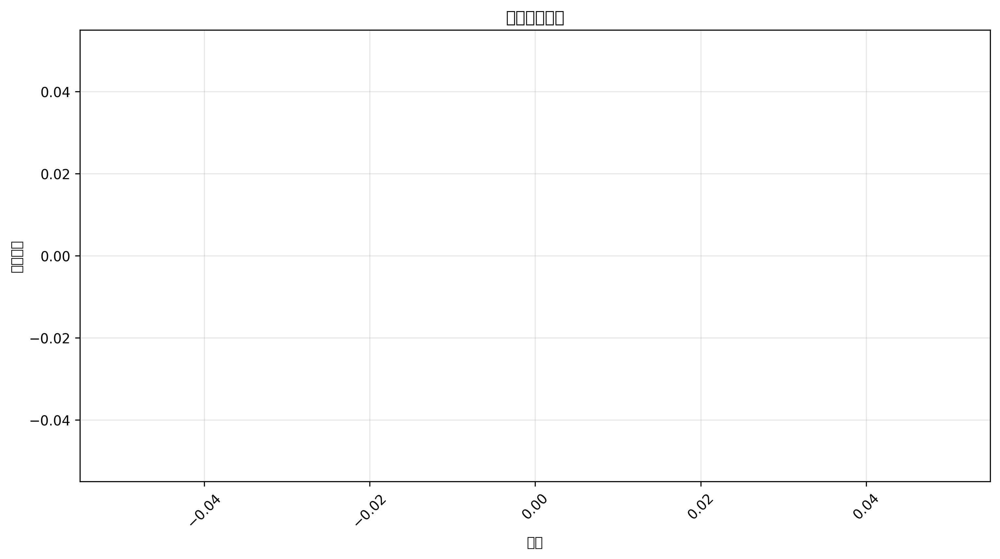

# 伪娘与性转相关漫画存档库 Analysis
*生成日期：2025-02-14*

## 执行摘要
本报告分析了 0 个项目的时间分布和主题分类。

## 时间分布

### 年度明细

| 年份 | 数量 |
|------|-------|

## 地区分布

  未知: 3,409 (100.0%)

## 主题分析

### 标签词云

### 热门标签

**前50个热门标签：**

  binary: 3,395  性转漫画: 12  跨性别: 12  自我探索: 11  伪娘: 10  变身: 9  性别认同: 6  变身漫画: 5  伪娘漫画: 4  男娘: 4  二次元: 3  愚人节: 3  性别转换: 2  自我认同: 2  跨性别漫画: 2  实验: 1  幽默: 1  性转: 1  搞笑: 1  漫画: 1

查看更多标签

## 说明
- 所有统计数据截至报告生成日期
- 标签保持原始大小写形式