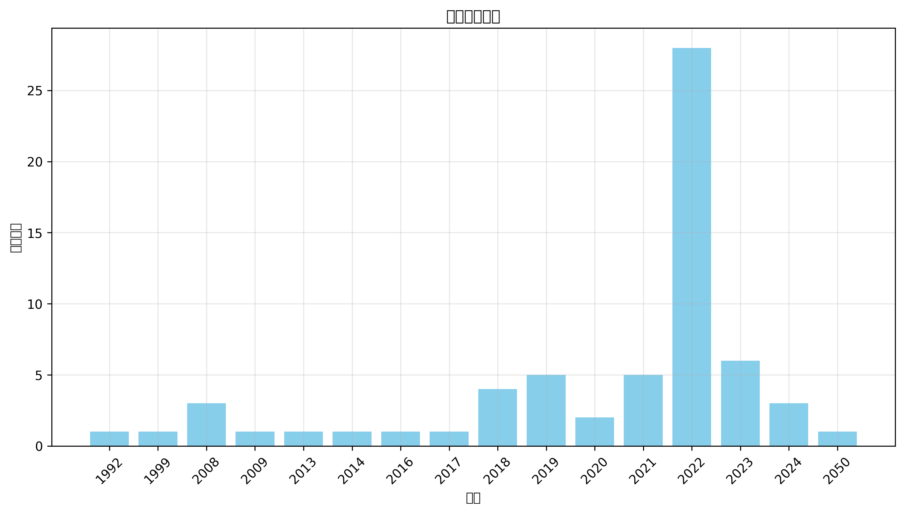
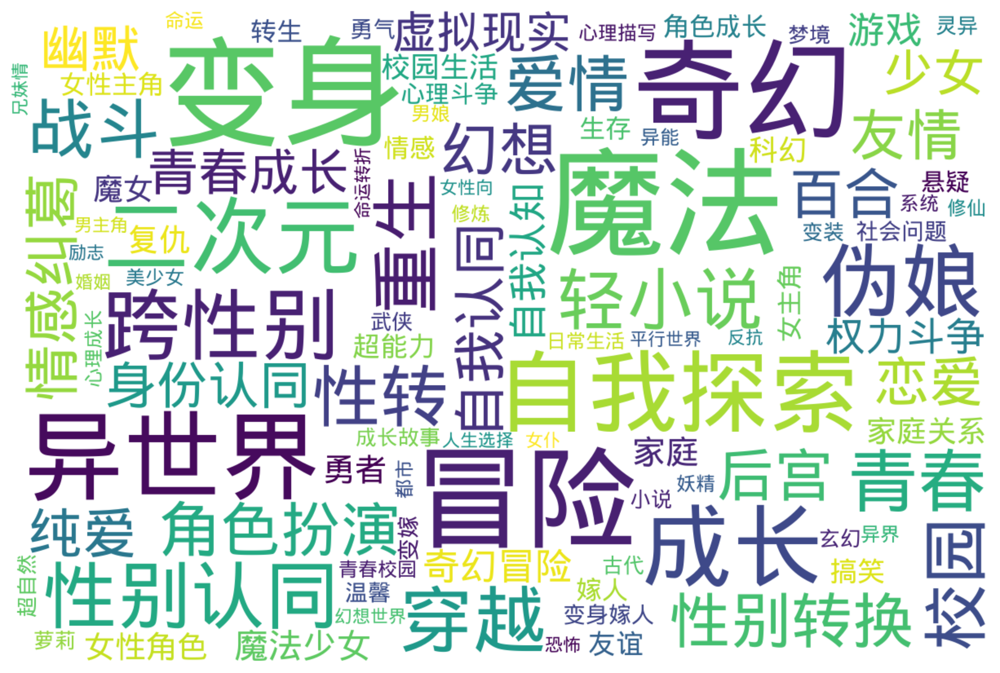

# 变身文学与小说存档库三（非限制级，持续更新） Analysis
*生成日期：2025-02-14*

## 执行摘要
本报告分析了 64 个项目的时间分布和主题分类。

## 时间分布

### 年度明细

| 年份 | 数量 |
|------|-------|
| 2050 | 1 |
| 2024 | 3 |
| 2023 | 6 |
| 2022 | 28 |
| 2021 | 5 |
| 2020 | 2 |
| 2019 | 5 |
| 2018 | 4 |
| 2017 | 1 |
| 2016 | 1 |
| 2014 | 1 |
| 2013 | 1 |
| 2009 | 1 |
| 2008 | 3 |
| 1999 | 1 |
| 1992 | 1 |

## 地区分布

  未知: 169 (73.2%)  中国大陆: 60 (26.0%)  日本: 1 (0.4%)  美国: 1 (0.4%)

## 主题分析

### 标签词云

### 热门标签

**前50个热门标签：**

  变身: 136  魔法: 128  冒险: 114  奇幻: 110  异世界: 85  成长: 73  自我探索: 72  二次元: 64  伪娘: 58  跨性别: 55  性别认同: 48  穿越: 47  重生: 44  青春: 42  性转: 41  轻小说: 41  校园: 39  战斗: 38  爱情: 34  性别转换: 32  角色扮演: 31  幻想: 29  后宫: 28  情感纠葛: 27  友情: 26  百合: 25  恋爱: 24  纯爱: 24  自我认同: 23  身份认同: 22  少女: 21  幽默: 21  青春成长: 21  虚拟现实: 20  权力斗争: 19  自我认知: 19  奇幻冒险: 18  游戏: 18  魔法少女: 18  家庭: 17  勇者: 15  复仇: 15  女性角色: 14  家庭关系: 13  魔女: 13  校园生活: 12  科幻: 12  友谊: 11  搞笑: 11  超能力: 11

查看更多标签

  女主角: 10  女性主角: 10  嫁人: 10  情感: 10  生存: 10  角色成长: 10  转生: 10  心理斗争: 9  悬疑: 9  勇气: 8  变嫁: 8  变身嫁人: 8  温馨: 8  社会问题: 8  变装: 7  古代: 7  小说: 7  成长故事: 7  梦境: 7  武侠: 7  灵异: 7  玄幻: 7  萝莉: 7  超自然: 7  修仙: 6  修炼: 6  命运: 6  妖精: 6  异界: 6  异能: 6  心理成长: 6  心理描写: 6  日常生活: 6  男娘: 6  系统: 6  美少女: 6  都市: 6  青春校园: 6  人生选择: 5  兄妹情: 5  励志: 5  反抗: 5  命运转折: 5  女仆: 5  女性向: 5  婚姻: 5  平行世界: 5  幻想世界: 5  恐怖: 5  男主角: 5  舰娘: 5  魅魔: 5  魔族: 5  个人成长: 4  亲情: 4  公主: 4  变身小说: 4  吸血鬼: 4  复杂人际关系: 4  孤儿: 4  心理冲突: 4  性别转变: 4  情感冲突: 4  情感探索: 4  探索: 4  日常: 4  末世: 4  母女关系: 4  求生: 4  治愈: 4  神秘: 4  科技幻想: 4  精灵: 4  身份危机: 4  都市奇幻: 4  魔法师: 4  魔王: 4  乡村生活: 3  二次元文化: 3  人际关系: 3  仙侠: 3  兄弟情: 3  初恋: 3  历史: 3  反转人生: 3  古风: 3  奇幻世界: 3  奇幻小说: 3  女主: 3  女儿: 3  女孩: 3  女性成长: 3  女装: 3  妖怪: 3  姐妹情: 3  孤独: 3  少年成长: 3  忠诚: 3  悲剧: 3  权谋: 3  江湖: 3  火影忍者: 3  甜宠: 3  病态: 3  职场: 3  血腥: 3  角色互动: 3  角色发展: 3  言情: 3  身份探索: 3  身体交换: 3  黑暗: 3  黑暗奇幻: 3  黑暗幻想: 3  SM: 2  丧尸: 2  人工智能: 2  人物关系: 2  伙伴关系: 2  关系发展: 2  养成: 2  剑与魔法: 2  力量觉醒: 2  双子姐妹: 2  反击: 2  反派角色: 2  变性: 2  变百: 2  叛逆: 2  史莱姆: 2  同性恋: 2  复生: 2  多元宇宙: 2  天使: 2  天才: 2  天才千金: 2  失忆: 2  奇幻生物: 2  女主成长: 2  女儿身: 2  女孩成长: 2  女性力量: 2  女性身份: 2  女神: 2  女英雄: 2  奴隶制: 2  奴隶制度: 2  妖女: 2  姐妹: 2  姐姐: 2  宠物: 2  家族关系: 2  少女冒险: 2  少女心: 2  少年: 2  少年少女: 2  巫女: 2  废墟: 2  强盗: 2  心理战: 2  心理探索: 2  忍者: 2  性别探索: 2  性别角色: 2  性转小说: 2  悲伤: 2  情感成长: 2  感情纠葛: 2  战争: 2  战舰: 2  探索自我: 2  政治斗争: 2  救赎: 2  斗争: 2  时空穿越: 2  时间旅行: 2  暗恋: 2  校园恋爱: 2  校园暴力: 2  校园爱情: 2  梦想: 2  次元: 2  毒药: 2  治愈系: 2  流氓: 2  深渊: 2  温情: 2  灵魂: 2  灵魂互换: 2  灵魂交换: 2  灵魂转世: 2  灵魂转移: 2  热血: 2  爱恨情仇: 2  牺牲: 2  猫娘: 2  王女: 2  现代: 2  现代生活: 2  现代都市: 2  甜蜜爱情: 2  生存游戏: 2  电竞: 2  男主: 2  社会压力: 2  神器: 2  神秘少女: 2  科技: 2  系统流: 2  职业技能: 2  背叛: 2  能力觉醒: 2  自我救赎: 2  英雄: 2  萌系: 2  虐待: 2  虐恋: 2  西幻: 2  角色变身: 2  贫困: 2  贵族: 2  轮回: 2  逃亡: 2  逆袭: 2  逆转: 2  都市传说: 2  都市幻想: 2  阴谋: 2  陪伴: 2  霸凌: 2  青春期: 2  青梅竹马: 2  非凡者: 2  魔兽: 2  魔道具: 2  龙娘: 2  1980年代: 1  BL: 1  Cosplay: 1  R18: 1  SCP基金会: 1  cosplay: 1  ”dreamer: 1  东方幻想乡: 1  东煌: 1  两性关系: 1  丧尸题材: 1  个体成长: 1  丫鬟: 1  中世纪: 1  主人与精灵: 1  乙女向: 1  乡镇生活: 1  二战: 1  二次元情节: 1  互动式叙述: 1  互相理解: 1  亡国公主: 1  交错的命运: 1  亲子关系: 1  亲情故事: 1  人兽情: 1  人性: 1  人性和自我探索: 1  人族: 1  人格分裂: 1  人格复生: 1  人格转变: 1  人物成长: 1  人生转变: 1  仙女: 1  仙家至宝: 1  仙界: 1  代表赛: 1  任务系统: 1  传奇: 1  传统玄幻: 1  伦敦: 1  伪装: 1  佐罗传说: 1  佣兵: 1  佣兵团: 1  使命: 1  俘虏: 1  信任: 1  信任与依赖: 1  信任危机: 1  修真: 1  偷拍事件: 1  傲娇: 1  光明正大: 1  克勃格帝国: 1  克隆身份: 1  公会: 1  公公: 1  关系冲突: 1  兽人: 1  内力: 1  内心成长: 1  冒险任务: 1  冒险故事: 1  冒险旅程: 1  冒险游戏: 1  冒险经历: 1  冒险者: 1  冒险者公会: 1  军事: 1  军校: 1  冰雪魔法: 1  冷酷: 1  冷酷少年: 1  创业: 1  初中: 1  制服: 1  剑姬: 1  剑术: 1  剥削: 1  剧情: 1  剧情反转: 1  剧情发展: 1  力量斗争: 1  动态视力: 1  动情: 1  动漫文化: 1  动漫衍生: 1  努力与坚持: 1  努力与奋斗: 1  努力改变: 1  勇者与光之关系: 1  勇者审判: 1  勇者能力: 1  北地雪域: 1  医治: 1  医院生活: 1  升级: 1  半妖: 1  单亲家庭: 1  单女主: 1  单恋: 1  卡牌: 1  危机与救援: 1  危险: 1  历史冲突: 1  历史推演: 1  历史重塑: 1  双重生活: 1  双重身份: 1  双鹰帝国: 1  反传统: 1  反向攻略: 1  反对歧视: 1  反差人设: 1  反派: 1  反派女友: 1  反英雄: 1  变化: 1  变身聊: 1  变迁: 1  古代社会: 1  古代神话: 1  古墓探险: 1  古文化: 1  古风情节: 1  另类恋爱: 1  召唤仪式: 1  召唤师: 1  可爱: 1  可爱角色: 1  同学关系: 1  同居: 1  同性恋主题: 1  同班同学: 1  后宫斗争: 1  向日葵: 1  命运交织: 1  命运交错: 1  命运法则: 1  咖啡厅: 1  唤醒本能: 1  商业竞争: 1  善恶: 1  善恶交织: 1  善良: 1  喜剧: 1  回忆: 1  团宠: 1  团队协作: 1  团队合作: 1  困惑: 1  国王游戏: 1  国策: 1  圣丹斯电影节: 1  圣剑: 1  圣女: 1  圣灵公主: 1  地下室: 1  城市冒险: 1  堕落天使: 1  增殖能力: 1  复杂人性: 1  复杂人物关系: 1  复杂关系: 1  复活: 1  夏天歌: 1  多元性别: 1  多角恋: 1  夜晚: 1  天使型角色: 1  天女兽: 1  天才魔法师: 1  天赋觉醒: 1  天魔宗: 1  失去与寻找: 1  失去与重获: 1  奇幻文学: 1  奇幻游戏: 1  奇幻穿越: 1  奋斗: 1  契约: 1  契约关系: 1  奧斯卡: 1  女主强: 1  女主拯救: 1  女主重生: 1  女人角色: 1  女儿心: 1  女同性恋: 1  女天使: 1  女孩维权: 1  女帝: 1  女强: 1  女性: 1  女性主义: 1  女性化: 1  女性发育: 1  女性独立: 1  女性英雄: 1  女性认同: 1  女扮男装: 1  女生: 1  女生化: 1  女生系统: 1  女老师: 1  女骑士: 1  女鬼: 1  奴役: 1  奴隶: 1  奴隶契约: 1  好莱坞: 1  妖兽: 1  妖族: 1  妮可·基德曼: 1  妹子: 1  妹控: 1  姐弟情: 1  娱乐圈: 1  婚事: 1  婚姻关系: 1  婚姻危机: 1  婚姻重建: 1  婚约: 1  婴儿生活: 1  存在主义: 1  孤儿故事: 1  学习压力: 1  学习成长: 1  学园: 1  学城: 1  学徒: 1  学渣逆袭: 1  学霸: 1  宗教改革: 1  宗门: 1  宝可梦: 1  实验: 1  实验室: 1  宠物妄想: 1  审判者: 1  宫廷: 1  宫廷争斗: 1  家庭伦理: 1  家庭暴力: 1  家族: 1  家族内斗: 1  家族恩怨: 1  家族悲剧: 1  家族纷争: 1  家暴: 1  宿命转变: 1  宿命转折: 1  密教: 1  富豪: 1  富豪嫁入: 1  对话: 1  寻友: 1  寻宝: 1  寻找亲人: 1  小医仙: 1  少女强势: 1  少女成长: 1  少年】]}: 1  少年冒险: 1  少年漫画: 1  尴尬情境: 1  尸体复生: 1  屈辱: 1  山中井野: 1  崩坏: 1  工业革命: 1  巨龙: 1  巫师: 1  师弟: 1  师徒情: 1  师徒情深: 1  帝国政治: 1  帝都: 1  帮派争斗: 1  平安时代: 1  平淡人生: 1  年代: 1  幻想乡: 1  幻想冒险: 1  幻想剧情: 1  幻想小说: 1  幻术: 1  幻觉: 1  幼馴染: 1  幽灵舞蹈: 1  废萌: 1  异世界冒险: 1  异世界探索: 1  异界探险: 1  异类变身: 1  弱者: 1  弱者逆袭: 1  强大女性角色: 1  强者: 1  归属感: 1  微观世界: 1  心灵冲突: 1  心灵探索: 1  心灵穿越: 1  心理健康: 1  心理咨询: 1  心理幻想: 1  心理戏: 1  心理挣扎: 1  心理探讨: 1  心理暗示: 1  心理社会: 1  心脏病: 1  忍者学校: 1  忠臣: 1  性别转化: 1  怨恨: 1  怪人: 1  怪盗: 1  怪诞生物: 1  恋人: 1  恋爱故事: 1  恐惧: 1  恐惧与勇气: 1  恶女: 1  恶魔: 1  恶魔猎手: 1  悔恨: 1  悲怆: 1  情感互动: 1  情感关系: 1  情感剧: 1  情感危机: 1  情感发展: 1  情感教育: 1  情感重建: 1  情欲: 1  情诗: 1  惊悚: 1  感人故事: 1  慢热: 1  成年人: 1  成长困境: 1  成长小说: 1  战争策略: 1  战利品: 1  战友情谊: 1  战役: 1  战斗本能: 1  战斗法则: 1  战斗系统: 1  战斗训练: 1  战术分析: 1  战略: 1  战略合作: 1  打脸: 1  扭曲: 1  拍卖师: 1  招募同伴: 1  挑战: 1  挣扎: 1  挣扎求生: 1  掌门: 1  探案: 1  探险: 1  推理: 1  搞笑元素: 1  收养: 1  改变命运: 1  改革: 1  政治: 1  故事: 1  教会: 1  数码兽: 1  数码宝贝: 1  文化冲突: 1  文学作品: 1  文艺: 1  斗智斗勇: 1  斗智斗狠: 1  斗气大陆: 1  新世界: 1  新月秘境: 1  新生机遇: 1  无助与勇气: 1  无厘头: 1  无毒无害: 1  无系统: 1  日本: 1  时代变迁: 1  时空双神: 1  时空旅行: 1  时空穿梭: 1  时间操控: 1  昆汀·塔伦蒂诺: 1  暗杀: 1  暴力事件: 1  替代身份: 1  朝堂之上: 1  未来世界: 1  未来科技: 1  末日: 1  末日废墟: 1  机智: 1  机械: 1  机械少女: 1  杀人鬼: 1  权利游戏: 1  权力与血统: 1  权力争夺: 1  极权主义: 1  林克导演: 1  校园恋: 1  校花: 1  梦幻: 1  森林: 1  植物变身: 1  模拟人生: 1  次元文明: 1  次元穿越: 1  正义与邪恶: 1  武侠玄幻: 1  武功修炼: 1  武器: 1  武器锻造: 1  武士: 1  武林: 1  武者: 1  武道: 1  死亡: 1  死亡与重生: 1  死者森林: 1  残酷: 1  残酷合同: 1  母女情: 1  母子关系: 1  母爱: 1  母爱与责任: 1  毒师: 1  毒素技能: 1  毒贩: 1  毛利兰: 1  水下: 1  水下世界: 1  水晶: 1  江湖人物: 1  江湖纷争: 1  沉浸式体验: 1  沙漠: 1  沙雕幽默: 1  测试: 1  海贼王: 1  深冬情景: 1  深渊魔兽: 1  渣男: 1  渣男元素: 1  温情家庭: 1  温柔: 1  温泉: 1  温馨家庭: 1  游戏世界: 1  游戏制作: 1  游戏开发: 1  游戏攻略: 1  游戏爱好者: 1  游戏竞技: 1  游戏背景: 1  演戏: 1  漩涡中的希望: 1  漫画: 1  漫画改编: 1  潜入: 1  澜云妖院: 1  灵力: 1  灵动武装: 1  灵天长生造化宝泉: 1  灵异事件: 1  灵异现象: 1  灵异直播间: 1  灵魂交易: 1  灵魂武器: 1  灵魂穿越: 1  灵魂融合: 1  灵魂附身: 1  爱与友情: 1  爱与牺牲: 1  爱恋: 1  爱情告白: 1  爱情故事: 1  父女关系: 1  父权: 1  爽文: 1  特殊能力: 1  特种部队: 1  特警: 1  牺牲与希望: 1  犬夜叉: 1  狙击手: 1  狩猎: 1  独立: 1  独立游戏: 1  独立电影: 1  狼的攻击: 1  猎奇: 1  猎杀者: 1  猫咪魔兽: 1  猫魔女: 1  献祭: 1  王宫生活: 1  现代奇幻: 1  现代战争: 1  现实与梦境: 1  现实主义: 1  现实题材: 1  理想社会: 1  甜虐交织: 1  生命的希望: 1  生存冒险: 1  生存挑战: 1  生存斗争: 1  生存欲望: 1  生死: 1  生死决斗: 1  生死存亡: 1  生死界限: 1  生死轮回: 1  生活习惯: 1  生活日常: 1  生活片段: 1  电子歌姬: 1  电影制作: 1  电影发行: 1  电影节颁奖: 1  男主女主: 1  男主成长: 1  男儿: 1  男儿身: 1  男女关系: 1  男女平等: 1  男孩: 1  男孩变女孩: 1  男孩变女生: 1  男孩转变: 1  男性变女性: 1  男性角色变化: 1  男装: 1  番外: 1  疼痛与治疗: 1  病娇: 1  病弱公主: 1  病态心理: 1  病房生活: 1  痛苦: 1  白雪公主: 1  皇帝: 1  真实感受: 1  矛盾: 1  短发御姐: 1  矿井: 1  研究: 1  破坏神: 1  社交: 1  社会主题: 1  社会互动: 1  社会人: 1  社会关注: 1  社会变革: 1  社会底层: 1  社会构建: 1  社会现象: 1  社会认同: 1  社会适应: 1  社畜生活: 1  神圣技能: 1  神界幻想: 1  神秘力量: 1  神秘学: 1  神秘废墟: 1  神秘森林: 1  神秘生物: 1  神秘组织: 1  神秘萝莉: 1  神话: 1  神话角色: 1  神选者: 1  票房对赌: 1  禁忌爱情: 1  禁忌知识: 1  种族创造: 1  科幻小说: 1  科技文明: 1  秘密恋情: 1  程序员: 1  空手道大赛: 1  空间能力: 1  穿越小说: 1  穿越文学: 1  竞争与挑战: 1  童年: 1  童话: 1  第二性征: 1  篮球: 1  粉色薄雾: 1  精灵宝可梦: 1  精灵族: 1  精神健康: 1  精神困惑: 1  精神复苏: 1  精神疾病: 1  系统类小说: 1  紧身衣女: 1  红世: 1  经济困难: 1  经济学: 1  绑架: 1  绝世美女: 1  绝望与希望: 1  绝望故事: 1  维斯共和国: 1  网络互动: 1  网络小说: 1  美少年: 1  群体冲突: 1  聊天群: 1  职业系统: 1  职场压力: 1  职场奋斗: 1  职场学习: 1  职场斗争: 1  能力提升: 1  腐向: 1  腐女: 1  自我反省: 1  自我发现: 1  自我成长: 1  致郁文: 1  艺人生活: 1  艺术: 1  艺术电影: 1  艾灵莎: 1  英勇: 1  英日混血: 1  英雄主义: 1  草帽海贼团: 1  草神: 1  药材: 1  莉格露·奈特巴格: 1  萝莉魔王: 1  虐心: 1  虚幻世界: 1  虚拟世界: 1  虚拟游戏: 1  虚拟系统: 1  虚构: 1  虚构世界: 1  虚构历史: 1  虚构故事: 1  血族: 1  血玫瑰: 1  血祭: 1  血肉之花: 1  血腥狩猎: 1  西方奇幻: 1  规则怪谈: 1  角色关系: 1  角色认同: 1  警匪: 1  警察: 1  许愿池: 1  设定背景: 1  评审团大奖: 1  诅咒: 1  试道大会: 1  诡异事件: 1  诺斯人: 1  财富: 1  责任: 1  责任与救赎: 1  贫困少女: 1  贫富差距: 1  贵族教育: 1  贵族社会: 1  贵族联姻: 1  赛亚人: 1  超凡力量: 1  超现实: 1  超级英雄: 1  超维地图: 1  超自然事件: 1  超自然生物: 1  跨性别角色: 1  身世秘密: 1  身份转变: 1  身心体验: 1  转变: 1  转职系统: 1  轮回世界: 1  轮回乐园: 1  追寻希望: 1  逆境成长: 1  道教: 1  邪恶科学家: 1  邪神: 1  都市小说: 1  都市情感: 1  都市情缘: 1  都市日常: 1  都市生活: 1  酒馆: 1  重建文明: 1  野外探索: 1  钓鱼: 1  铜币掉落: 1  银发女性: 1  错位恋爱: 1  间谍: 1  队伍合作: 1  阳气与阴气: 1  阴暗牧师: 1  阴气: 1  阴阳师: 1  阴阳草: 1  阴阳阁: 1  除妖师: 1  隐藏门派: 1  隔阂: 1  障碍克服: 1  霍格沃兹: 1  露出: 1  青云宗: 1  青春叛逆: 1  青春奇幻: 1  青春奋斗: 1  青春小说: 1  青春爱情: 1  非人: 1  非攻略对象: 1  面具: 1  风见幽香: 1  飞升: 1  飞行: 1  食物探寻: 1  骑乘: 1  骑士: 1  骚扰与霸凌: 1  骷髅: 1  高中生: 1  鬼: 1  鬼怪: 1  鬼畜: 1  鬼魂: 1  魂系: 1  魔契: 1  魔女之夜: 1  魔导书: 1  魔幻: 1  魔法力量: 1  魔法学院: 1  魔法实验: 1  魔法袭击: 1  魔法课堂: 1  魔法转变: 1  魔法革命: 1  魔物: 1  魔界: 1  魔皇: 1  魔药: 1  魔镜: 1  魔鬼海域: 1  黑卡蒂: 1  黑暗与光明: 1  黑暗圣典: 1  黑暗实验: 1  黑暗风: 1  黑暗魔法: 1  黑莲花: 1  龙珠: 1  龙骑士: 1

## 说明
- 所有统计数据截至报告生成日期
- 标签保持原始大小写形式